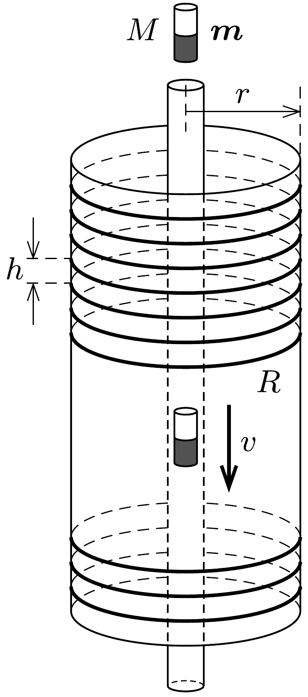

Hosszú, keskeny, függőleges üvegcsövet egy vele azonos tengelyú, de sokkal szélesebb, $r$ külső sugarú másik üvegcső vesz körül. E szélesebb csövön sürün, egymástól $h$ távolságra elhelyezkedő, $R$ ellenállású körvezetők vannak.

Ha a keskeny csőbe egy $M$ tömegǘ, $\boldsymbol{m}$ mágneses dipólnyomatékú kicsiny rúdmágnest ejtünk, az viszonylag hamar elér egy állandó $v$ sebességet, amellyel egyenletesen süllyed.

További kísérleteink során a fenti öt mennyiség ( $M$, $\boldsymbol{m}, h, R, r)$ közül az egyiket mindig a kétszeresére növeljük, miközben a másik négyet nem változtatjuk meg. Hányszorosára nő az egyes esetekben a kicsiny rúdmágnes állandósult végsebessége?
(A mechanikai súrlódástól és a közegellenállástól, továbbá a körvezetők önindukciójától és kölcsönös indukciójától eltekinthetünk.)

