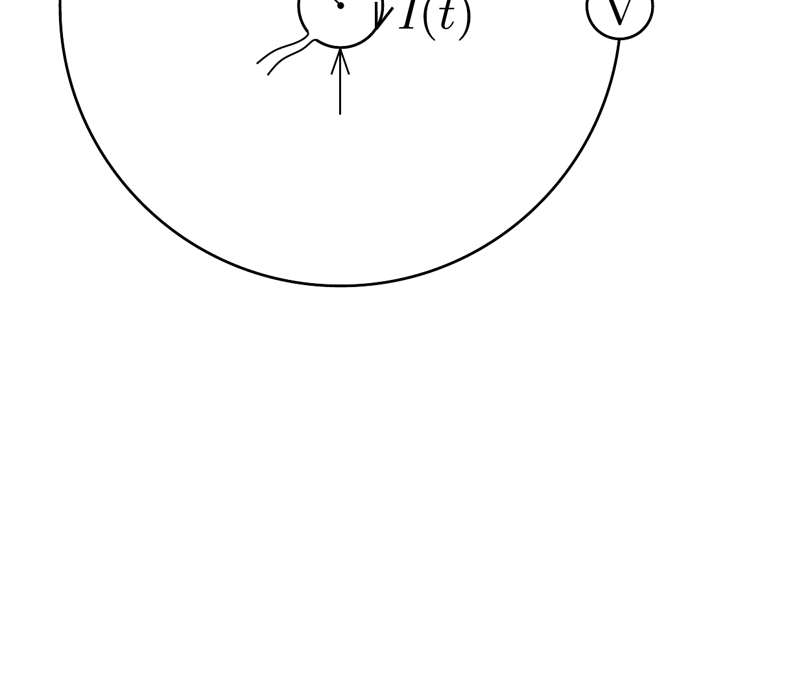

Egy $R$ sugarú körvezető közepén, vele egy síkban, koncentrikusan elhelyezve egy $r$ sugarú $(r \ll R)$ másik körvezető található. A kisebb körvezetőben az áramerősséget $t_{0}$ idő alatt nulláról egyenletesen $I_{0}$ értékre növeljük. Mekkora feszültség indukálódik ezalatt a nagyobb körben?

