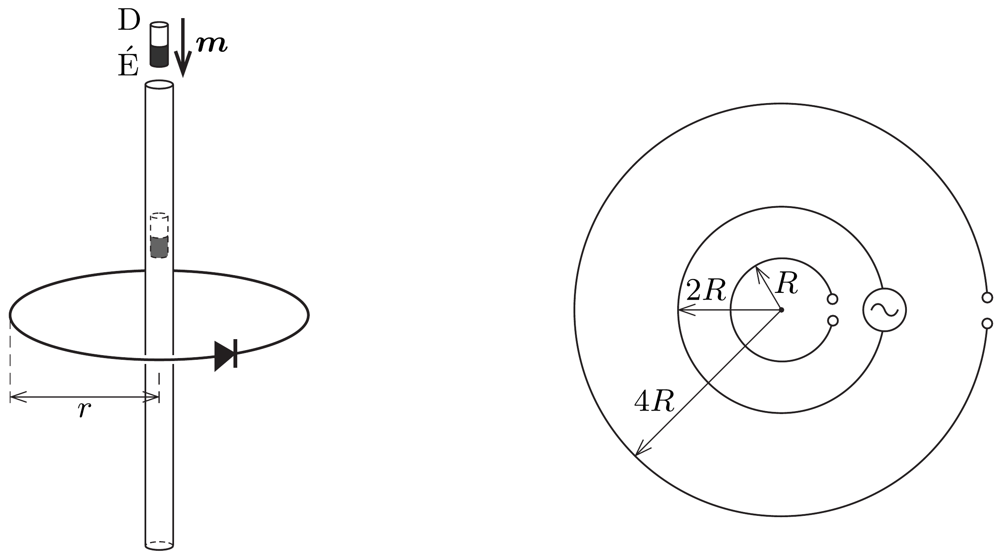

$R$ ellenállású drótból és egy ideálisnak tekinthető diódából $r$ sugarú zárt karikát készítettünk. A karikát vízszintes síkban tartjuk, a középpontján pedig egy függőleges tengelyú, hosszú üvegcsövet vezetünk át a bal oldali ábra szerint. Mekkora töltés halad át a diódán, ha az üvegcsőbe $\boldsymbol{m}$ dipólnyomatékú, kicsiny mágnesrudat ejtünk?

