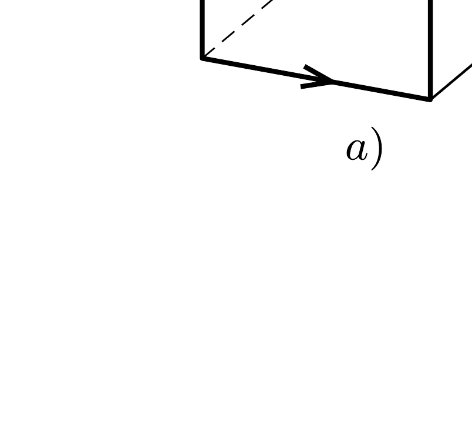
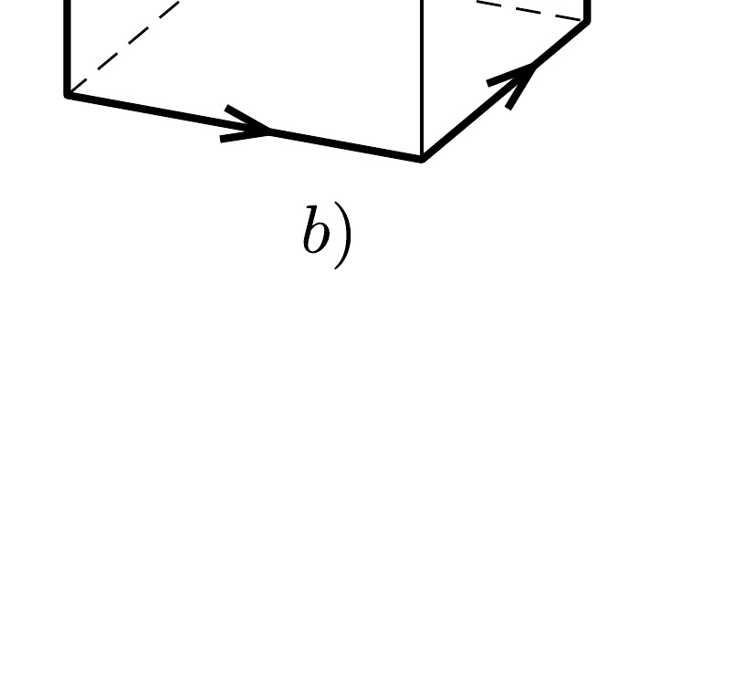
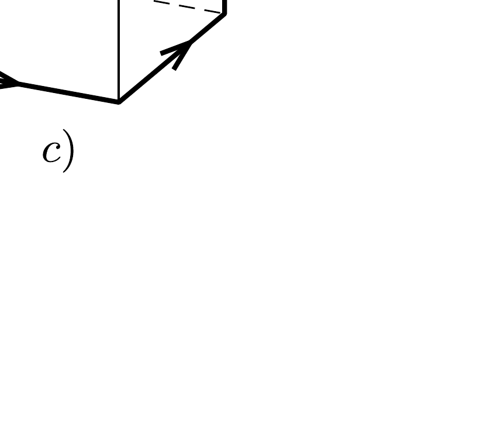

Egy kocka alakú test oldalélei mentén háromféle elrendezésben vezetünk végig egy drótot. Az $a$ ) ábrán látható négyzet önindukciós együtthatója a mérések szerint $L_{1}$, a $b$ ) ábrán látható elrendezésben pedig $L_{2}$. Vajon mekkora önindukciós együtthatót fogunk mérni a $c$ ) alakzatnál?

