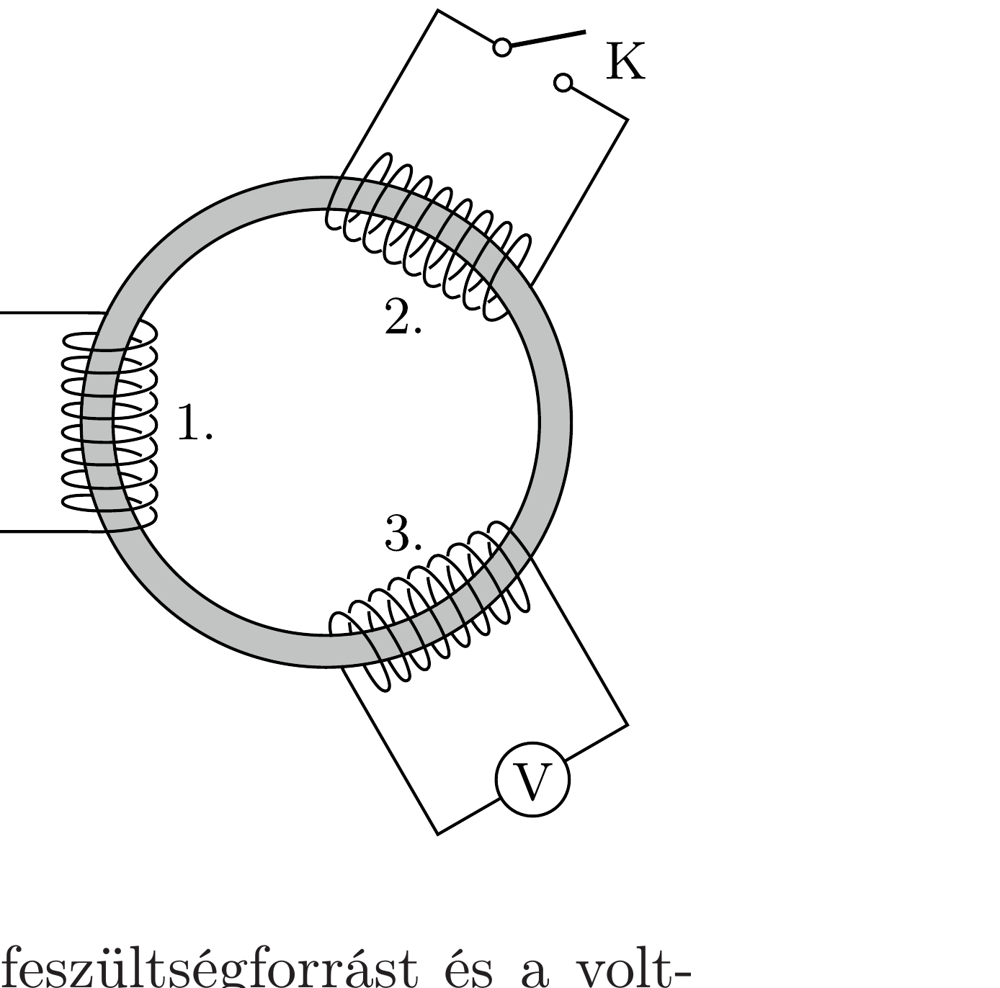

Egy toroid (úszógumi) alakú „sovány" vasmagra szimmetrikus elrendezésben három egyforma, „kövér” elektromágneses tekercs van felfúzve az ábra szerint. Az első tekercsre váltóáramú feszültségforrást kapcsolunk, a második tekercs kivezetéseit szabadon hagyjuk, a harmadik tekercs csatlakozóira pedig voltmérőt kötünk. Ekkor a voltmérő a feszültségforrás effektív értékének a felét mutatja.

Ezután a második tekercs kivezetéseit a K kapcsolóval rövidre zárjuk. Mit mutat ebben

az esetben a voltmérő?
(A tekercsek ohmos ellenállása elhanyagolható, a feszültségforrást és a voltmérőt ideálisnak tekinthetjük. A vasmag mágneses permeabilitása nem függ a mágneses fluxustól.)
