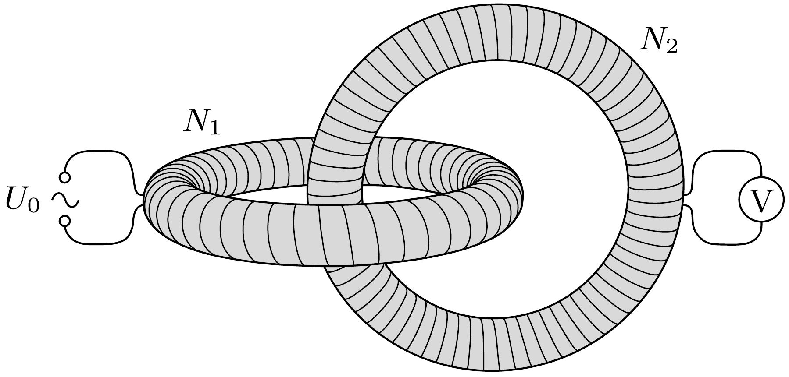

Két ugyanolyan méretú, csak a menetszámukban különböző, $N_{1}$ és $N_{2}$ menetes légmagos toroid tekercs egymásba van fúzve az ábra szerint. (A középkörök síkjai merólegesek egymásra.) Az $N_{1}$ menetes tekercsre $U_{0}$ effektív értékú, hálózati váltakozó feszültséget kapcsolunk, a másik tekercs kivezetéseire pedig ideálisnak tekinthető voltmérőt kötünk. Mekkora effektív feszültséget jelez a múszer?

