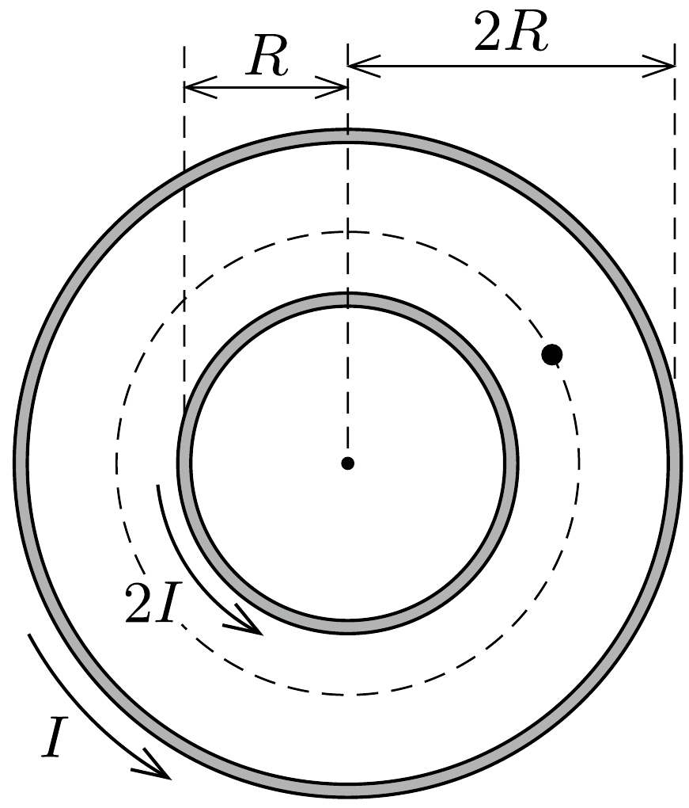

Egy hosszú tekercs (szolenoid) belsejében egy feleakkora sugarú másik szolenoid helyezkedik el úgy, hogy tengelyük közös. Mindkét tekercs egységnyi hosszára azonos menetszám jut. Ha a tekercsekben folyó áram erősségét a kezdeti nulla értékről egyenletesen növeljük, a tekercsek környezetében elektromos erótér indukálódik. A belső tekercsben minden pillanatban kétszer akkora áram folyik, mint a külsőben; az áramok iránya megegyezik. A két tekercs közötti térben egy kezdetben álló, töltött részecske az elektromágneses erők hatására körpályán mozog. Mekkora a körpálya sugara?

