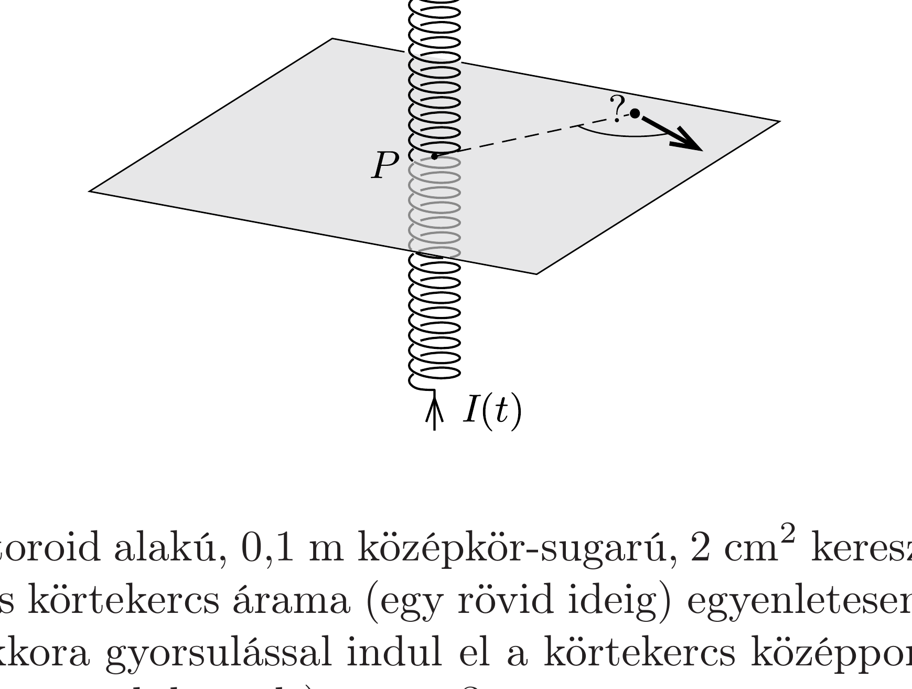

Vízszintes síkon egy kezdetben nyugvó, töltött, apró gyöngyöcske mozoghat súrlódásmentesen. A gyöngytől nem messze egy függőleges tengelyü, hosszú szolenoid helyezkedik el. A tekercsben folyó áram erősségét a kezdeti nulla értékről időben egyenletesen egy adott értékig növeljük, majd szintén egyenletesen újra zérusra csökkentjük. Az ábrán látható $P$ ponthoz képest merre fog mozogni a töltött gyöngy a folyamat végén?

