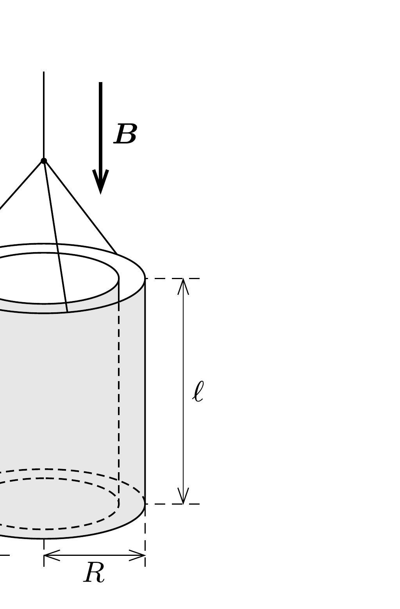

Egy $R$ külső, $R-d$ belsó sugarú $(d \ll R)$, $\ell$ hosszúságú, összesen $M$ tömegü hengerkondenzátort vékony szigetelő szálra függesztettünk fel, amely körül gyakorlatilag szabadon elfordulhat. (Gondoskodunk róla, hogy vízszintes irányban a kondenzátor ne mozdulhasson el.) Az $U$ feszültségre feltöltött kondenzátor környezetében függőleges irányú, $B$ indukciójú, homogén mágneses mező van.

Mi történik, ha
- a) óvatosan (anélkül, hogy meglöknénk) a benne ta-
 lálható, sugárirányú vezetéken keresztül kisütjük a kondenzátort;
- b) hirtelen megszüntetjük a mágneses teret?

