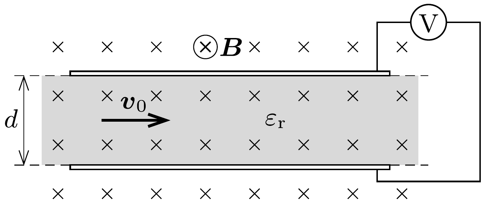

Egy eredetileg töltetlen síkkondenzátor lemezei közötti távolság $d$. A lemezekkel párhuzamosan, az ábrán látható módon $B$ indukciójú, homogén mágneses mező van. Mekkora feszültséget mutat a kondenzátorra kapcsolt voltmérő, ha a lemezek között $v_{0}$ sebességgel olyan - elektromosan semleges - folyadékot áramoltatunk, amelynek relatív dielektromos állandója $\varepsilon_{\mathrm{r}}$ ? (A folyadék relatív mágneses permeabilitása 1.)

