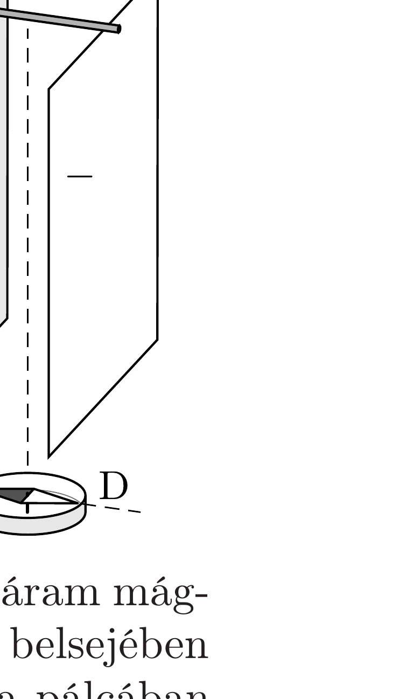

Egy párhuzamosan, függőlegesen elhelyezett lemezpárból álló kondenzátor fel van töltve. A lemezek alsó széle alatt középen egy kis iránytú áll az ábrán látható helyzetben. Ezután a lemezek tetejére, középre helyezett kis pálcával a kondenzátort viszonylag gyorsan kisütjük. (A kondenzátor lemezei sokkal jobb vezetők, mint a pálca, ellenállásuk elhanyagolható.)

Három diák, Aladár, Bendegúz és Cili azon vitatkozik, vajon hogyan viselkedik kisütés közben az iránytú?

Aladár szerint a vezető pálcában folyó áram által keltett mágneses mező az iránytú északi pólusát az ábra síkjára merőlegesen, „befelé” téríti ki.

Ez hibás érvelés, állítja Bendegúz, hiszen nemcsak a pálcában folyó áram mágneses tere hat az iránytüre a kisülés közben, hanem a kondenzátor belsejében fellépő Maxwell-féle eltolási áram által keltett tér is. Ez az „elkent”, a pálcában folyó valódi árammal azonos nagyságú, de azzal ellentétes irányú áram mindenhol közelebb van az iránytúhöz, mint a pálca, ezért a mágneses hatása erósebben érvényesül. Eszerint az iránytú északi pólusa a kisülés alatt az ábra síkjából „kifelé” mutató irányban térül el.

Cili szerint az eltolási áramokat nem, de a lemezekben folyó „valódi” áramokat figyelembe kell vennünk a mágneses mező kiszámításánál. Meglehet, hogy ezek az áramok a pálcában folyó áram hatását kioltják, így együtt nulla (de legalábbis a pálca árama által keltettnél lényegesen kisebb) mágneses teret eredményeznek a kondenzátor alsó széle alatt, tehát az iránytú semerre nem fog kitérülni.

Vajon melyiküknek van igaza?
