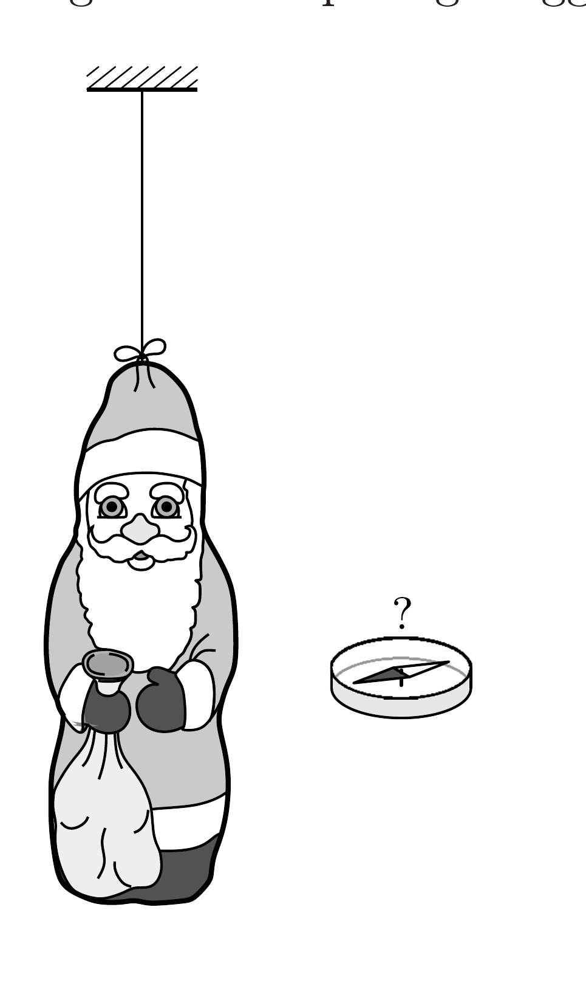

Szigeteló szálra függesztett, alufóliával bevont csokimikulást elektromosan feltöltöttünk. A mikulás a levegő csekély vezetőképessége miatt lassan elveszíti töltését. Milyen lesz kisülés közben a mikulás körül kialakuló mágneses mező? (Feltehetjük, hogy a levegő vezetőképessége független a helytől.)

