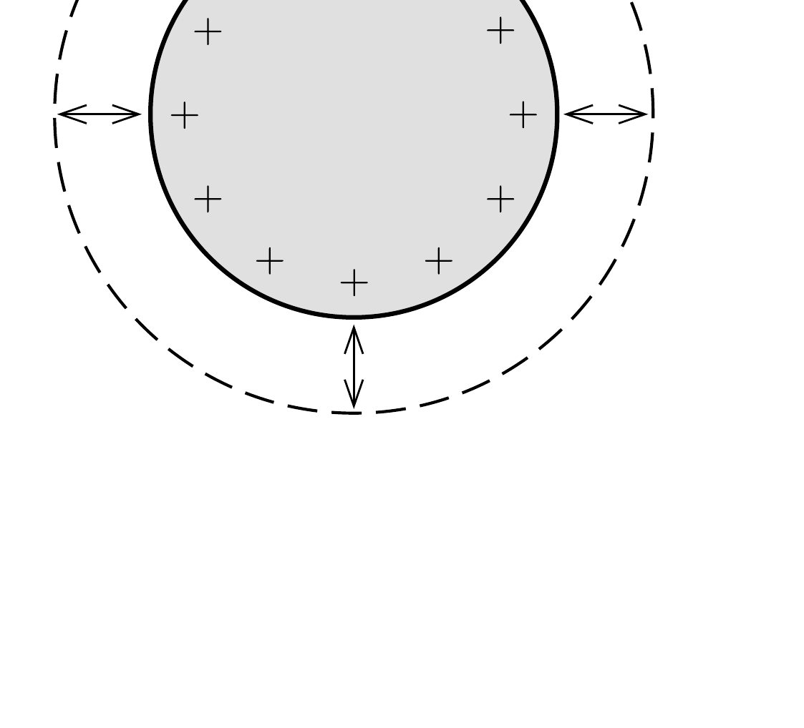
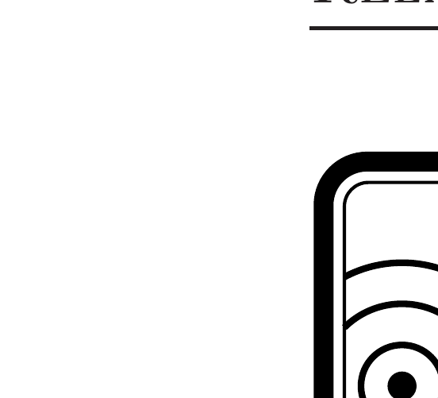

Egy elektromosan töltött vezető gömb radiálisan „pulzál”, a sugara valamekkora amplitúdóval periodikusan változik. A felületén elhelyezkedő töltések - mint megannyi dipólantenna - elektromágneses sugárzást bocsátanak ki. Vajon milyen lesz az eredő sugárzás?

\section*{Relativitáselmélet és modern fizika}
