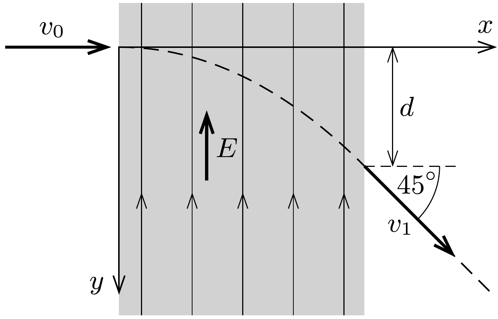

Egy elektron a fénysebesség 60\%-ával mozogva a sebességére merőleges irányú, homogén elektromos mezőbe érkezik. Amikor elhagyja az elektromos mezőt, sebességének iránya a kezdősebesség irányával 45°-os szöget zár be.

- a) Mekkora $v_{1}$ sebességgel mozog az elektromos mezót elhagyó elektron?
- b) Mekkora az ábrán jelölt $d$ távolság, ha a térerősség nagysága $E=510 \mathrm{kV} / \mathrm{m}$ ?
- c) Mennyi ideig tartózkodik az elektron az elektromos mezőben?
- d) Becsüljük meg, milyen széles $x$ irányban az elektromos mezó!

(Az elektron $m c^{2}$ nyugalmi energiája 510 keV.)
