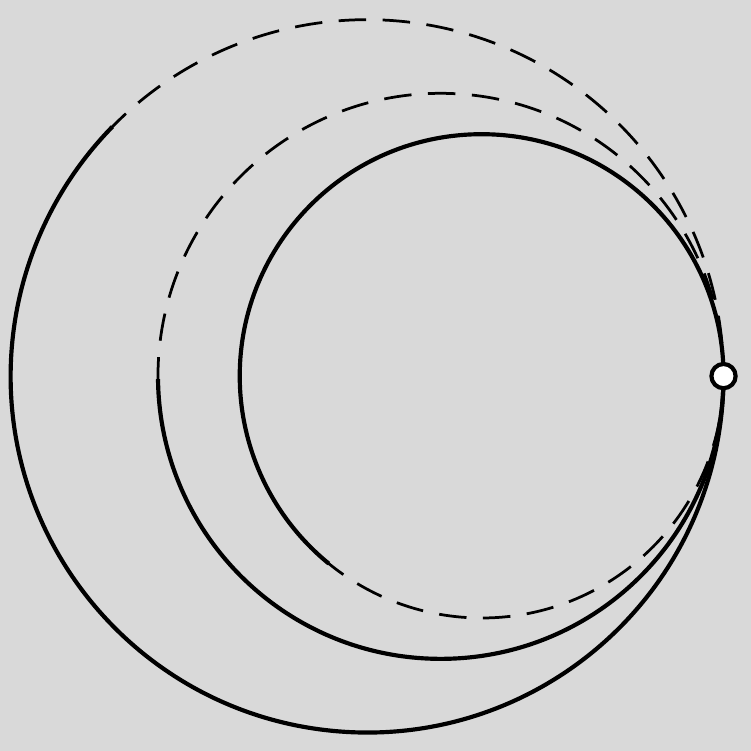

Ködkamrás kísérletekkel lehetővé válik a homogén mágneses térben mozgó töltött részecskék pályájának megfigyelése. Elképzelhető-e, hogy egy töltött részecske két másik részecskére történő bomlása során az ábrán látható, egymást érintő, körív alakú nyomok keletkezzenek a ködkamrában? (A részecskék fékeződése a vizsgált pályaszakaszon elhanyagolható.)

