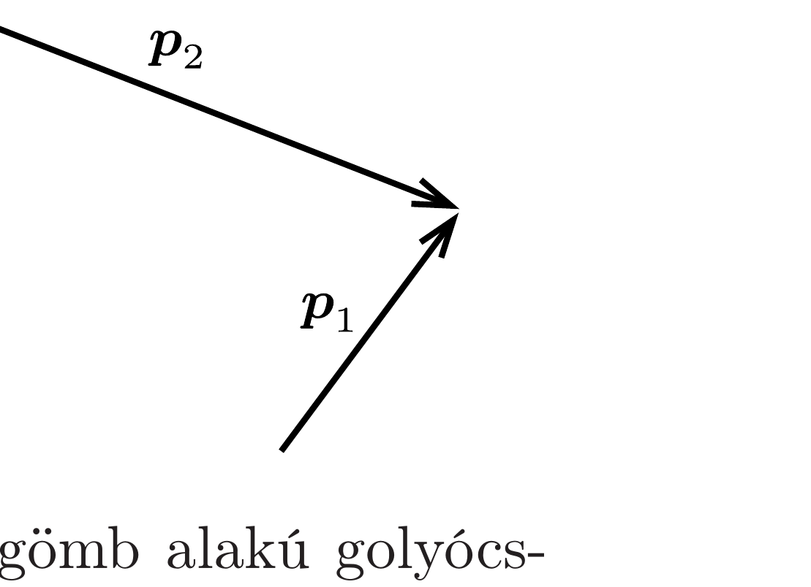

Két, a fénysebességhez nagyon közeli (ultrarelativisztikus) sebességgel mozgó részecske rugalmasan ütközik. A részecskék ütközés előtti impulzusvektorai az ábrán láthatók. Szerkesszük meg azt a legkisebb szöget, melyet a szétrepülő részecskék mozgásiránya bezárhat egymással!

