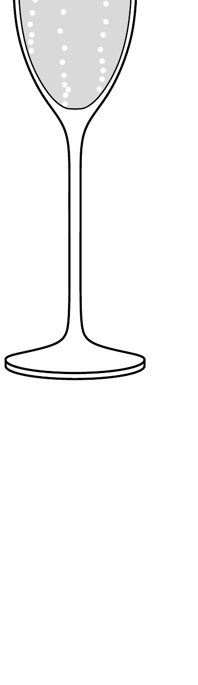

Ha a Kedves Olvasó eljutott könyvünk utolsó feladatához, illő lenne pezsgővel köszöntenünk. Mivel technikailag még nem oldható meg a teleportáció, álljon itt egy pezsgőről szóló, matematikai számításokat nem igénylő rejtvény! A pezsgőspohárban jól látható buborékok rendszerint a pohár alján keletkeznek néhány jól meghatározott ponton, majd szállnak felfelé. Megfigyelhetjük, hogy a buborékok felfelé egyre nagyobb sebességgel mozognak. Mitől gyorsulnak fel a pohárban?

