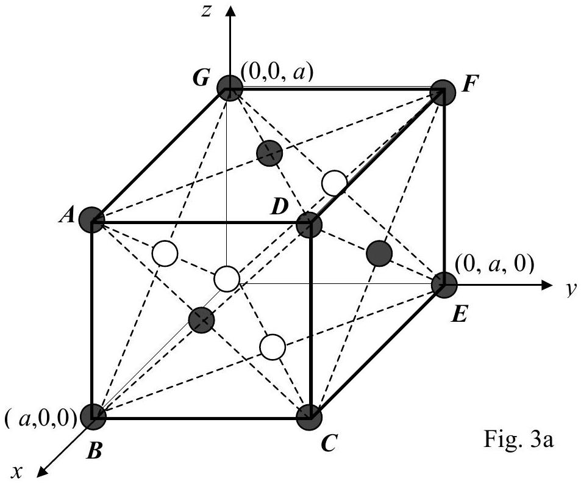
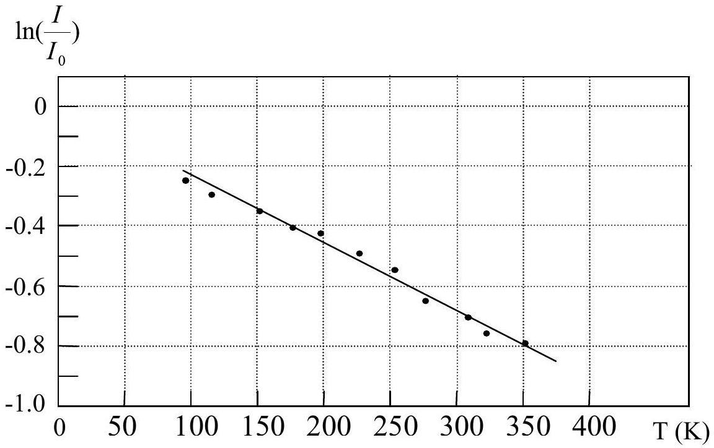

## Theoretical Question 3

## Thermal Vibrations of Surface Atoms

This question considers the thermal vibrations of surface atoms in an elemental metallic crystal with a face-centered cubic (fcc) lattice structure. The unit cubic cell of an $f_{c c}$ lattice consists of one atom at each corner and one atom at the center of each face of the cubic cell, as shown in Fig. 3a. For the crystal under consideration, we use $(a, 0,0),(0, a, 0)$ and $(0,0, a)$ to represent the locations of the three atoms on the $x, y$ and $z$ axes of its cell. The lattice constant $a$ is equal to $3.92 \AA$ (i.e..the length of each side of the cube is $3.92 \AA$ ).

(1) The crystal is cut in such a way that the plane containing ABCD becomes a boundary surface and is chosen for doing low-energy electron diffraction experiments. A collimated beam of electrons with kinetic energy of 64.0 eV is incident on this surface plane at an incident angle $\phi_{0}$ of 15.0°. Note that $\phi_{0}$ is the angle between the incident electron beam and the normal of the surface plane. The plane containing $\overline{A C}$ and the normal of the surface plane is the plane of incidence. For simplicity, we assume that all incident electrons are back scattered only by the surface atoms on the topmost layer.
(a) What is the wavelength of the matter waves of the incident electrons?
(b) If a detector is set up to detect electrons that do not leave the plane of incidence after being diffracted, at what angles with the normal of the surface will these diffracted electrons be observable?
(2) Assume that the thermal vibrational motions of the surface atoms are simple

harmonic. The amplitude of vibration increases as the temperature rises. Low-energy electron diffraction provides a way to measure the average amplitude of vibration. The intensity $I$ of the diffracted beam is proportional to the number of scattered electrons per second. The relation between the intensity $I$ and the displacement $\vec{u}(\mathrm{t})$ of the surface atoms is given by

$$
I=I_{0} \exp \left\{-<\left[\left(\vec{K}^{\prime}-\vec{K}\right) \cdot \vec{u}\right]^{2}>\right\}
$$

In Eq.(1), $I$ and $I_{0}$ are the intensities at temperature $T$ and absolute zero, respectively. $\vec{K}$ and $\vec{K}^{\prime}$ are wave vectors of incident electron and diffracted electron, respectively. The angle brackets < > is used to denote average over time. Note that the relation between the wave vector $\vec{K}$ and the momentum $\vec{p}$ of a particle is $\vec{K}=2 \pi \vec{p} / h$, where $h$ is the Planck constant.

To measure vibration amplitudes of surface atoms of a metallic crystal, a collimated electron beam with kinetic energy of 64.0 eV is incident on a crystal surface at an incident angle of 15.0°. The detector is set up for measuring specularly reflected electrons. Only elastically scattered electrons are detected. A plot of $\ln \left(I / I_{0}\right)$ versus temperature $T$ is shown in Fig. 3b.

Assume the total energy of an atom vibrating in the direction of the surface normal $\hat{x}$ is given by $k_{B} T$, where $k_{B}$ is the Boltzmann constant.

(a) Calculate the frequency of vibration in the direction of the surface normal for the surface atoms.
(b)Calculate the root-mean-square displacement, i. e. the value of $\left(<u_{\mathrm{x}}{ }^{2}>\right)^{1 / 2}$, in the direction of the surface normal for the surface atoms at $300 K$.

Fig. 3b

The following data are given:
Atomic weight of the metal $M=195.1$
Boltzmann constant $k_{B}=1.38 \times 10^{-23} \mathrm{~J} / \mathrm{K}$
Mass of electron $=9.11 \times 10^{-31} \mathrm{~kg}$
Charge of electron $=1.60 \times 10^{-19} C$
Planck constant $h=6.63 \times 10^{-34} J_{-S}$
