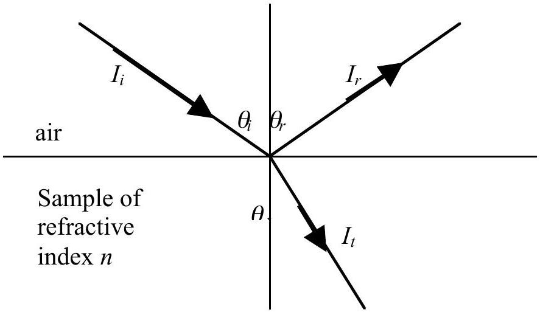
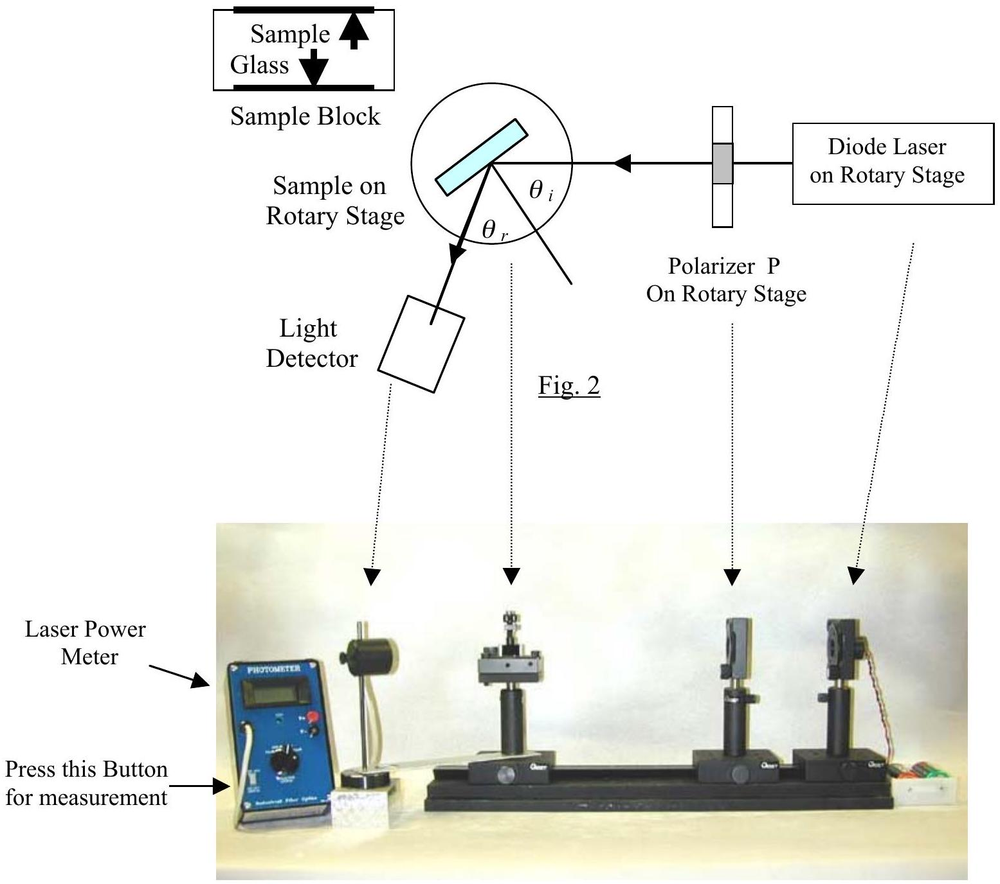

## $3{ }^{\text {rd }}$ Asian Physics Olympiad   Singapore

Experimental Competition
(The Experimental Competition consists of two parts, Part A and Part B)
May 10, 2002

## PART A

Time Available: 2_ hours for Part A
Read This First

1. In this experiment, you are not expected to indicate uncertainties of your experimental results.
2. Use only the pen provided
3. Use only the front side of the answer sheets and blank work sheets furnished.
4. Express your answers primarily in equations, numbers and figures. Use as little text as possible. Underline your final result if it is a numeric number.
5. The blank work sheets are to be used for equation derivations, measurement data and whatever else you consider is required for the solution of the question and that you wish to be marked. If you use some blank sheets of paper for notes that you do not wish to be marked, put a large cross through the whole sheet and do not include them in your numbering.
6. It is absolutely essential that you enter in the boxes at the top of answer sheets, work sheets and graph papers: your Name, your Country and your Student No. In addition, on the blank work sheets you should enter the Question Part No., the progressive Page No. of each sheet and the Total Pages of blank work sheets that you have used and wish to be marked.
7. At the end of 2_ hours for your first half of the competition, please staple your answer sheets and graphs in order, before proceeding to the second Part of the competition.

## Part A

## Measurement of Reflectance and Determination of Refractive Index

## I. Background

The aim of this experiment is to measure the angular dependence of reflection of polarized light and to determine the refractive index of a semiconductor wafer.

When light falls on a semiconductor surface it will be partially reflected, partially transmitted and partially absorbed. The relative amount of light power reflected is called reflectance $R$, which is defined as the ratio of the reflected power $I_{r}$ over the incident power $I_{i}$ :

$$
R=\frac{I_{r}}{I_{i}}
$$

The incident light may be resolved into two polarized components. One component is polarized parallel (labeled as $p$-polarization) to the plane of incidence, and the other polarized perpendicular (labeled as $s$-polarization) to the plane of incidence. For the red laser wavelength used in this study, the effects of absorption at the semiconductor surface are negligible. Under such condition, for an incident light from air onto a material the reflectance $R_{p}$ and $R_{s}$, respectively for the $p$ and $s$ components, are given by the Fresnel equations:

$$
\begin{aligned}
& \pm \sqrt{R_{p}}=\frac{n \cos \grave{e}_{i}-\cos \grave{e}_{t}}{\cos \grave{e}_{t}+n \cos \grave{e}_{i}} \\
& -\sqrt{R_{s}}=\frac{\cos \grave{e}_{i}-n \cos \grave{e}_{t}}{\cos \grave{e}_{i}+n \cos \grave{e}_{t}}
\end{aligned}
$$

where $n$ is the refractive index of the material, $\theta_{i}$ is the angle of incidence, $\theta_{r}$ the angle of reflection, and $\theta_{t}$ the angle of transmission (or refraction), as shown in Fig. 1.

Fig. 1

Direct measurements of $R_{s}$ and $R_{p}$ with $\theta_{i}=0$ are practically not feasible. However, the Fresnel equations allow the calculation of n from $R_{s}$ and $R_{p}$ obtained for any oblique incident angle. A possible schematic diagram for the measurement is shown in Fig. 2 below, and a photograph of the suggested setup is shown in Fig.3.

Fig. 3

Note: The reference line for angular setting is on the upper left corner of the rotary stage
II. Equipment and Materials

(1) A diode laser mounted on rotary stage together with 3V battery supply. The laser emits a wavelength 650 nm.
Caution: Do not look into the laser beam Watch out for strayed or scattered laser light

Keep the glass and sample surfaces clean with tissues provided

(2) A linear polarizer of diameter 20 mm mounted on a rotary stage. (Note: The angular setting of $0^{\circ}$ of the rotary stage has no bearing on the polarization axis of the polarizer.)
(3) A glass plate (refractive index 1.57 for light of wavelength 650 nm) and a semiconductor wafer, fixed on the opposite sides of a rectangular sample block.
(4) Rotary optical stage with clamp for the sample block
(5) A digital laser power meter, with light detector head mounted on a stand that can be revolved about the sample.
(6) One optical bench
(7) Graph paper for reflected laser power vs angular setting of the rotary stage for polarizer (2 sheets)
(8) Graph paper for reflectance vs incident angle (4 sheets)
(9) Light-shielding board
(10) A torch light and a flexible ruler

III. Experiments and Calculations
(1): Determine the plane of polarization of the incident laser light. (1 point)

The diode laser emits partially linearly polarized light at 650 nm . For best results in your measurements to be performed, the polarization axis of the polarizer should be aligned with the strongest linear component of the laser light.

In order to obtain $R_{\mathrm{S}}$ or $R_{p}$, one needs to determine the orientation of the polarization axis of the polarizer in order to produce polarized light parallel or perpendicular to the plane of incidence. The axis of polarization of the polarizer can be inferred from the laser power reflected from the glass sample of known refractive index 1.57.

With the optics aligned as accurately as possible,

a) Determine the relative orientation of diode laser and polarizer (difference in degree between the angular settings of the diode laser rotary stage and the polarizer rotary stage) such that the polarizer is aligned with the strongest linear component of the laser light. In the measurements that follow, treat the polarizer and the source as a single system, rotating both together as necessary.
b) Mount the glass sample on the rotary stage at the Brewster angle of incidence. Measure and plot the reflected laser power vs the angular setting (in degrees) of the polarizer. Hence determine the orientation of the polarization axis of the polarizer.
Note: You will have to press the button (as indicated in Fig. 3) on the laser power meter each time to take a reading.

(2): Measure the reflectance $R_{p}$ and $R_{\underline{s}}$ of the semiconductor wafer (5 points)

Mount the sample block on the rotary stage so that the reflecting plane of the semiconductor wafer can be rotated about a vertical axis on the path of the incident light.

With the optics aligned as accurately as possible,

a) Set the orientation of the incident light onto the semiconductor wafer such that it is polarized parallel to the plane of incidence.
Measure the reflected laser power and plot the values of $R_{p}$ as a function of incident angle for a widest range of incident angles permitted by the experimental setup.
b) Change the orientation of the incident light onto the semiconductor wafer such that it is polarized perpendicular to the plane of incidence.
Measure the reflected laser power and plot the values of $R_{s}$ as a function of incident angle for a widest range of incident angles permitted by the experimental setup.

(3) : Calculate the refractive index of the semiconductor wafer (4 points)
    (a) From the Fresnel equations, show that $n=\sqrt{\frac{\left(1 \pm \sqrt{R_{p}}\right)\left(1+\sqrt{R_{s}}\right)}{\left(1+\sqrt{R_{p}}\right)\left(1-\sqrt{R_{s}}\right)}}$
From your graphs or otherwise determine the ranges of the angle of incidence where the signs of $\pm \sqrt{R_{p}}$ are positive and negative.
    (b) Using the graphs obtained in Question (2), obtain six sets of values for $R_{p}$ and $R_{s}$ at angles of incidence of 20°, 30°, 40°, 50° 60° and 80°.
Calculate six values of the refractive index $n$ of the semiconductor wafer using these six sets of values. Compute the mean value for $n$ and estimate its standard deviation.
    (c) Using the graphs obtained in Question (2), determine $R_{S}$ and $R_{p}$ at normal incidence by extrapolation. Hence calculate the average refractive index $n$ of the semiconductor wafer from the results of extrapolation.
