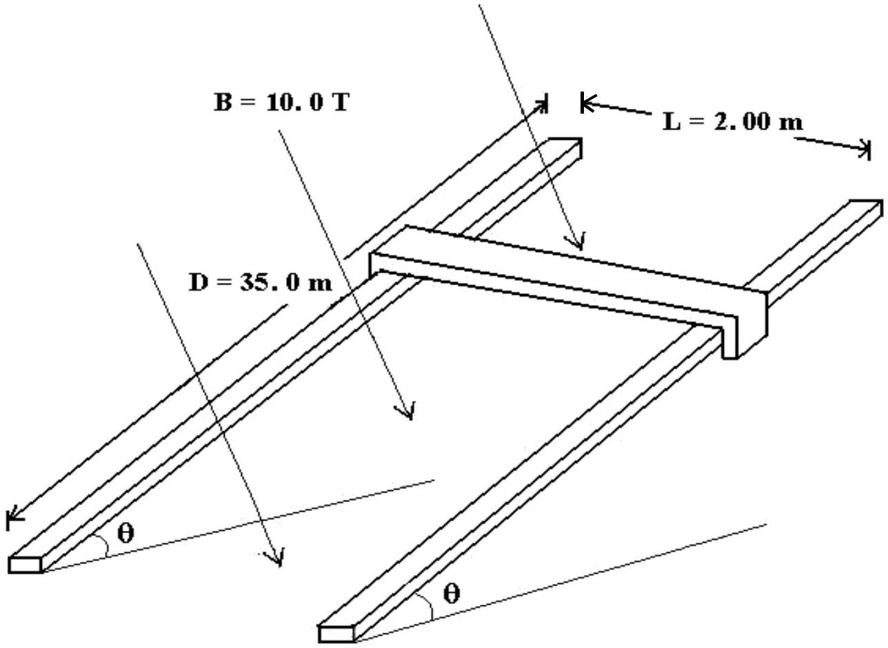
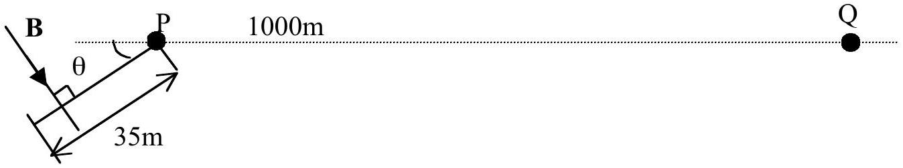

## Theoretical Question 2 (the rail gun)

A young man at P and a young lady at Q were deeply in love. These two places are separated by a strait of width $w=1000 \mathrm{~m}$. After learning about the theory of rail gun in class, the young man could not wait to construct such a device to launch himself across the strait. He constructed a ramp of adjustable elevation of angle $\theta$ on which he laid two metal rails (the length of each rail is $D=35.0 \mathrm{~m}$ ) in parallel, separated by $L=$ 2.00 m . He managed to connect a 2424 V DC power supply to the ends of the rails. A conducting bar can slide freely on the metal rails such that he could hang on to it safely as it slides.

A skilled engineer, moved by all these efforts, designed a system that can produce a $B=10.0 \mathrm{~T}$ magnetic field that can be directed perpendicular to the plane of the rails. The mass of the young man is 70 kg . The mass of the conducting bar is 10 kg and its resistance is $\mathrm{R}=1.0 \Omega$.

Just after he had completed the construction and checked that it worked perfectly, he received a call from the young lady, sobbing and telling him that her father was going to marry her off to a rich man unless he can arrive at Q within 11 seconds after the call, and having said that she hang up.

The young man immediately got into action and launched himself across the strait to Q.

Show, using the steps listed below, whether it is possible for him to make it in time, and if so, what is the range of $\theta$ he must set the ramp?

(a) Derive an expression for the acceleration of the young man parallel to the rail.

[3 marks]

(b) Obtain an expression in terms of $\theta$ for the time spent
    i. on the rails, $t_{s}$ and
    ii. in flight, $t_{f}$.

[3 marks]

(c) Plot a graph of the total time $T=t_{s}+t_{f}$ against the angle of inclination $\theta$.
[1.5 marks]
(d) By considering the relevant parameters of this device, obtain the range of angles that he should set. Plot another graph if necessary.
[2.5 marks]

Make the following assumptions:

1) The time between the end of the call and all preparations (such as setting $\theta$ to the appropriate angle) for the launch is negligible. This is to say, the launch is considered to start at time $t=0$ when the bar (with the young man hanging to it) is starting to move.
2) The young man may start his motion from any point along the metal rails.

3) The higher end of the ramp and Q is at the same level, and the distance between them is $w=1000 \mathrm{~m}$.
4) There is no question about safety such as when landing, electric shocks, etc.
5) The resistance of the metal rails, the internal resistance of the power supply, the friction between the conducting bar and the rails and the air resistance are all negligible.
6) Take acceleration due to gravity as $g=10 \mathrm{~m} / \mathrm{s}^{2}$.

Some Mathematical notes:

1. $\int e^{-a x} d x=-\frac{e^{-a x}}{a}$.
2. The solution to $\frac{d x}{d t}=a+b x$ is given by
$$
x(t)=\frac{a}{b}\left(e^{b t}-1\right)+x(0) e^{b t} .
$$
