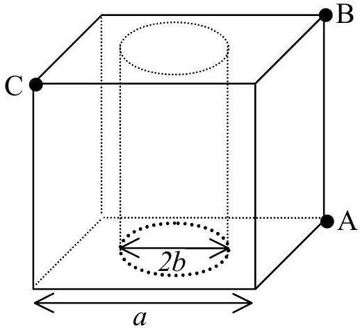
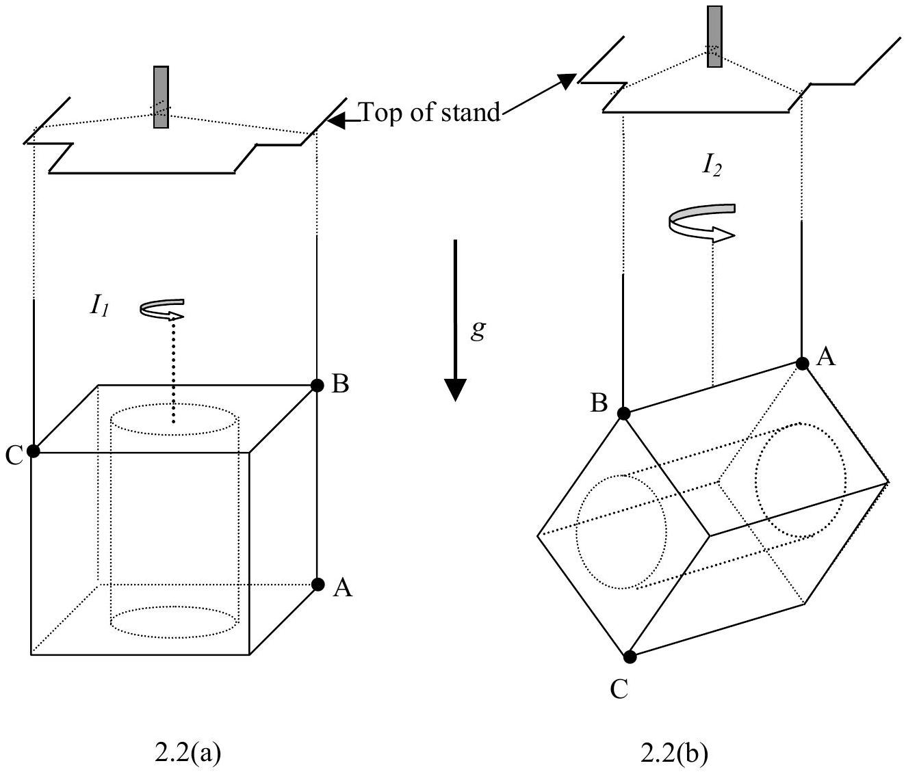
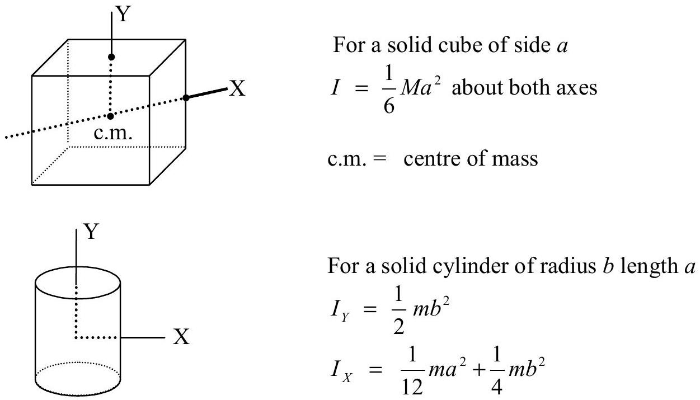

## Experimental Competition

## II. Cylindrical Bore

## Background

There are many techniques to study the object with a bore inside. Mechanical oscillation method is one of the non-destructive techniques. In this problem, you are given a brass cube of uniform density with cylindrical bore inside. You are required to perform non-destructive mechanical measurements and use these data to plot the appropriate graph to find the ratio of the radius of the bore to the side of the cube.

The cube of sides $a$ has a cylindrical bore of radius $b$ along the axis of symmetry as shown in Fig. 2.1. This bore is covered by very thin discs of the same material. A, B and C represent small holes at the corners of the cube. These holes can be used for suspending the cube in two configurations. Fig. 2.2(a) shows the suspension using B and C; the other suspension is by using A and B as shown in Fig 2.2(b).

Fig. 2.1 Geometry of cube with cylindrical bore

Fig. 2.2 Two configurations of cube's suspension

Students may use the following in their derivation of necessary formulae:

## Materials and apparatus

1. brass cube
2. stop watch
3. stand
4. thread
5. ruler/ centimeter stick
6. linear graph papers

## Experiment

a) Choose only one of the two bifilar suspensions as shown in Fig. 2.2, and derive the expressions for the moment of inertia and the period of oscillation about the vertical axis through the centre of mass in terms of $\ell, d, b, a$ and $g$ where $\ell$ is the length of each thread and $d$ is the separation between threads. (2 points)
b) Perform necessary non-destructive mechanical measurements and use these data to plot an appropriate graph and then find the value of $\frac{b}{a}$. (8 points)

The value of $g$ for Bangkok $=9.78 \mathrm{~m} / \mathrm{s}^{2}$.
