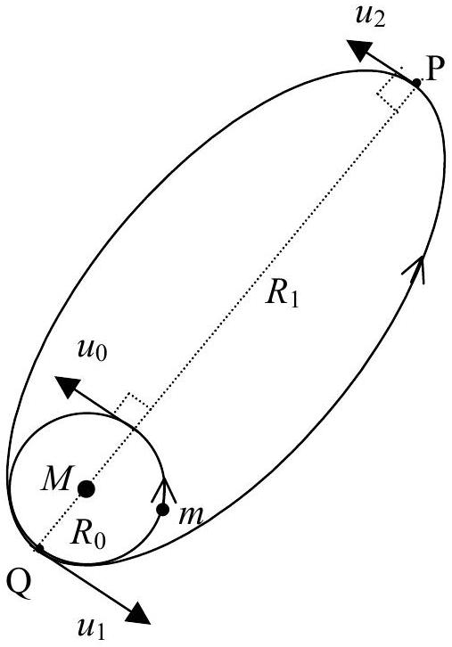
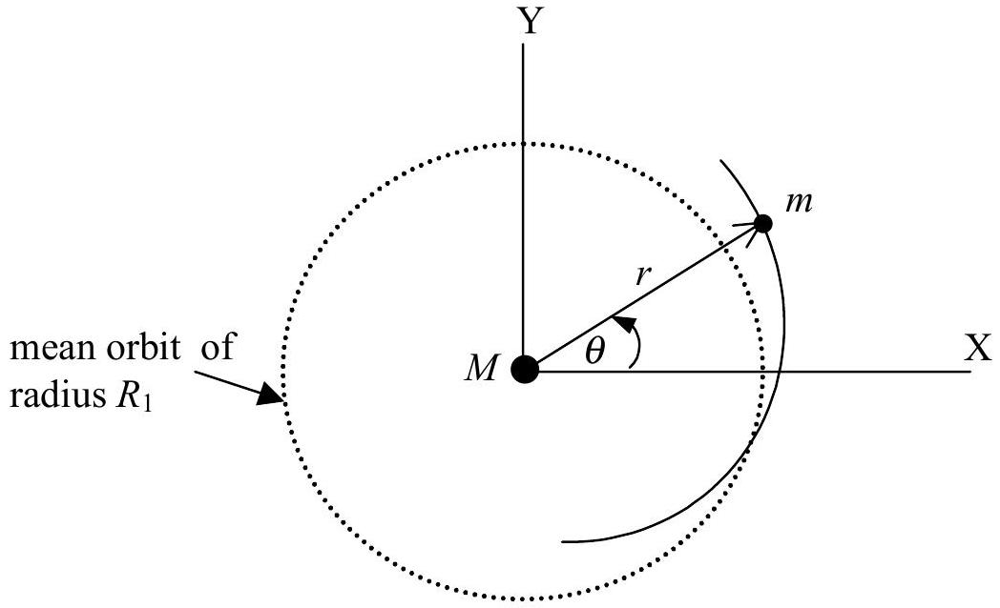

## Theoretical Competition

## I. Satellite's orbit transfer

In the near future we ourselves may take part in launching of a satellite which, in point of view of physics, requires only the use of simple mechanics.

a) A satellite of mass $m$ is presently circling the Earth of mass $M$ in a circular orbit of radius $R_{0}$. What is the speed ( $u_{0}$ ) of mass $m$ in terms of $M, R_{0}$ and the universal gravitation constant $G$ ? (1 point)
b) We are to put this satellite into a trajectory that will take it to point P at distance $R_{1}$ from the centre of the Earth by increasing (almost instantaneously) its velocity at point Q from $u_{0}$ to $u_{1}$. What is the value of $u_{1}$ in terms of $u_{0}, R_{0}, R_{1}$ ? (2 points)
c) Deduce the minimum value of $u_{1}$ in term of $u_{0}$ that will allow the satellite to leave the Earth's influence completely. (1 point)
d) (Referring to part b.) What is the velocity $\left(u_{2}\right)$ of the satellite at point P in terms of $u_{0}, R_{0}, R_{1}$ ? (1 point)
e) Now, we want to change the orbit of the satellite at point P into a circular orbit of radius $R_{1}$ by raising the value of $u_{2}$ (almost instantaneously) to $u_{3}$.
What is the magnitude of $u_{3}$ in terms of $u_{2}, R_{0}, R_{1}$ ? (1 point)

f) 
If the satellite is slightly and instantaneously perturbed in the radial direction so that it deviates from its previously perfectly circular orbit of radius $R_{1}$, derive the period of its oscillation $T$ of $r$ about the mean distance $R_{1}$.
Hint: Students may make use (if necessary) of the equation of motion of a satellite in orbit:
$$
m\left[\frac{d^{2}}{d t^{2}} r-\left(\frac{d}{d t} \theta\right)^{2} r\right]=-G \frac{M m}{r^{2}}
$$
and the conservation of angular momentum:
$$
m r^{2} \frac{d}{d t} \theta=\text { constant }
$$
(3 points)
g) Give a rough sketch of the whole perturbed orbit together with the unperturbed one.
(1 point)
