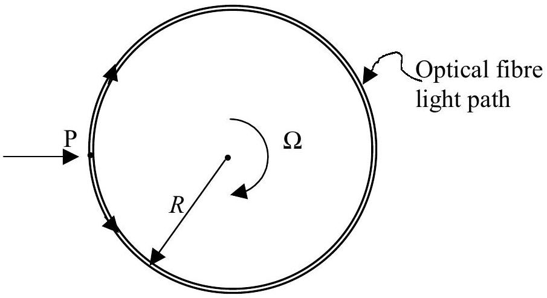
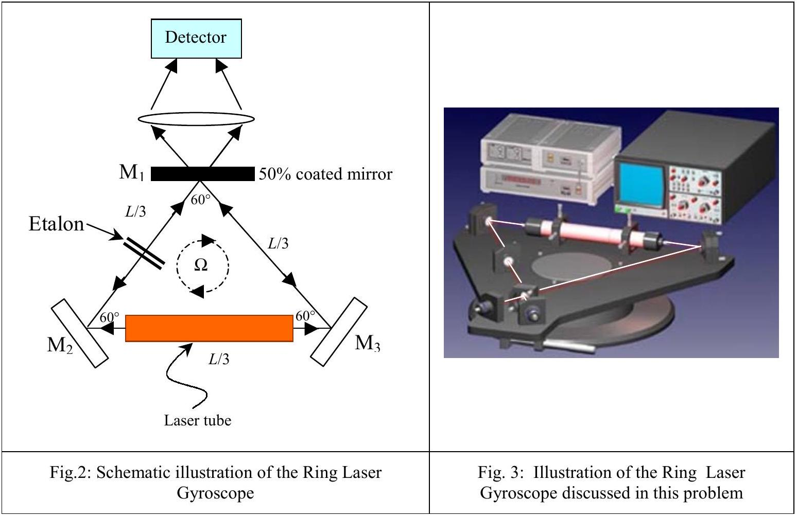

## II. Optical Gyroscope

In 1913 Georges Sagnac (1869-1926) considered the use of a ring resonator to search for the aether drift relative to a rotating frame. However, as often happen, his results turned out to be useful ways that Sagnac himself never dreamt of. One of those applications is the Fibre-Optic Gyroscope (FOG) which is based upon a simple phenomena, first observed by Sagnac. The essential physics associated with the Sagnac effect is due to the phase shift caused by two coherent beams of light being sent around a rotating ring of optical fibre in the opposite directions. This phase shift is also used to determine the angular speed of the ring.

As shown in a schematic diagram in Fig. 1, a light wave enters a circular optical fibre light path of radius $R$ at point P on the rotating platform with a uniform angular speed $\Omega$, in the clockwise direction. Here the light wave is split into two waves which travels in the opposite directions, clockwise (CW) and counter clockwise (CCW), through the ring. The refractive index of optical fibre material is $\mu$. Assuming the light traveling inside the fibre-optic cable is a smooth circular path of radius $R$.

Fig. 1

a) Practically, the orbital speed of the ring is much less than the speed of light such that $(R \Omega)^{2} \ll c^{2}$, find the time difference $\Delta t=t^{+}-t^{-}$where $t^{+}$and $t^{-}$denote the round-trip transit time of the CW and CCW beam respectively. Give your answer in term of area $A$ enclosed by the ring. (2 points)
b) Find the optical path difference, $\Delta L$, for the CW and CCW beams to complete one round-trip of the light within the rotating ring. (2 points)
c) For a circular fibre-optic of radius, $R=1 \mathrm{~m}$, what is the maximum value of $\Delta L$ for the rotation of the earth? Given $\mu=1.5$. (1 point)
d) In part b), the measurement could be amplified by increasing number of turns in fibre-optic coil, $N$, find the phase difference, $\Delta \theta$, for lights to complete the turns.

(1 point)

The second scheme of the Optical Gyroscope is Ring Laser Gyroscope (RLG). This could be accomplished by the inclusion of active laser cavity into an equilateral triangular ring, of total length $L$, as illustrated in Fig.2. The laser source here will generate two amplified coherent light sources propagating in the opposite directions. In order to sustain the laser oscillation in this triangular ring resonator, the perimeter of the ring must be equal to the integer multiple of wavelength $\lambda$. Etalon, additional component inserted into the ring, is possible to cause frequency selective losses in the ring resonator, so that the undesired modes can be damped and suppressed.

e) Find the time difference of the transit in clockwise and counterclockwise, $\Delta t$, for the case of the triangular ring as shown in the figure 2. Give the answer in terms of $\Omega$ and the area $A$ enclosed by the ring. Show that this result is the same as that of the circular ring. (2 points)
f) If the ring is rotating with an angular frequency $\Omega$ as shown in Fig. 2, there will be frequency difference between CW and CCW measurements. What is the observed beat frequency, $\Delta v$, between the CW and CCW beams in terms of $L, \Omega, \lambda$.

(2 points)
