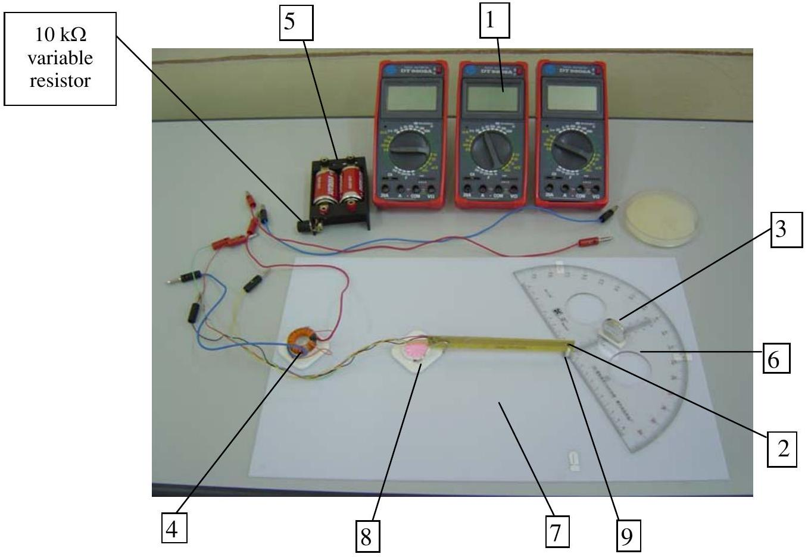
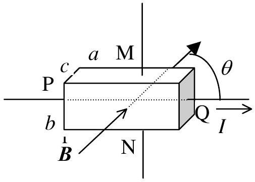
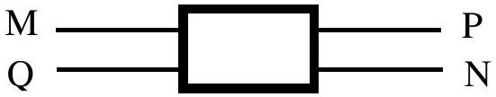

## Experimental competition- Problem No. 1   Hall effect and magnetoresistivity effect

## APPARATUS AND MATERIALS

1. Three digital multimeters.
2. A Hall sensor with four pins MNPQ (M in black wire, N yellow wire, P red wire, Q green wire), fixed on a printed circuit, a pair of conductors leading to M, N; another pair of conductors leading to P, Q.
3. A permanent magnet in the shape of a disk, of radius $r=14 \mathrm{~mm}$, of thickness $t=4 \mathrm{~mm}$. The magnetization is perpendicular to the surface of the disk. The value $B_{0}$ (in Tesla) of the magnetic field at the surface of the magnet is written on the magnet's surface.

During the experiment, keep the magnet far away from the Hall sensor whenever you do not use it.
4. A coil of $N$ turns is wound on a core having the shape of a toroid, made of a ferromagnetic material. The average diameter of the core is $\rho=25 \mathrm{~mm}$. The toroid has a gap of width $d=3 \mathrm{~mm}$.
5. A box with two independent 1.5 V dry cells. The cell connected in series to a $10 \mathrm{k} \Omega$ variable resistor, called battery 1, is used to supply the current to the Hall sensor. The second cell, called battery 2, is used to supply the current to the coil only during the measurement.
6. A protractor with a small hole at its center.
7. A piece of plexiglass with a small needle fixed on it.
8. A holder for the printed circuit with the Hall sensor.
9. A small piece of plastic used to fix the sensor on the needle.
10. Conductors with negligible resistance.
11. Graph papers.

Figure 1

## EXPERIMENT

## I. Introduction

## 1. The magnetoresistivity effect and the Hall effect.

Consider a conductor sample in the shape of a parallelopiped of length $a$, width $b$ and thickness $c$ (see Figure 2). The current $I$ flows along the direction of $a$. If the sample is placed in a magnetic field $\stackrel{1}{B}$, the magnetic field affects the resistance $R$ of the sample. This effect is called magneto-resistivity effect (MRE). Let $\Delta R$ be the increase of the resistance $R$ of the sample, $R_{0}$ - the value of the resistance in the absence of a magnetic field, then the

Figure 2

magnitude of the MRE is defined by the ratio $\Delta R / R_{0}$.

Assume that the applied magnetic field is uniform and the magnetic induction vector $\stackrel{1}{B}$ is parallel to the top face of the sample as shown in Figure 2. If the charge carriers in the sample are electrons, the Lorentz force will bend them upward, and the top face of the sample will be charged negatively. This effect is called the Hall effect. The voltage appearing between electrodes M (on the top face) and N (on the bottom face) is called the Hall voltage. This can be measured by use of a voltmeter.

The potential difference measured between the electrodes M and N is given by

$$
U_{\mathrm{MN}}=U_{\mathrm{H}}+V_{\mathrm{MN}}
$$

where, $U_{\mathrm{H}}$ is the Hall voltage, $V_{\mathrm{MN}}$ is the potential difference in the absence of a magnetic field due to some undesired effects (the electrodes M and N being not exactly opposite to each other, etc...).

Normally, the Hall voltage $U_{\mathrm{H}}$ is proportional to $I B . \sin \theta$, and the magnitude of the MRE is proportional to $B^{2} \sin ^{2} \theta$, where $\theta$ is the angle between vector $\stackrel{1}{B}$ and the current direction. But when the sample has a non regular shape, the dependence of $U_{H}$ and $\Delta R / R$ on $B \sin \theta$ may be more complicated.

The Hall effect is used to fabricate a device for measuring the magnetic field. This device is called the Hall sensor. For Hall sensor, the expression of $U_{\mathrm{H}}$ is given by:

$$
U_{\mathrm{H}}=\alpha . I . B . \sin \theta
$$

where $\alpha$ is, by definition, the sensitivity of the Hall sensor.

## II. The measuring sample:

The measuring sample in this experiment is a commercial Hall sensor. It consists of a small thin semiconductor plate covered with plastic, with 4 ohmic electrodes, leading to the pins M, N, P, Q (see Figure 3). It is used in this experiment to study both the MRE and the Hall effect.

Figure 3

Place the sensor in the magnetic field and use an ohmmeter to mesure the resistance between pins M and N, we can deduce the magnitude of the MRE. Set a current $(I \sim 1 \mathrm{~mA})$ flowing from P to Q, we can study the Hall effect by measuring the voltage between M and N with a milivoltmeter.

## III. Experiment

## 1. Determination of the sensitivity $\alpha$ of the Hall sensor

Set the current through the sensor $I \sim 1 \mathrm{~mA}$. Keep the distance between the sensor and the centre of the surface of the magnet $y=2 \mathrm{~cm}$. Adjust the orientation of the magnet to obtain maximal value of the Hall voltage. Measure the Hall voltage with some values of $I$ and determine the sensitivity $\alpha$ of the Hall sensor.

For a magnet having the shape of a disk of radius $r$, thickness $t$, the magnetic field at a point situated on its axis at a distance $y$ from the center of the disk surface with $y \gg t$ is given by the expression

$$
B(y)=\frac{1}{2} B_{0}\left[\frac{y+t}{\sqrt{(y+t)^{2}+r^{2}}}-\frac{y}{\sqrt{y^{2}+r^{2}}}\right]
$$

where $B_{0}$ is the magnetic induction at the surface of the magnet. The value of $B_{0}$ is given on the surface of the magnet.
[2.0 pts]
2. Study of the dependence of $\boldsymbol{U}_{\mathbf{H}}$ on angle $\boldsymbol{\theta}$ between $\stackrel{1}{B}$ and the current direction.

Set the current through the sensor $I \sim 1 \mathrm{~mA}$. Keep the distance between the sensor and the centre of the surface of the magnet $y=2 \mathrm{~cm}$. Put the magnet on the protractor so that the plane of the magnet is perpendicular to the line connecting the sensor and centre of the magnet.

a. Draw a sketch of the experimental arrangement.
b. Tabulate the values of $U_{\mathrm{H}}$ for $\theta$ in the range of $-90^{\circ} \leq \theta \leq 90^{\circ}$.
c. Verify the proportionality between $\mathrm{U}_{\mathrm{H}}$ and $\sin \theta$ by using a graph plotted in an appropriate way.
[2.5 pts]
3. Study of the dependence of $\Delta \boldsymbol{R} / \boldsymbol{R}$ on $\boldsymbol{B}$, for $\stackrel{1}{B}$ perpendicular to the sample plane.

The MRE is significant only at sufficiently strong magnetic field. So it is recommended to use a magnetic field as strong as possible.

a. Draw a sketch of the experimental arrangement and explain the principle of the measurements.
b. Perform measurements and tabulate the data.
c. Assume that $\Delta R / R \sim B^{k}$, determine the value of $k$ by using a graph plotted in an appropriate way. Estimate the maximal deviation of the obtained value of $k$. [4.0 pts]

## 4. Determination of the relative permeability $\boldsymbol{\mu}$ of the ferromagnetic materials of the core of the toroidal coil

Determine the relative permeability $\mu$ of the core material at the measured current intensity $I$ by following this guidance step by step:

- Put the Hall sensor into the gap on the core.
- Connect the coil and an ammeter to battery 2. Use only the inputs COM and 20A of the ammeter in this case.
- Measure the current $I$ in the coil and the magnetic field $B$ in the gap.
- Calculate the value of $\mu$

You can use the following relation:

$$
\frac{B \cdot(\rho-d)}{\mu}+B \cdot d=4 \pi \cdot 10^{-7} \cdot N \cdot I
$$

[1.5 pts]
