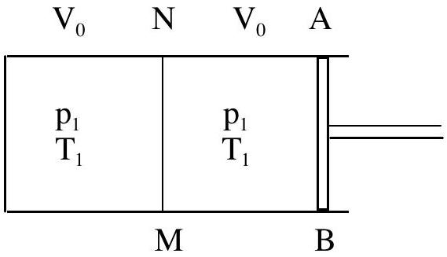

## Theoretical Competition-Problem No. 3 Compression and expansion of a two gases system

A cylinder is divided in two compartments with a mobile partition NM. The compartment in the left is limited by the fond of the cylinder and the partition NM (Figure 1). This compartment contains one mole of water vapor. The compartment in the right is limited by the partition NM and a mobile piston AB. This compartment contains one mole of nitrogen gas $\left(\mathrm{N}_{2}\right)$.

At first, the volumes and temperatures of the gases in two compartments are equal. The partition NM is well heat conductive. His heat capacity is very small

Figure 1

and can be neglected.

The specific volume of liquid water is negligible in comparison with the specific volume of water vapor at the same temperature.

The specific latent heat of vaporization $L$ is defined as the amount of heat that must be delivered to one unit of mass of substance to convert it from liquid state to vapor at the same temperature. For water at $T_{0}=373 \mathrm{~K}, L=2250 \mathrm{~kJ} / \mathrm{kg}$.

1. Suppose that the piston and the wall of the cylinder are heat conductive, the partition NM can slide freely without friction. The initial state of the gases in the cylinder is defined as follows:

Pressure $p_{1}=0.5 \mathrm{~atm}$.; total volume $V_{1}=2 V_{0}$; temperature $T_{1}=373 \mathrm{~K}$.
The piston AB slowly compresses the gases in a quasi-static (quasi-equilibrium) and isothermal process to the final volume $V_{\mathrm{F}}=V_{0} / 4$
a. Draw the $p(V)$ curve, that is the curve representing the dependence of pressure $p$ on the total volume $V$ of both gases in the cylinder at temperature $T_{1}$. Calculate the coordinates of important points of the curve. [1.5 pts]

Gas constant: $R=8.31 \mathrm{~J} / \mathrm{mol} . \mathrm{K}$ or $R=0.0820 \mathrm{~L} . \mathrm{atm} . / \mathrm{mol} . \mathrm{K}$

$$
1 \mathrm{~atm} .=101.3 \mathrm{kPa} ;
$$

Under the pressure $p_{0}=1 \mathrm{~atm}$., water boils at the temperature $T_{0}=373 \mathrm{~K}$.

b. Calculate the work done by the piston in the process of gases compressing. [1.0 pts]
$$
\int \frac{d V}{V}=\ln V
$$
c. Calculate the heat delivered to outside in the process. [1.5 pts]
2. All conditions as in 1. except that there is friction between partition NM and the wall of the cylinder so that NM displaces only when the difference of the pressures acting on its two opposed faces attains 0.5 atm. and over (assuming that the coefficients of static and kinetic friction are equal).
a. Draw the $\mathrm{p}(\mathrm{V})$ curve representing the pressure $p$ in the right compartment as a function of the total volume $V$ of both gases in the cylinder at a constant temperature $\mathrm{T}_{1}$. [1.5 pts]
b. Calculate the work done by the piston in compressing the gases. [0.5 pts]

c. After the volume of gases reaches the value $V_{F}=V_{0} / 4$, piston AB displaces slowly to the right and makes a quasi-static and isothermal process of expansion of both substances (water and nitrogen) to the initial total volume $2 V_{0}$. Continue to draw in the diagram in question 2.a. the curve representing this process [2.0 pts]

Hint for 2.
Create a table like the one shown here and use it to draw the curves as required in 2.a. and 2.c.

| State | Left compartment Volume \| Pressure |  |  |  | Right compartment Volume \| Pressure | Total volume | Pressure on piston AB |
| :--- | :--- | :--- | :--- | :--- | :--- | :--- | :--- |
| initial | $V_{0}$ | I | 0.5 atm. | $V_{0}$ | 10.5 atm. | $2 V_{0}$ | 0.5 atm. |
| 2 |  | I |  |  | I |  |  |
| 3 |  | I |  |  | I |  |  |
| . |  | I |  |  | I |  |  |
| . |  | I |  |  | I |  |  |
| . |  | I |  |  | I |  |  |
| . |  | I |  |  | I |  |  |
| . |  | I |  |  | I |  |  |
| final |  | I |  |  | I | $2 V_{0}$ |  |

3. Suppose that the wall and the fond of the cylinder and the piston are heat insulator, the partition NM is fixed and heat conductive, the initial state of gases is as in 1. Piston AB moves slowly toward the right side and increases the volume of the right compartment until the water vapor begins to condense in the left compartment.
a. Calculate the final volume of the right compartment. [3 pts]
b. Calculate the work done by the gas in this expansion. [1 pts]

The ratio of isobaric heat capacity to isochoric one $\gamma=\frac{C_{p}}{C_{V}}$ for nitrogen is $\gamma_{1}=\frac{7}{5}$ and for water vapor $\gamma_{2}=\frac{8}{6}$.

In the interval of temperature from 353 K to 393 K one can use the following approximate formula:

$$
p=p_{0} \exp \left[-\frac{\mu L}{R}\left(\frac{1}{T}-\frac{1}{T_{0}}\right)\right]
$$

where $T$ is boiling temperature of water under pressure $p, \mu$ - its molar mass. $p_{0}, L$ and $T_{0}$ are given above.
