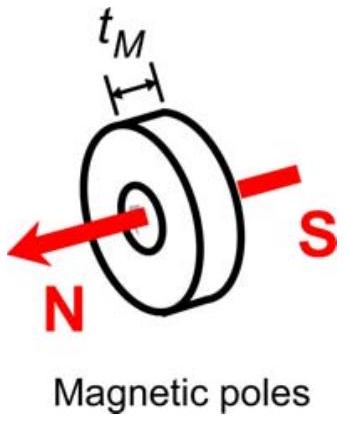
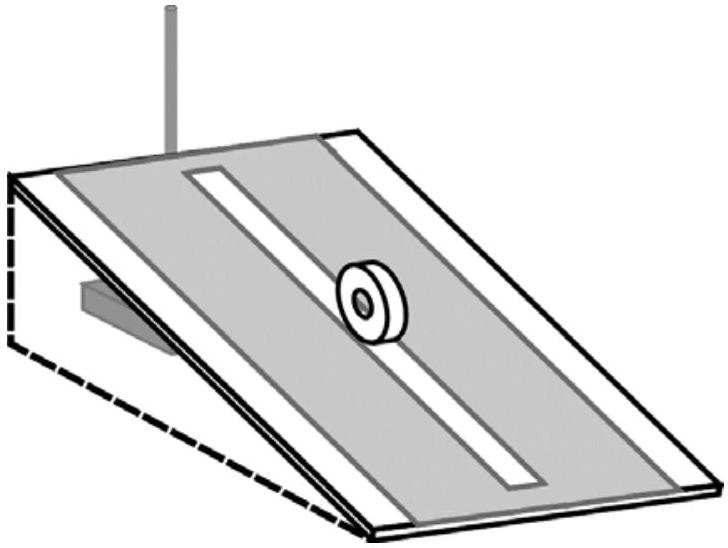
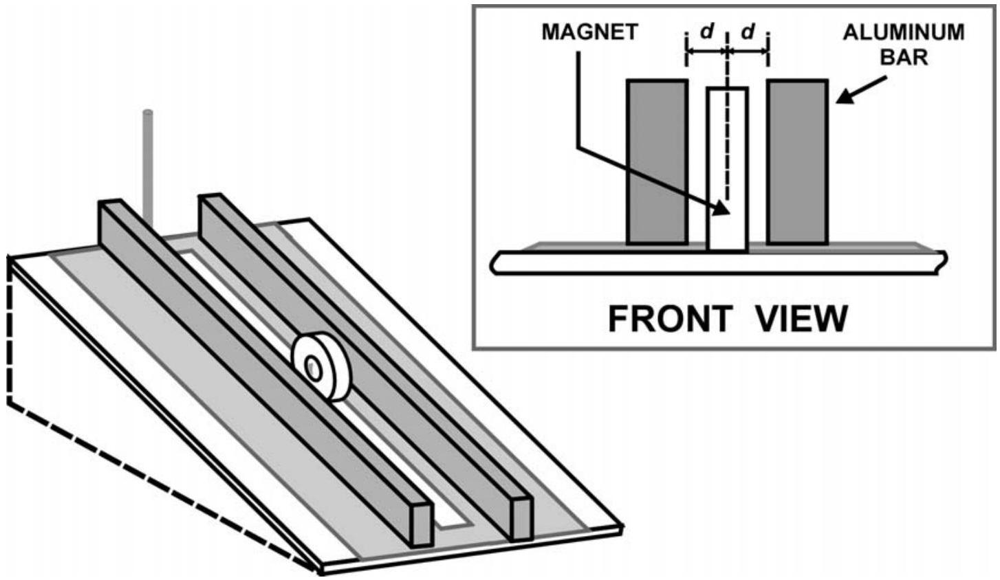

## 2. MAGNETIC BRAKING ON AN INCLINED PLANE

## INTRODUCTION

When a magnet moves near a non-magnetic conductor such as copper and aluminum it experiences a dissipative force called magnetic braking force. In this experiment we will investigate the nature of this force.

The magnetic braking force depends on:

- the strength of the magnet, determined by its magnetic moment $(\mu)$;
- the conductivity of the conductor $\left(\sigma_{\mathrm{C}}\right)$;
- the size and geometry of both magnet and the conductor;
- the distance between the magnet and conducting surface (d); and
- the velocity of the magnet ( $v$ ) relative to the conductor.

In this experiment we will investigate the magnetic braking force dependencies on the velocity ( $v$ ) and the conductor-magnet distance ( $d$ ). This force can be written empirically as:

$$
F_{M B}=-k_{0} d^{p} v^{n}
$$

where
$k_{0} \quad$ is an arbitrary constant that depends on $\mu, \sigma_{\mathrm{C}}$ and geometry of the conductor and magnet which is fixed in this experiment.
d is the distance between the center of magnet to the conductor surface
$v$ is the velocity of the magnet
$p$ and $n$ are the power factors to be determined in this experiment

## EXPERIMENTAL COMPETITION

## EXPERIMENT

In this experiment error analysis is required.

## APPARATUS

(1) Doughnut-shaped Neodymium Iron Boron magnet.
Thickness: $\quad t_{M}=(6.3 \pm 0.1) \mathrm{mm}$
Outer diameter: $\quad d_{M}=(25.4 \pm 0.1) \mathrm{mm}$
The poles are on the flat faces as shown:
(2) Aluminum bar (2 pieces)
(3) Acrylic plate for the inclined plane with a linear track for the magnet to roll

(4) Plastic stand
(5) Digital stop watch
(6) Ruler
(7) Graphic papers (10 pieces)

Additional information:
Local gravitational acceleration:

$$
\begin{aligned}
& g=9.8 \mathrm{~m} / \mathrm{s}^{2} \\
& m=(21.5 \pm 0.5) \mathrm{g}
\end{aligned}
$$

North-South direction is indicated on the table.
You can read the operation manual of the stopwatch
This problem is divided into two sections:

(A) Setup and introduction
(B) Investigation of the magnetic braking force

Remarks:
Make sure that the plane is clean before your experiment

## EXPERIMENTAL COMPETITION

## QUESTIONS

Please provide sufficient diagrams in your answers so that your work can be understood clearly

(A)Setup

Figure 1. Inclined plane setup without aluminum bars

Roll down the magnet along the track as shown. Choose a reasonably small inclination angle so that it does not roll too fast.

[1] As the magnet is very strong, it may experience significant torque due to interaction with earth's magnetic field. It will twist the magnet as it rolls down and may cause significant friction with the track. What will you do to minimize this torque? Explain it using diagram(s).

[1.0 pt]

## EXPERIMENTAL COMPETITION

Figure 2. A complete setup with aluminum bars

Place the two aluminum bars as shown in Figure 2 with distance approximately d = 5mm. Remember that the distance $\boldsymbol{d}$ is to the center of the magnet as shown in the inset of Figure 2.

Again release the magnet and let it roll. You should observe that the magnet would roll down much slower compared to the previous observation due to magnetic braking force.
[2].Provide diagram(s) of field lines and forces to describe the mechanism of magnetic braking.
[1.0 pt]

## EXPERIMENTAL COMPETITION

(B) Investigation of the magnetic braking force

The experimental setup remains the same as shown in Figure 2 with the same magnetconductor distance approximately $d=5 \mathrm{~mm}$ (about 2 mm gap between magnet and conductor on each side).
[1] Keeping the distance $d$ fixed, investigate the dependence of magnetic braking force on velocity ( $v$ ). Determine the exponent $\boldsymbol{n}$ of the speed dependence factor in Equation 1. Provide appropriate graph to explain your result.
[4.0 pt]
Now vary the conductor-magnet distance (d) on both left and right. Choose a fixed and reasonably small inclination angle.
[2] Investigate the dependence of the magnetic braking force on conductor-magnet distance ( $d$ ). Determine the exponent $\boldsymbol{p}$ of the distance dependence factor in Equation 1. Provide appropriate graph to explain your result.
[4.0 pt]
