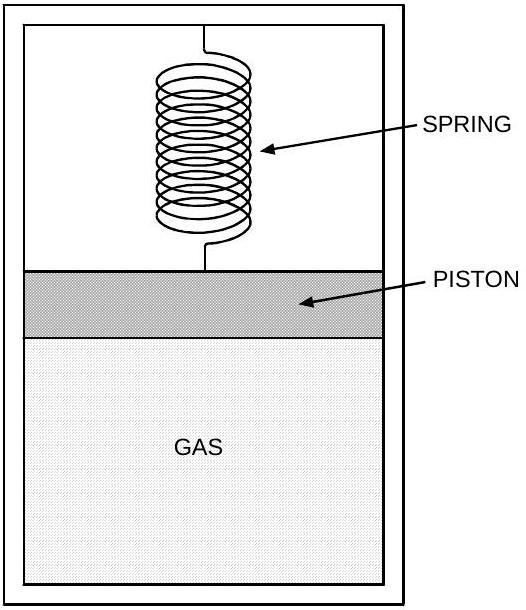
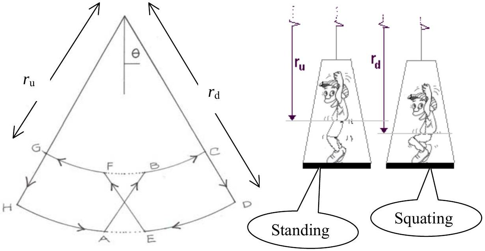

## Question 1

## 1A. SPRING CYLINDER WITH MASSIVE PISTON

Consider $n=2$ moles of ideal Helium gas at a pressure $P_{0}$, volume $V_{0}$ and temperature $T_{0}$ $=300 \mathrm{~K}$ placed in a vertical cylindrical container (see Figure 1.1). A moveable frictionless horizontal piston of mass $m=10 \mathrm{~kg}$ (assume $g=9.8 \mathrm{~m} / \mathrm{s}^{2}$ ) and cross section $A$ $=500 \mathrm{~cm}^{2}$ compresses the gas leaving the upper section of the container void. There is a vertical spring attached to the piston and the upper wall of the container. Disregard any gas leakage through their surface contact, and neglect the specific thermal capacities of the container, piston and spring. Initially the system is in equilibrium and the spring is unstretched. Neglect the spring's mass.

a. Calculate the frequency $f$ of small oscillation of the piston, when it is slightly displaced from equilibrium position. (2 points)

Figure 1.1

b. Then the piston is pushed down until the gas volume is halved, and released with zero velocity. calculate the value(s) of the gas volume when the piston speed is
$$
\sqrt{\frac{4 g V_{0}}{5 A}}
$$
(3 points)

Let the spring constant $k=m g A / V_{0}$. All the processes in gas are adiabatic. Gas constant $R=8.314 \mathrm{JK}^{-1} \mathrm{~mol}^{-1}$. For mono-atomic gas (Helium) use Laplace constant $\gamma=5 / 3$.

## THEORETICAL COMPETITION

FINAL PROBLEM

## 1B. THE PARAMETRIC SWING (5 points)

A child builds up the motion of a swing by standing and squatting. The trajectory followed by the center of mass of the child is illustrated in Fig. 1.2. Let $r_{\mathrm{u}}$ be the radial distance from the swing pivot to the child's center of mass when the child is standing, while $r_{\mathrm{d}}$ is the radial distance from the swing pivot to the child's center of mass when the child is squatting. Let the ratio of $r_{\mathrm{d}}$ to $r_{\mathrm{u}}$ be $2^{1 / 10}=1.072$, that is the child moves its center of mass by roughly 7\% compared to its average radial distance from the swing pivot.

To keep the analysis simple it is assumed that the swing be mass-less, the swing amplitude is sufficiently small and that the mass of the child resides at its center of mass. It is also assumed that the transitions from squatting to standing (the A to B and the E to F transitions) are fast compared to the swing cycle and can be taken to be instantaneous. It is similarly assumed that the squatting transitions (the C to D and the G to H transitions) can also be regarded as occurring instantaneously.

Figure 1.2

How many cycles of this maneuver does it take for the child to build up the amplitude (or the maximum angular velocity) of the swing by a factor of two?

## THEORETICAL COMPETITION

FINAL PROBLEM

| Country no | Country code | Student No. | Question No. | Page No. | Total No. of pages |
| :--- | :--- | :--- | :--- | :--- | :--- |
|  |  |  |  |  |  |

## ANSWER FORM

1A

a) $$
\begin{array}{lll}
f(\text { formula }) & = & \\
f & = & \mathrm{Hz}
\end{array}
$$
b) $$
\begin{aligned}
& V_{\text {gas }}(\text { formula })= \\
& \text { Value }(\text { s }) \text { of gas volume }=
\end{aligned}
$$

1B

N (number of cycles) =

## THEORETICAL COMPETITION

FINAL PROBLEM
