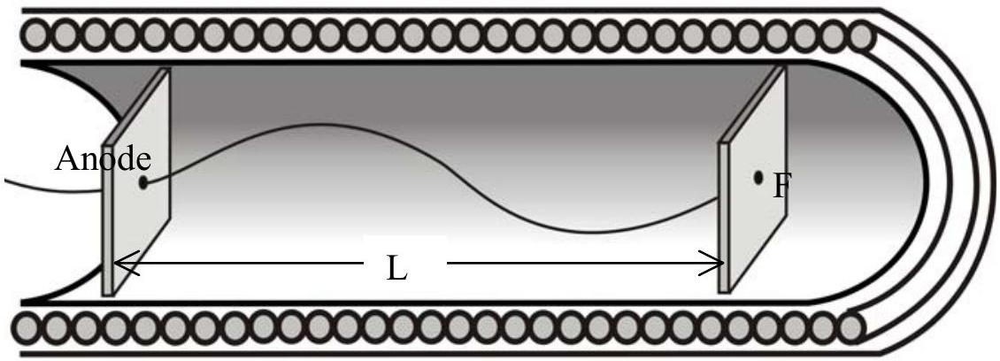
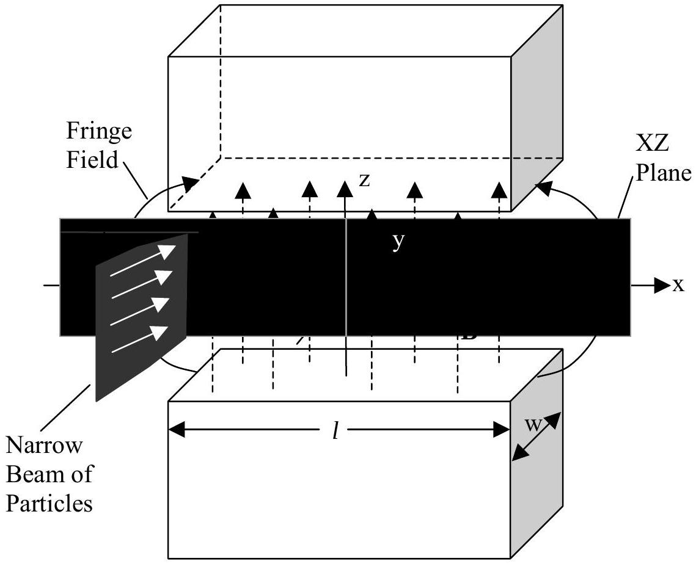
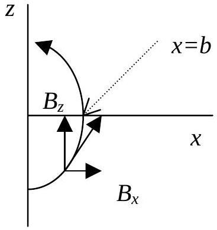
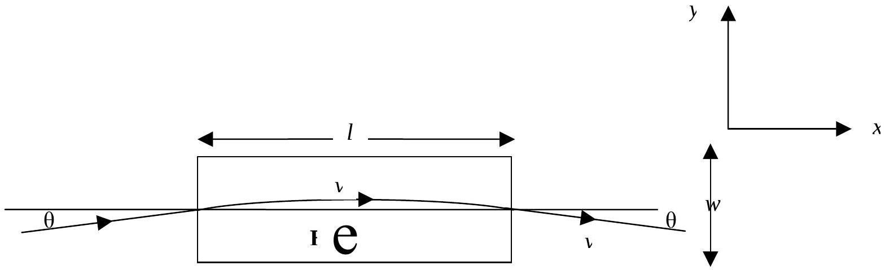
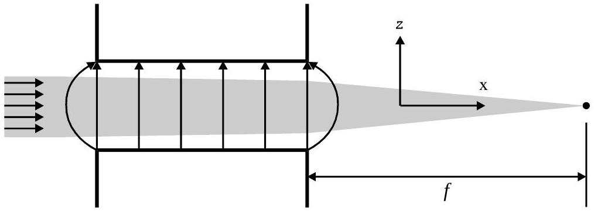

## Question 2 magnetic focusing

There exist many devices that utilize fine beams of charged particles. The cathode ray tube used in oscilloscopes, in television receivers or in electron microscopes. In these devices the particle beam is focused and deflected in much the same manner as a light beam is in an optical instrument.

Beams of particles can be focused by electric fields or by magnetic fields. In problem 2A and 2B we are going to see how the beam can be focused by a magnetic field.

## 2A. MAGNETIC FOCUSING SOLENOID (4 points)

Figure 2.1 shows an electron gun situated inside (near the middle) a long solenoid. The electrons emerging from the hole on the anode have a small transverse velocity component. The electron will follow a helical path. After one complete turn, the electron will return to the axis connecting the hole and point F . By adjusting the magnetic field $B$ inside the solenoid correctly, all the electrons will converge at the same point F after one complete turn. Use the following data:

- The voltage difference that accelerates the electrons $V=10 \mathrm{kV}$
- The distance between the anode and the focus point $\mathrm{F}, L=0.50 \mathrm{~m}$
- The mass of an electron $m=9.11 \times 10^{-31} \mathrm{~kg}$
- The charge of an electron $e=1.60 \times 10^{-19} \mathrm{C}$
- $\mu_{0}=4 \pi \times 10^{-7} \mathrm{H} / \mathrm{m}$
- Treat the problem non-relativistically
a) Calculate $B$ so that the electron returns to the axis at point F after one complete turn. (3 points)
b) Find the current in the solenoid if the latter has 500 turns per meter. (1 point)

Figure 2.1

## THEORETICAL COMPETITION

FINAL PROBLEM

## 2B. MAGNETIC FOCUSING (FRINGING FIELD) (6 points)

Two pole magnets positioned on horizontal planes are separated by a certain distance such that the magnetic field between them be $B$ in vertical direction (see Figure 2.2). The poles faces are rectangular with length $l$ and width $w$. Consider the fringe field near the edges of the poles (fringe field is field particularly associated to the edge effects). Suppose the extent of the fringe field is $b$ (see Fig. 2.3). The fringe field has two components $B_{X} \mathbf{i}$ and $B_{Z} \mathbf{k}$. For simplicity assume that $\left|B_{x}\right|=B|z| / b$ where $z=0$ is the mid plane of the gap, explicitly:

- when the particle enters the fringe field $B_{x}=+B z / b$,
- when the particle enters the fringe field after traveling through the magnet, $B_{x}=-B z / b$

Fig.2.2: Overall view (note that $\theta$ is very small).

## THEORETICAL COMPETITION

FINAL PROBLEM

Figure 2.3. Fringe field

A parallel narrow beam of particles, each of mass $m$ and positive charge $q$ enters the magnet (near the center) with a high velocity $v$ parallel to the horizontal plane. The vertical size of the beam is comparable to the distance between the magnet poles. A certain beam enters the magnet at an angle $\theta$ from the center line of the magnet and leaves the magnet at an angle $-\theta$ (see Figure 2.4. Assume $\theta$ is very small). Assume that the angle $\theta$ with which the particle enters the fringe field is the same as the angle $\theta$ when it enters the uniform field.

Figure 2.4. Top view

## THEORETICAL COMPETITION

FINAL PROBLEM

The beam will be focused due to the fringe field. Calculate the approximate focal length if we define the focal length as illustrated in Figure 2.5 (assume $b \ll l$ and assume that the $z$-component of the deflection in the uniform magnetic field $B$ is very small).

Figure 2.5. Side view

## THEORETICAL COMPETITION

FINAL PROBLEM

| Country no | Country code | Student No. | Question No. | Page No. | Total No. of pages |
| :--- | :--- | :--- | :--- | :--- | :--- |
|  |  |  |  |  |  |

## ANSWER FORM

2A

a) $$
\begin{aligned}
& B(\text { formula })= \\
& B=
\end{aligned}
$$
b) $$
\begin{aligned}
& I(\text { formula })= \\
& I=\quad \text { ampere }
\end{aligned}
$$

2B

Focus length (formula) =

## THEORETICAL COMPETITION

FINAL PROBLEM
