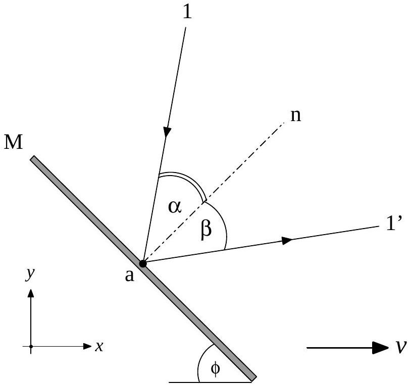
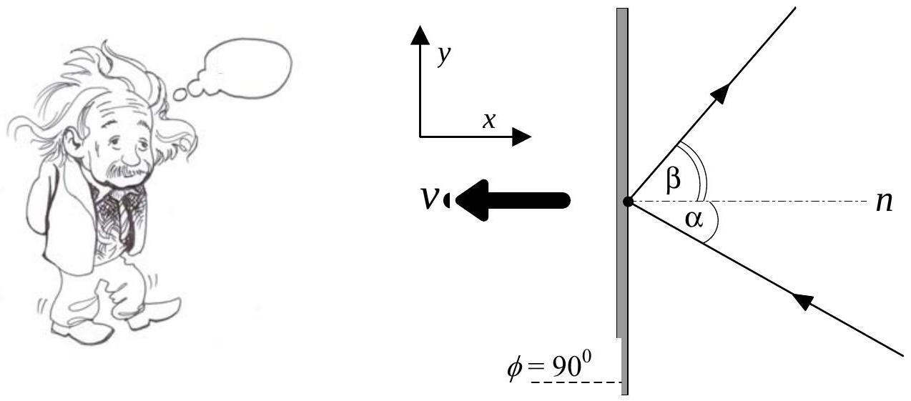
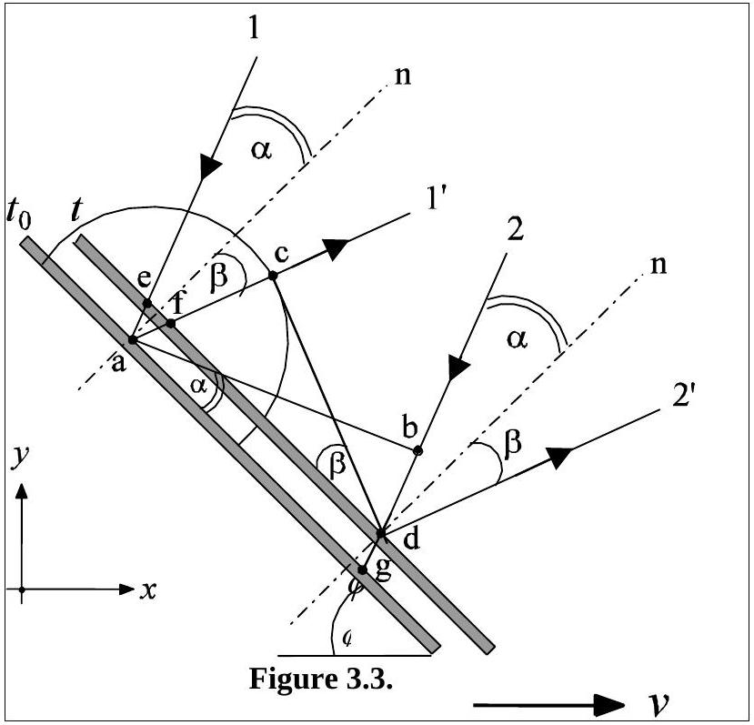

## Question 3 light deflection by a moving mirror

Reflection of light by a relativistically moving mirror is not theoretically new. Einstein discussed the possibility or worked out the process using the Lorentz transformation to get the reflection formula due to a mirror moving with a velocity $\stackrel{p}{v}$. This formula, however, could also be derived by using a relatively simpler method. Consider the reflection process as shown in Fig. 3.1, where a plane mirror M moves with a velocity $\stackrel{\varpi}{v}=v \hat{e}_{x}$ (where $\hat{e}_{x}$ is a unit vector in the $x$-direction) observed from the lab frame F. The mirror forms an angle $\phi$ with respect to the velocity (note that $\phi \leq 90^{0}$, see figure 3.1). The plane of the mirror has n as its normal. The light beam has an incident angle $\alpha$ and reflection angle $\beta$ which are the angles between $\stackrel{w}{n}$ and the incident beam 1 and reflection beam $1^{\prime}$, respectively in the laboratory frame F. It can be shown that,

$$
\sin \alpha-\sin \beta=\frac{v}{c} \sin \phi \sin (\alpha+\beta)
$$

Figure 3.1. Reflection of light by a relativistically moving mirror

## THEORETICAL COMPETITION

FINAL PROBLEM

## 3A. Einstein's Mirror (2.5 points)

About a century ago Einstein derived the law of reflection of an electromagnetic wave by a mirror moving with a constant velocity $\stackrel{\varpi}{v}=-v \hat{e}_{x}$ (see Fig. 3.2). By applying the Lorentz transformation to the result obtained in the rest frame of the mirror, Einstein found that:

$$
\cos \beta=\frac{\left(1+\left(\frac{v}{c}\right)^{2}\right) \cos \alpha-2 \frac{v}{c}}{1-2 \frac{v}{c} \cos \alpha+\left(\frac{v}{c}\right)^{2}}
$$

Derive this formula using Equation (1) without Lorentz transformation!

Figure 3.2. Einstein mirror moving to the left with a velocity $v$.

## 3B. Frequency Shift (2 points)

In the same situation as in 3A, if the incident light is a monochromatic beam hitting M with a frequency $f$, find the new frequency $f^{\prime}$ after it is reflected from the surface of the moving mirror. If $\alpha=30^{0}$ and $v=0.6 c$ in figure 3.2, find frequency shift $\Delta f$ in percentage of $f$.

## THEORETICAL COMPETITION

## 3C. Moving Mirror Equation (5.5 Points)

Figure 3.3 shows the positions of the mirror at time $t_{0}$ and $t$. Since the observer is moving to the left, the mirror moves relatively to the right. Light beam 1 falls on point $a$ at $t_{0}$ and is reflected as beam $1^{\prime}$. Light beam 2 falls on point $d$ at $t$ and is reflected as beam 2'. Therefore, $\overline{a b}$ is the wave front of the incoming light at time $t_{0}$. The atoms at point are disturbed by the incident wave front $\overline{a b}$ and begin to radiate a wavelet. The disturbance due to the wave front $\overline{a b}$ stops at time $t$ when the wavefront strikes point $d$. The semicircle in the figure represents wave-front of the wavelet at time $t$.

By referring to figure 3.3 for light wave propagation or using other methods, derive equation (1).

## THEORETICAL COMPETITION

FINAL PROBLEM

| Country no | Country code | Student No. | Question No. | Page No. | Total No. of pages |
| :--- | :--- | :--- | :--- | :--- | :--- |
|  |  |  |  |  |  |

## ANSWER FORM

3

3A) Einstein's Mirror

Proof:

## THEORETICAL COMPETITION

FINAL PROBLEM

3B. Shift Frequency

Frequency Shift =

3C. Moving Mirror Equation
Proof:
