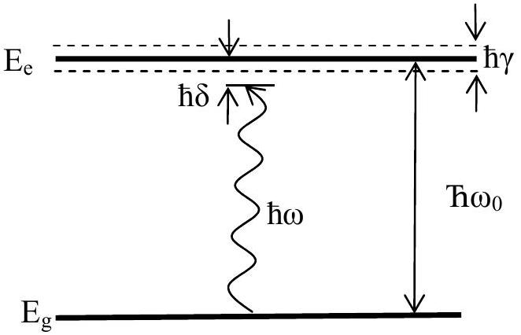

## Theoretical Question 1

## Laser cooling of atoms

In this problem you are asked to consider the mechanism of atom cooling with the help of laser radiation. Investigations in this field led to considerable progress in the understanding of the properties of quantum gases of cold atoms, and were awarded Nobel prizes in 1997 and 2001.

## Theoretical Introduction

Consider a simple two-level model of the atom, with ground state energy $E_{\mathrm{g}}$ and excited state energy $E_{\mathrm{e}}$. Energy difference is $E_{g}-E_{e}=\eta \omega_{0}$, the angular frequency of used laser is $\omega$, and the laser detuning is $\delta=\omega-\omega_{0} \ll \omega_{0}$. Assume that all atom velocities satisfy $v \ll c$, where $c$ is the light speed. You can always restrict yourself to first nontrivial orders in small parameters $v / c$ and $\delta / \omega_{0}$. Natural width of the excited state $E_{\mathrm{e}}$ due to spontaneous decay is $\gamma \ll \omega_{0}$ : for an atom in an excited state, the probability to return to a ground state per unit time equals $\gamma$. When an atom returns to a ground state, it emits a photon of a frequency close to $\omega_{0}$ in a random direction.

It can be shown in quantum mechanics, that when an atom is subject to lowintensity laser radiation, the probability to excite the atom per unit time depends on the frequency of radiation in the reference frame of the atom, $\omega_{a}$, according to

$$
\gamma_{p}=s_{0} \frac{\gamma / 2}{1+4\left(\omega_{a}-\omega_{0}\right)^{2} / \gamma^{2}} \ll \gamma,
$$

where $s_{0} \ll 1$ is a parameter, which depends on the properties of atoms and laser intensity.

Fig 1. Note that shown parameters are not in scale.

In this problem properties of the gas of sodium atoms are investigated neglecting the interactions between the atoms. The laser intensity is small enough, so that the number of atoms in the excited state is always much smaller than number of atoms in
the ground state. You can also neglect the effects of the gravitation, which are compensated in real experiments by an additional magnetic field.

## Numerical values:

Planck constant
Boltzmann constant
Mass of sodium atom
Frequency of used transition
Excited state linewidth
Concentration of the atoms

$$
\begin{aligned}
& \eta=1.05 \cdot 10^{-34} \mathrm{~J} \mathrm{~s}^{-1} \\
& k_{B}=1.38 \cdot 10^{-23} \mathrm{~J} \mathrm{~K}^{-1} \\
& m=3.81 \cdot 10^{-26} \mathrm{~kg} \\
& \omega_{0}=2 \pi \cdot 5.08 \cdot 10^{14} \mathrm{~Hz} \\
& \gamma=2 \pi \cdot 9.80 \cdot 10^{6} \mathrm{~Hz} \\
& n=10^{14} \mathrm{~cm}^{-3}
\end{aligned}
$$

## Questions

a) [1 Point] Suppose the atom is moving in the positive $x$ direction with the velocity $v_{\mathrm{x}}$, and the laser radiation with frequency $\omega$ is propagating in the negative $x$ direction. What is the frequency of radiation in the reference frame of the atom?
b) [2.5 Points] Suppose the atom is moving in the positive $x$ direction with the velocity $v_{\mathrm{x}}$, and two identical laser beams shine along $x$ direction from different sides. Laser frequencies are $\omega$, and intensity parameters are $s_{0}$. Find the expression for the average force $F\left(v_{x}\right)$ acting on an atom. For small $v_{\mathrm{x}}$ this force can be written as $F\left(v_{x}\right)=-\beta v_{x}$. Find the expression for $\beta$. What is the sign of $\delta=\omega-\omega_{0}$, if the absolute value of the velocity of the atom decreases? Assume that momentum of an atom is much larger than the momentum of a photon.

In what follows we will assume that the atom velocity is small enough so that one can use the linear expression for the average force.

c) [2.0 Points] If one uses 6 lasers along $x, y$ and $z$ axes in positive and negative directions, then for $\beta>0$ the dissipative force acts on the atoms, and their average energy decreases. This means that the temperature of the gas, which is defined through the average energy, decreases. Using the concentration of the atoms given above, estimate numerically the temperature $T_{Q}$, for which one cannot consider atoms as point-like objects because of quantum effects.

In what follows we will assume that the temperature is much larger than $T_{Q}$ and six lasers along $x, y$ and $z$ directions are used, as was explained in part c).
In part b) you calculated the average force acting on the atom. However, because of the quantum nature of photons, in each absorption or emission process the momentum of the atom changes by some discrete value and in random direction, due to the recoil processes.

d) [0.5 Points] Determine numerically the square value of the change of the momentum of the atom, $(\Delta \mathrm{p})^{2}$, as the result of one absorption or emission event.

e) [3.5 Points] Because of the recoil effect, average temperature of the gas after long time doesn't become an absolute zero, but reaches some finite value. The evolution of the momentum of the atom can be represented as a random walk in the momentum space with an average step $\sqrt{\left\langle\Delta p^{2}\right\rangle}$, and a cooling due to the dissipative force. The steady-state temperature is determined by the combined effect of these two different processes. Show that the steady state temperature $T_{d}$ is of the form: $T_{d}=\eta \gamma\left(x+\frac{1}{x}\right) /\left(4 k_{B}\right)$. Determine $x$. Assume that $T_{d}$ is much larger than $\left\langle\Delta \mathrm{p}^{2}\right\rangle /\left(2 k_{B} m\right)$.

Note: If vectors $\mathbf{P}_{\mathbf{1}}, \mathbf{P}_{\mathbf{2}}, \ldots, \mathbf{P}_{\mathbf{n}}$ are mutually statistically uncorrelated, mean square value of their sum is

$$
<\left(P_{1}+P_{2}+\ldots+P_{n}\right)^{2}>=P_{1}^{2}+P_{2}^{2}+\ldots+P_{n}^{2}
$$

f) [0.5 Point] Find numerically the minimal possible value of the temperature due to recoil effect. For what ratio $\delta / \gamma$ is it achieved?
