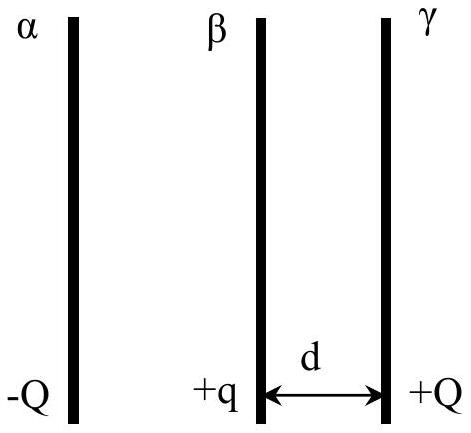

## Theoretical Question 3

This problem consists of four not related parts.
A. [2.5 points] The Mariana Abyss in the Pacific Ocean has a depth of $H=10920 m$. Density of salted water at the surface of the ocean is $\rho_{0}=1025 \mathrm{~kg} / \mathrm{m}^{3}$, bulk modulus is $K=2,1 \cdot 10^{9} \mathrm{~Pa}$, acceleration of gravity is $g=9.81 \mathrm{~m} / \mathrm{s}^{2}$. Neglect the change in the temperature and in the acceleration of gravity with the depth, and also neglect the atmospheric pressure.

A1) Find the relation between the density $\rho(x)$ and pressure $P(x)$ at the depth of $x$.
A2) Find the numerical value of the pressure $P(H)$ at the bottom of the Mariana Abyss. You may use iterative methods to solve this part.

Note: The fluids have very small compressibility. Compressibility coefficient is defined as

$$
\kappa=-\frac{1}{V}\left(\frac{d V}{d P}\right)_{T=\text { const }}
$$

Bulk modulus $K$ is the inverse of $\kappa: K=1 / \kappa$.
B. [2.5 points] Light mobile piston separates the vessel into two parts. The vessel is isolated from the environment. One part of the vessel contains $m_{1}=3 g$ of hydrogen at the temperature of $T_{10}=300 \mathrm{~K}$, and the other part contains $m_{2}=16 g$ of oxygen at the temperature of $T_{20}=400 \mathrm{~K}$. Molar masses of hydrogen and oxygen are $\mu_{1}=2 \mathrm{~g} /$ mole and $\mu_{2}=32 \mathrm{~g} /$ mole respectively , and $R=8.31 \mathrm{~J} /(\mathrm{K} \cdot$ mole $)$. The piston weakly conducts heat between oxygen and hydrogen, and eventually the temperature in the system equilibrates. All the processes are quasi stationary.

B1) What is the final temperature of the system $T$ ?
B2) What is the ratio between final pressure $P_{f}$ and initial pressure $P_{i}$ ?
B3) What is the total amount of heat $Q$, transferred from oxygen to hydrogen?

C. [2.5 points] Two identical conducting plates $\alpha$ and $\beta$ with charges -Q and +q respectively $(\mathrm{Q}>\mathrm{q}>0)$ are located parallel to each other at a small distance. Another identical plate $\gamma$ with mass $m$ and charge +Q is situated parallel to the original plates at distance $d$ from the plate $\beta$ (see fig 1). Surface area of the plates is $S$. The plate $\gamma$ is released and can move freely, while the plates $\alpha$ and $\beta$ are kept fixed. Assume that the collision between the plates $\beta$ and $\gamma$ is elastic, and neglect the gravitational force and the boundary effects. Assume that the charge has enough time to redistribute between plates $\beta$ and $\gamma$ during the collision.

C1) What is the electric field $E_{l}$ acting on the plate $\gamma$ before the collision with the plate $\beta$ ?
C2) What are the charges of the plates $Q_{\beta}$ and $Q_{\gamma}$ after the collision?
C3)What is the velocity $v$ of the plate $\gamma$ after the collision at the distance $d$ from the plate $\beta$ ?

Fig. 1
D. [2.5 points] Two thin lenses with lens powers $D_{1}$ and $D_{2}$ are located at distance $L=25 c m$ from each other, and their main optical axes coincide. This system creates a direct real image of the object, located at the main optical axis closer to lens $D_{1}$, with the magnification $\Gamma^{\prime}=1$. If the positions of the two lenses are exchanged, the system again produces a direct real image, with the magnification $\Gamma^{\prime \prime}=4$.
    D1) What are the types of the lenses? On the answer sheet you should mark the gathering lens as «+», and the diverging lens as «-».
    D2) What is the difference between the lens powers $\Delta D=D_{1}-D_{2}$ ?
