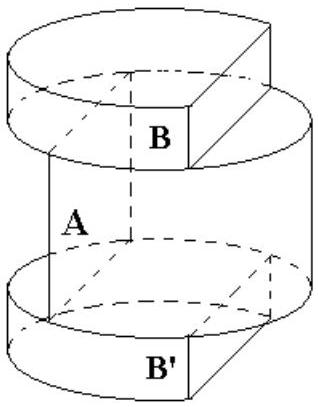
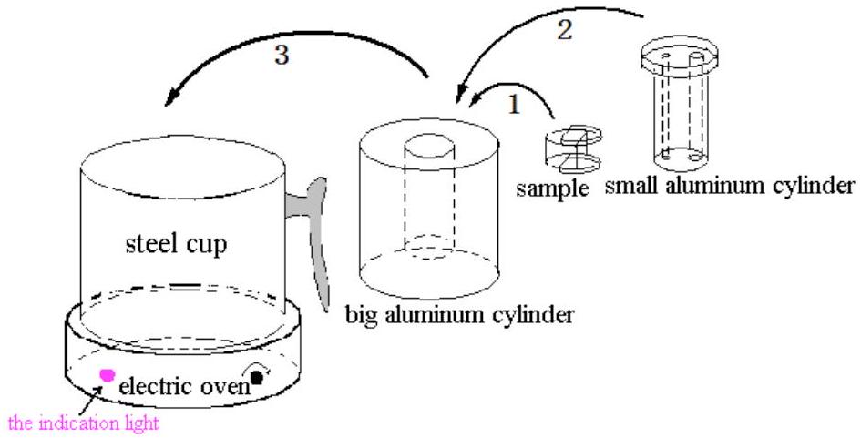
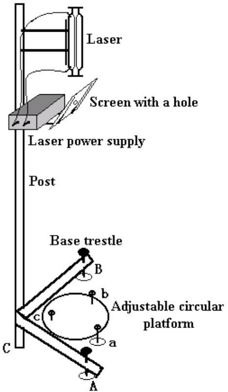
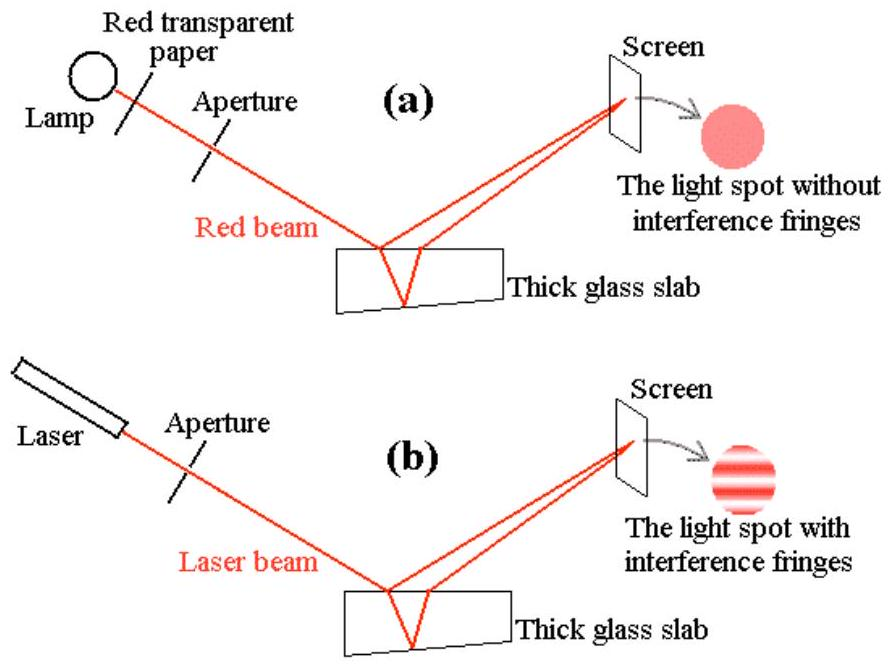
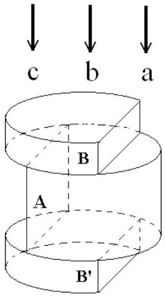

## Experimental Competition

Before attempting to assemble your apparatus, read the problem text completely!

Please read this first:

1. The time available for the Experimental problem 1 is 2 hours and 45 minutes; and that for the Experimental problem 2 is 2 hours and 15 minutes.
2. Use only the pen and equipments provided.
3. Use only the one side of the provided sheets of paper.
4. In addition to blank sheets where you may write freely, there is a set of Answer sheets where you must summarize the results you have obtained. Numerical results must be written with as many digits as appropriate; do not forget the units.
5. Please write on the "blank" sheets the results of all your measurements and whatever else you deem important for the solution of the problem that you wish to be evaluated during the marking process. However, you should use mainly equations, numbers, symbols, graphs, figures, and as little text as possible.
6. It is absolutely imperative that you write on top of each sheet: your student code as shown on your identification tag, and additionally on the "blank" sheets: your student code, the progressive number of each sheet (Page n. from 1 to N) and the total number (N) of "blank" sheets that you use and wish to be evaluated (Page total).
7. The student should start with a new page for each section. It is also useful to write the number of the section you are answering at the beginning of each such section. If you use some sheets for notes that you do not wish to be evaluated by the marking team, just put a large cross through the whole sheet and do not number it.
8. When you have finished, turn in all sheets in proper order (answer sheet first, then used sheets in order, the unused sheets and problem text at the bottom) and put them all inside the envelope provided; then leave everything on your desk. You are not allowed to take anything out of the room.

## Experimental problem 1

Using the interference method to measure the thermal expansion coefficient and temperature coefficient of refractive index of glass (10 points)
(1) Instructions

Optical instruments are often used at high or low temperatures. When optical instruments are used at different temperatures, the thermal properties of the materials, of which the optical elements were made of, including thermal expansion and the variation of refractive index with temperature, will directly affect their optical properties. Two parameters, i.e. the linear thermal expansion coefficient $\beta$ and the temperature coefficient of refractive index $\gamma$, are defined as $\beta=\frac{1}{L} \frac{d L}{d T}$ and $\gamma=\frac{d n}{d T}$ respectively to describe these properties, where $L$ stands for the length of the material, $T$ the temperature, and $n$ the refractive index. The purpose of the present experiment is to measure $\beta$ and $\gamma$ of a given glass material.

Figure 1

(2) Experimental apparatus, devices, and materials

1. Sample: The cylinder-like sample used in present experiment is made of uniform and isotropic glass, as shown in Fig. 1. Where A represents a glass cylinder with a segmental part parallel to its axis cut away, its top and bottom surface are approximately parallel to each other. $B$ and $B^{\prime}$ are two circular plates made of the same glass material, from each of which a segmental part parallel to the axis was also cut away. The top and bottom surface of each glass plate are not parallel to each other. A, B, and B' are glued together as a whole, as shown in Fig. 1. The refractive index of
the glue is as the same as that of the glass, and its thickness can be neglected.
2. Heater: The heater used in this experiment is schematically shown in Fig. 2. A knob on the right of the electric oven is used to adjust the temperature of the electric oven. A big aluminum cylinder was bored a co-axis pipe-like sample cavity in the middle of it,. The experimental sample can be put at the bottom of this cavity. Besides, there is a small aluminum cylinder, through which two tube-like holes of different radius were bored. The small hole allows light to pass through, while a probe of a thermometer can be inserted in the big hole. If you want to heat the sample, you should first slip the sample carefully into the cavity of the big aluminum cylinder before you heat it (in doing so, the big aluminum cylinder should be inclined somewhat to avoid cracking the sample). Next, put the small aluminum cylinder onto the sample already located in the cavity. Then, put the whole big aluminum cylinder including the sample and the small cylinder inside into the steel cup on the electric oven. (For heating, you should not put any water in the steel cup, and you shouldn't take away the steel cup but put the whole aluminum cylinder directly on the oven, either.)

Figure 2

3. Light source holder. As shown in Fig. 3, a support consisting of a vertical post and a base trestle is designed to hold the laser light source. The post and the base trestle are fixed together at C and two tunable adjusting screws A and B are attached to the trestle. A He-Ne laser and its power supply are held at the upper part of the post,
as shown in Fig.3. Just below the laser, a slant bracket is attached to the power supply, on which is placed an aluminum plate with a hole through it. A piece of graph paper is attached to the aluminum plate, which can be used as an observation screen.

Figure 3

4. Sample platform: A circular platform with three adjusting screws $a, b$, and $c$ is designed to hold the heating oven or the big aluminum cylinder including the sample and the small aluminum cylinder. The platform is placed on the experimental table, close to the base trestle, right below the laser light source, as shown in Fig 3.
5. A digital thermometer
6. A straight ruler
7. A basin (containing the cooling water)
8. A piece of towel
9. A piece of graph paper
10. A calculator
11. A pen and a pencil

【Attention】
a. Never look at the laser light source along the direction opposite to the incident direction of the light. Otherwise, the laser light might hurt your eyes.
b. Never touch the optical surface of the sample. Take the sample gently to avoid any damage.
(3) Experimental content

1. Answer Questions ( 2.4
points)
1.1 When a beam of white natural light coming from a lamp and passing through a piece of red transparent paper strikes on a thick glass slab of a thickness about 2 cm, the beams reflected from the top and bottom surfaces of the slab meet at the observation screen, resulting in a light spot on the screen without interference fringes, as shown in Fig. 4 (a). However, when a laser beam strikes on the same glass slab, the reflected beams meet at the same observation screen, resulting in a light spot with interference fringes, as shown in Fig. 4(b). What is the reason accounting for these two different phenomena? (choose the correct one)
A. The laser beam is stronger than the red beam
B. The laser beam is more collimated than the red beam
C. The laser beam is more coherent than the red beam
D. The wavelength of the laser beam is shorter than that of the red beam

Fig. 4

1.2 a As shown in Fig.5, if a laser light beam strikes approximately normally on the region $a$, $b$, and $c$ of the sample respectively, how many main light spots of the reflection light will be observed (need not consider multiple reflections)? Will the profiles of these reflected optical spots be inevitably the same as that of the incident light?

Fig. 5

1.2 b If the profile of some spots of the reflected light is different from that of the incident light? Please give a reason to account for.
2. Experiment: Measurement of $\beta$ and $\gamma$ of the glass (7.6 points)

With the wavelength of the laser light $\lambda=632.8 \mathrm{~nm}$, the height of the glass cylinder A $L=10.12 \pm 0.05 \mathrm{~mm}$, and the average refractive index of the glass corresponding to this given wavelength and the given temperature range of measurement $n=1.515$, measure the thermal expansion coefficient $\beta$ and the temperature coefficient of the refractive index $\gamma$ for the glass sample over the temperature range from $40^{\circ} \mathrm{C}$ to 90°C.(Within this temperature range $\beta$ and $\gamma$ may be taken as constant.)
2.1 Design the Experiment, draw the experimental ray diagrams and derive the formulae relevant to the measurement. (3.2 points)
2.2 Carry out the experiment and record the measured data of the thermal expansion coefficient $\beta$ and $\gamma$. (1.6 points)
2.3 Calculate $\beta$ and $\gamma$ of the given glass material and estimate their uncertainties. (2.6 points)
2.4 Write the final experimental results. (0.2 points)

【Attention】

1. When put the sample into the sample cavity of the big aluminum cylinder, in order to avoid cracking the sample, incline somewhat the big aluminum cylinder, and make the sample slip towards the bottom of the sample cavity carefully and

slowly.

2. During the process of experiment, the temperature can be increased continuously. In order to guarantee enough time you better to measure your data when the temperature is increasing. To heat the sample, the knob of the electric oven may be first turned to its maximum. When the temperature approaches to near 90°C ( around 85°C ), turn the knob to the minimum immediately to stop heating. During heating, the indication light on the left of the oven might be off and then on again. This indicates that the oven is controlling the temperature itself automatically. Do not care about it.
3. After the sample in the cavity of the big aluminum cylinder is heated enough, its natural cooling down will be very slow. To get a rapid cooling, you may put the heated steel cup containing the big aluminum cylinder with the small aluminum cylinder inside into the water-filled basin. After a while of cooling (at least 5 minutes) , carefully use the towel to wrap the big aluminum cylinder and put it directly into the cooling water to speed up the cooling process. Be careful to avoid burning your hand. After cooling, use the towel to dry the big aluminum cylinder, and put it back to the steel cup, then you can heat it again. In order to avoid short circuit, never pour any water into the electric oven.
4. When you finished the experiment, turn off the electric oven immediately to avoid overheating.

## Warning: Be careful in your experiments! If your sample or instrument is broken, you may have difficulties to continue your experiments, since we do not have enough backups!
