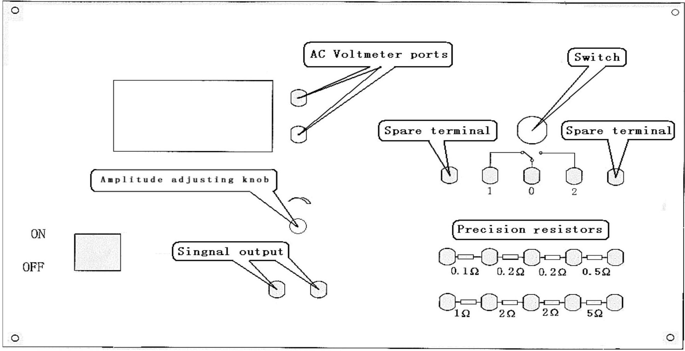
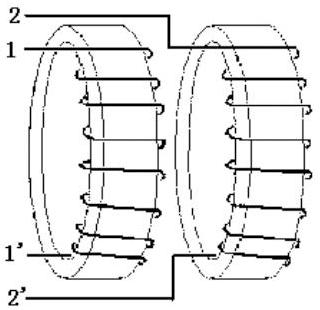
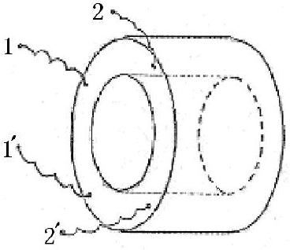
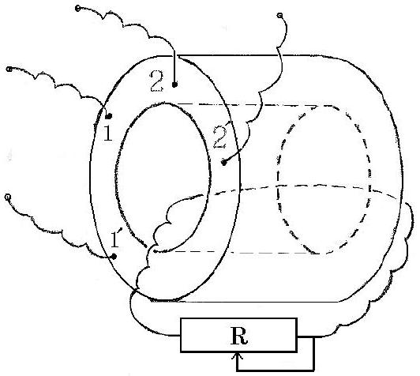

## Experimental Competition

Before attempting to assemble your apparatus, read the problem text completely!

Please read this first:

1. The time available for the Experimental problem 1 is 2 hours and 45 minutes; and that for the Experimental problem 2 is 2 hours and 15 minutes.
2. Use only the pen and equipments provided.
3. Use only the one side of the provided sheets of paper.
4. In addition to blank sheets where you may write freely, there is a set of Answer sheets where you must summarize the results you have obtained. Numerical results must be written with as many digits as appropriate; do not forget the units.
5. Please write on the "blank" sheets the results of all your measurements and whatever else you deem important for the solution of the problem that you wish to be evaluated during the marking process. However, you should use mainly equations, numbers, symbols, graphs, figures, and as little text as possible.
6. It is absolutely imperative that you write on top of each sheet: your student code as shown on your identification tag, and additionally on the "blank" sheets: your student code, the progressive number of each sheet (Page n. from 1 to N) and the total number (N) of "blank" sheets that you use and wish to be evaluated (Page total).
7. The student should start with a new page for each section. It is also useful to write the number of the section you are answering at the beginning of each such section. If you use some sheets for notes that you do not wish to be evaluated by the marking team, just put a large cross through the whole sheet and do not number it.
8. When you have finished, turn in all sheets in proper order (answer sheet first, then used sheets in order, the unused sheets and problem text at the bottom) and put them all inside the envelope provided; then leave everything on your desk. You are not allowed to take anything out of the room.
9. are not allowed to take anything out of the room.

Panel Instruction

Note: The AC voltmeter black port is connected with two spare terminals

## Experimental problem 2

## Measurement of liquid electric conductivity ( 10 points )

## 1. Experimental instructions

In the apparatus of present experiment to measure the conductivity of liquid (i.e., water with salt), the sensor deals with $a c$ signal without any contact potential involved to interfere with the desired experimental results. Meanwhile, since the sensor (detective winding ) does not directly touch the liquid to be measured, no chemical reaction would happen during the experiments to damage any part of the apparatus. Therefore it can be used repeatedly for a long time.

As shown in Fig. 1, the sensor designed for measuring the conductivity of liquid consists of two circular loops with the same radius, made of soft-iron-based alloy. Each loop is wound with winding. The numbers of circles of the two windings are equal to each other. The two alloy loops are aligned along the same axis and connected closely as one airproof hollow cylinder, as shown in Fig. 2.

Fig. 1

Fig. 2

The sensor is immersed in the liquid to be measured. Winding 11' is connected to sine signal generator of frequency about 2.5kHz. The amplitude of its output signal might drift somewhat. If the drift exceeds certain value, it should be adjusted in time to keep the output amplitude remain at certain value. Winding 22' is connected to $a c$ voltmeter used to measure the induced signal voltage. With the measured magnitude of the signal voltage, the conductivity of the liquid can be calculated.

## 2. Experimental principles

The operation principle of the present experimental apparatus can be simply explained as follows. The $a c$ sine current from the signal generator induces an $a c$ magnetic field in loop 11'. In turn the magnetic field induces an $a c$ current in the
conducting liquid. Such induced current induces back a time-varying magnetic field in loop 22', which induces an electromotive force in the same loop 22', being the output signal of the sensor.

Neglecting the magnetic hysteresis effect, output voltage $V_{o}$ is a monotonical function of input voltage $V_{i}$. When input voltage $V_{i}$ and the conductivity $\sigma$ of the liquid are respectively within certain range, a proportional relation holds between $\sigma$ and the ratio of $\frac{V_{o}}{V_{i}}$ :

$$
\sigma=K\left(V_{o} / V_{i}\right),
$$

where $K$ is the proportionality constant.
In the present apparatus, the liquid container can contain so much liquid to be measured that the resistance of the liquid outside the cylinder-shaped sensor is negligible. Therefore the output voltage $V_{o}$ of the sensor depends mainly on the 'liquid within the hollow cylinder' (referred as "liquid cylinder" hereafter). Thus, it is possible to use the liquid cylinder to calculate the liquid conductivity. Resistance of the liquid cylinder is

$$
R=\frac{1}{\sigma} \frac{L}{S}, \quad \sigma=\frac{1}{R} \frac{L}{S}
$$

where $L$ is the length of the liquid cylinder along its axis, and $S$ is the area of its cross section. Combination of (1) and (2) leads to:

$$
V_{o} / V_{i}=\left(\frac{1}{K} \frac{L}{S}\right) \frac{1}{R}=B \frac{1}{R}
$$

where $B=\left(\frac{1}{K} \frac{L}{S}\right)$, or alternatively $K=\frac{1}{B} \frac{L}{S}$.
With Eq.(2) and (3) we obtain

$$
\sigma=\left(\frac{1}{B} \frac{L}{S}\right)^{V_{o}} / V_{i} .
$$

Equation (4) shows that, when using the present sensor to measure the liquid conductivity, $\sigma$ is related to $L$ (length of the hollow cylinder), $S$ (area of its cross section), $V_{o} / V_{i}$, and $B$ as well.

Remark: Essentially in the present experiment, in order to obtain the proportionality constant $K$ and then $B$ accurately, various kinds of liquid with known
$\sigma$ should be required and prepared. Obviously this is not an easy task. Therefore, for the sake of both convenience and correctness, instead of the various liquids of known $\sigma$, we use externally connected standard resistors. The two ends of the standard resistor are connected to the two ends of a conducting thread passing through the hollow cylinder of the sensor to form a resistor circuit, as shown in Fig. 3.

Fig. 3

## 3. Experimental content

1. Draw the experimental circuit diagram for scaling the sensor of the liquid conductivity ( 1.0 points) , and complete the connection of the circuit in order to measure both the input voltage $V_{i}(<2.000 \mathrm{~V})$ and induced output voltage $V_{o}$ according to the above circuit diagram (1.0 points).
2. According to the range of resistance of standard resistors: $0-9.9 \Omega$, measure $\frac{V_{o}}{V_{i}}$ for various resistances. Record the data in the data Table designed by yourself. (2.0points) Control the amplitude of $V_{i}$ at any moment to make sure that its effective value is within the range of [1.700V, 1.990V] and its variation should not be higher than 0.03V. You can also fix the input voltage at a single value within this range. (1.0 points)

3-1. Take $\frac{V_{o}}{V_{i}}$ as ordinate and the reciprocal of resistance $R$ of the standard resistor $1 / R$ as abscissa. Draw the curve of $V_{o} / V_{i}$ versus $1 / R$. The number of measurement points should be greater than 20 within the whole output voltage range, and you are not required to add error (uncertainty) bars to the graph, but should estimate the uncertainties from the scatter points. (1.0 points)

3-2 It can be seen that at some region of less induced current the curve is linear. Graph this linear part and use the graphical method to obtain the slope $B$ of the straight part of the curve and its relative uncertainty $u(B)$ or $u(B) / B$. (1.5 points)
4. With the given axis length of the sensor $L=(30.500 \pm 0.025) \mathrm{mm}$ and diameter of the liquid cylinder $d=(13.900 \pm 0.025) \mathrm{mm}$, calculate the value of $K$ and $u(K)$ or $u(K) / K$. (1.0 points)
5. Work out the conductivity of the liquid in the container and write the result. According to the uncertainties of $L, d$, and $B$, estimate the uncertainty of the conductivity. The measurement of the conductivity should be done for six times, during which the liquid should be stirred for each time. (1.5 points)

## 4. Instruments and materials

1. Sensor of liquid conductivity
The sensor has four ports of connection terminals: two terminal ports are connected to winding 11' and two terminal ports are connected to the other winding 22'.
2. Container filled with the yet-to-be-determined liquid and stirring rod.
3. The instrument for measuring the liquid conductivity.
On the instrument panel there are:
    - Signal generator:
Two ports of connection terminals connected to the signal generator, the red one for signal output, and the black one for grounding. The amplitude of output signal can be adjusted by turning the knob.
    - $a c$ digital voltmeter.
    - Inserting-type resistor box:

On the panel, there are many ports of connection terminals, between every two adjacent ports, there is a resistor with relative resistance error of 0.001. Resistance of these resistors is $0.1,0.2,0.5,1,2$, and $5 \Omega$ respectively.

- Switch $1 \times 2$ ( single-pole double throw ) .
4. Some leads
5. Two pieces of graph paper (20cm × 25cm ), calculator, recording paper, ruler, and pen.
