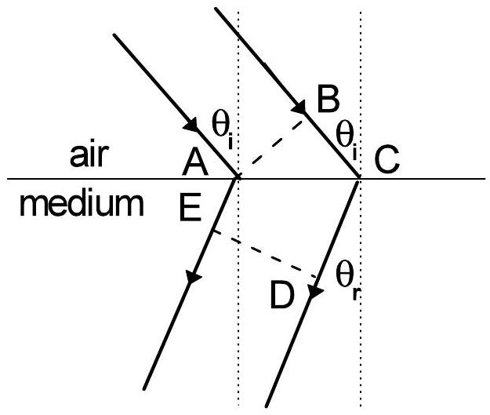
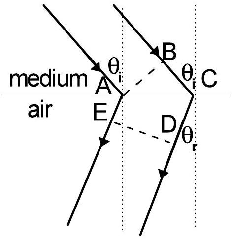
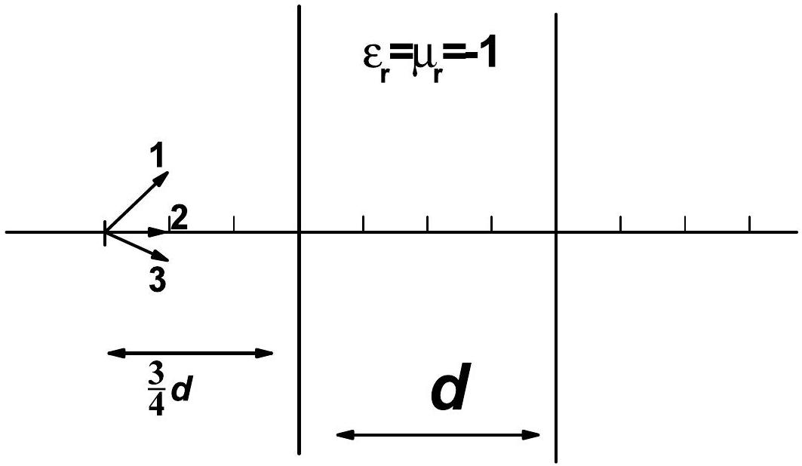
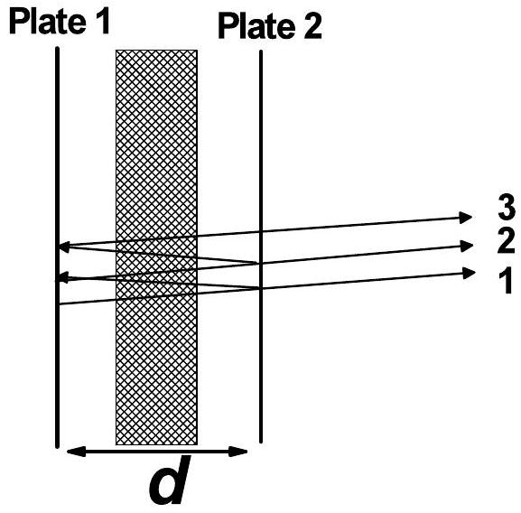
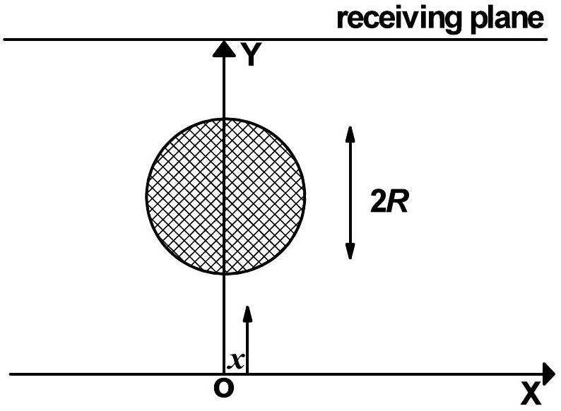
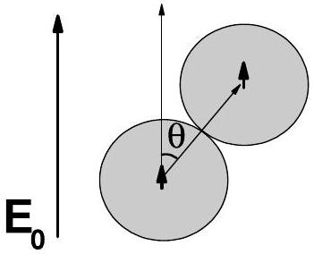
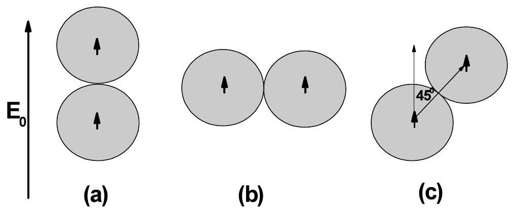
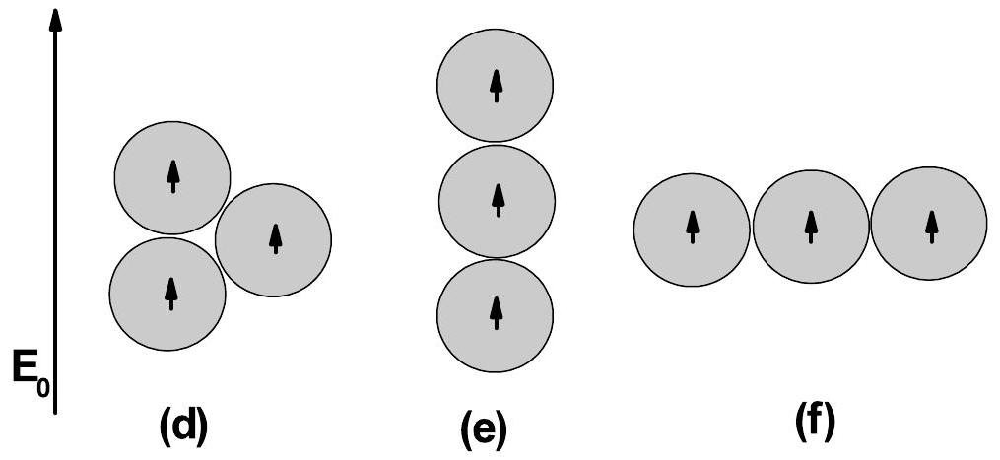

## Theoretical problem 2

## 2A. Optical properties of an unusual material (7 points)

The optical properties of a medium are governed by its relative permittivity $\left(\varepsilon_{r}\right)$ and relative permeability ( $\mu_{r}$ ). For conventional materials like water or glass, which are usually optically transparent, both of their $\varepsilon_{r}$ and $\mu_{r}$ are positive, and refraction phenomenon meeting Snell's law occurs when light from air strikes obliquely on the surface of such kind of substances. In 1964, a Russia scientist V. Veselago rigorously proved that a material with simultaneously negative $\varepsilon_{r}$ and $\mu_{r}$ would exhibit many amazing and even unbelievable optical properties. In early 21st century, such unusual optical materials were successfully demonstrated in some laboratories. Nowadays study on such unusual optical materials has become a frontier scientific research field. Through solving several problems in what follows, you can gain some basic understanding of the fundamental optical properties of such unusual materials. It should be noticed that a material with simultaneously negative $\varepsilon_{r}$ and $\mu_{r}$ possesses the following important property. When a light wave propagates forward inside such a medium for a distance $\Delta$, the phase of the light wave will decrease, rather than increase an amount of $\sqrt{\varepsilon_{r} \mu_{r}} k \Delta$ as what happens in a conventional medium with simultaneously positive $\varepsilon_{r}$ and $\mu_{r}$. Here, positive root is always taken when we apply the square-root calculation, while $k$ is the wave vector of the light. In the questions listed below, we assume that both the relative permittivity and permeability of air are equal to 1.

1. (1)According to the property described above, assuming that a light beam strikes from air on the surface of such an unusual material with relative permittivity $\varepsilon_{r}<0$ and relative permeability $\mu_{r}<0$, prove that the direction of the refracted light beam depicted in Fig.2-1 is reasonable. (1.2 points)

Fig. 2-1

(2) For Fig. 2-1, show the relationship between refraction angle $\theta_{r}$ (the angle that refracted beam makes with the normal of the interface between air and the material) and incidence angle $\theta_{i}$. (0.8 points)
(3) Assuming that a light beam strikes from the unusual material on the interface between it and air, prove that the direction of the refracted light beam depicted in Fig.2-2 is reasonable. (1.2 points)

Fig. 2-2

(4) For Fig. 2-2, show the relationship between the refraction angle $\theta_{r}$ (the angle that refracted beam makes with the normal of the interface between two media) and the incidence angle $\theta_{i}$. (0.8 points)
2. As shown in Fig. 2-3, a slab of thickness $d$, which is made of an unusual optical material with $\varepsilon_{r}=\mu_{r}=-1$, is placed in air, with a point light source located in
front of the slab separated by a distance of $\frac{3}{4} d$. Accurately draw the ray diagrams for the three light rays radiated from the point source. (Hints: under the conditions given in this problem, no reflection would happen at the interface between air and the unusual material). (1.0 points)

Fig. 2-3

3. As shown in Fig. 2-4, a parallel-plate resonance cavity is formed by two plates parallel with each other and separated by a distant $d$. Optically one of the plates, denoted as Plate 1 in Fig.2-4 , is ideally reflective (reflectance equals to 100\%), and the other one, denoted by Plate 2, is partially reflective ( but with a high reflectance). Suppose plane light waves are radiated from a source located near Plate 1, then such light waves are multiply reflected by the two plates inside the cavity. Since optically the Plate 2 is not ideally reflective, some light waves will leak out of Plate 2 each time the light beam reaches it (ray 1, 2, 3, as shown in Fig. 2-4), while some light waves will be reflected by it. If these light waves are in-phase, they will interfere with each other constructively, leading to resonance. We assume that the light wave gains a phase of $\pi$ by reflection at either of the two plates. Now we insert a slab of thickness $0.4 d$ (shown as the shaded area in Fig. 2-4), made of an unusual optical material with $\varepsilon_{r}=\mu_{r}=-0.5$, into the cavity parallel to the two plates. The remaining space is filled with air inside the cavity. Let us consider only the situation that the light wave travels along the direction perpendicular to the plates (the ray diagram depicted in Fig.2-4 is only a

schematic one), calculate all the wavelengths that satisfy the resonance condition of such a cavity. (Hints: under the condition given here, no reflection would occur at the interfaces between air and the unusual material). (1.0 points)

Fig. 2-4
4. An infinitely long cylinder of radius $R$, made of an unusual optical material with $\varepsilon_{r}=\mu_{r}=-1$, is placed in air, its cross section in XOY plane is shown in Fig. 2-5 with the center located on Y axis. Suppose a laser source located on the X axis (the position of the source is described by its coordinate $x$ ) emits narrow laser light along the Y direction. Show the range of $x$, for which the light signal emitted from the light source can not reach the infinite receiving plane on the other side of the cylinder. (1.0 points)

Fig. 2-5

## 2B. Dielectric spheres inside an external electric field (3 points)

By immersing a number of small dielectric particles inside a fluid of low-viscosity, you can get the resulting system as a suspension. When an external electric field is applied on the system, the suspending dielectric particles will be polarized with electric dipole moments induced. Within a very short period of time, these polarized particles aggregate together through dipolar interactions so that the effective viscosity of the whole system enhances significantly (the resulting system can be approximately viewed as a solid). This type of phase transition is called "electrorheological effect", and such a system is called "electrorheological fluid" correspondingly. Such an effect can be applied to fabricate braking devices in practice, since the response time of such a phase transition is shorter than conventional mechanism by several orders of magnitude. Through solving several problems in the following, you are given a simplified picture to understand the inherent mechanism of the electrorheological transition.

1. When there are many identical dielectric spheres of radius $a$ immersed inside the fluid, we assume that the dipole moment of each sphere $\vec{p}$, is induced solely by the external field $\vec{E}_{0}$, independent of any of the other spheres (Note: $\vec{p} \| \vec{E}_{0}$ ).
(1) When two identical small dielectric spheres exist inside the fluid and contact with each other, while the line connecting their centers makes an angle $\theta$ with the external field direction (see Fig. 2-6), write the expression of the energy of dipole-dipole interaction between the two small contacting dielectric spheres, in terms of $p, a$ and $\theta$. (Note: In your calculations each polarized dielectric sphere can be viewed as an electric dipole located at the center of the sphere) (0.5 points)

Fig. 2-6

(2) Calculate the dipole-dipole interaction energies for the three configurations shown in Fig. 2-7.
(0.75 points)

Fig. 2-7

(3) Identify which configuration of the system is the most stable one. (0.25 points) (Note: In your calculations each polarized dielectric sphere can be viewed as an electric dipole located at the center of the sphere, and the energy of dipole-dipole interaction can be expressed in terms of $p$ and $a$.)

2. In the case that three identical spheres exist inside the fluid, based on the same assumption as in question 1,
(1) calculate the dipole-dipole interaction energies for the three configurations shown in Fig. 2-8; (0.9 points)
(2) identify which configuration of the system is the most stable one; (0.3 points)
(3) identify which configuration of the system is the most unstable one. (0.3 points) (Note: In your calculations each polarized dielectric sphere can be viewed as an electric dipole located at the center of the sphere, and the energy of dipole-dipole interaction can be expressed in terms of $p$ and $a$.)

Fig. 2-8
