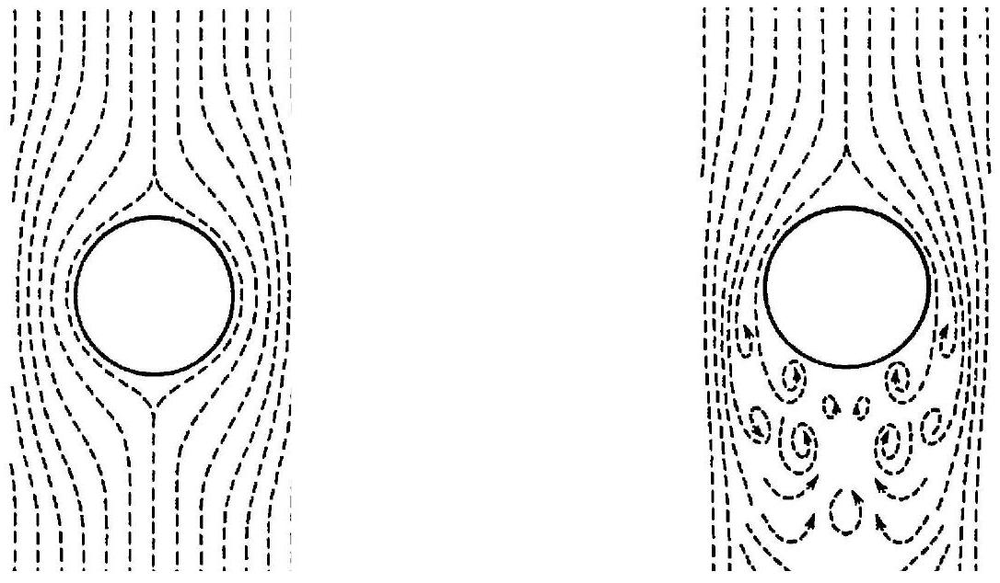
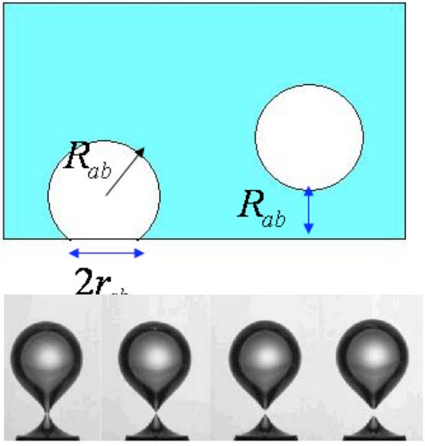
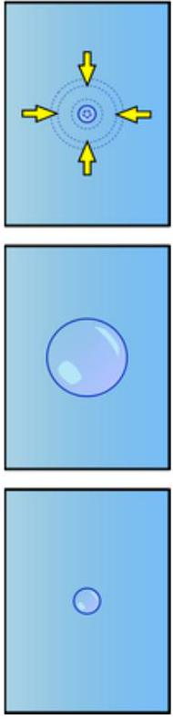

## Theoretical Problem 1. Tea Ceremony and Physics of Bubbles

The tea ceremony is traditional in Asia. One of the important steps in preparation of tea is the boiling of fresh water when bubbles appear inside. Bubbles are familiar from daily life and occupy an important role in physics, chemistry, medicine and technology. Nevertheless, their behavior is often surprising and unexpected - and, in many cases, still not understood.

At room temperature the pure water is saturated with gas. With increasing temperature the excess pressure of dissolved gas $P_{a b}$ increases, the dissolved air is liberated and air bubbles (ABs) appear at the bottom and walls of teakettle (Fig.2). For pure water the wettability is sufficient and an AB represents a truncated sphere with radius $R_{a b}$ and with unwetted foundation with radius $r_{a b} \ll R_{a b}$. At more heating ABs expand and by reaching certain sizes can detach from the bottom (Fig.3), flow up to the water surface and burst there. The vapor bubbles (VBs) appear when the water temperature at the bottom reaches the critical value $T_{w}^{0} \approx T_{\text {crit }}^{0}=100^{0} C$ at which the pressure of the saturated vapor exceeds the external pressure. The vapor production increases tens times, VBs expand and detach from the bottom. VB may be considered consisting only of vapor. If the water is heated sufficiently, the uprising VB continue to swell, reach the surface and burst. Else, water is not heated enough in the higher layers and there exits a vertical strong temperature gradient. By reaching relatively cold layers of water VB collapse in the volume of water (Fig.4). This causes the induced degassing - strong oscillations and a considerable amount of dissolved air is released in the form of microscopic air bubbles (MAB). This can generate ultrasonic vibrations.

The main stages of the bubble evolution during the boiling process are:

- the appearance and growth of AB at the bottom and walls, their transmutation into VB;
- the detachment and uprising of VB, their disappearance in the water volume or at the surface;
- the appearance of MAB in the water volume and their uprising to the surface.

This theoretical description is in good agreement with modern experiments. Particularly, an interesting noise analysis experiment (NAE, Ural State University, Ekaterinburg) for the boiling water was performed. Highly sensitive microphones attached to wide-band amplifiers and brought to an electric teakettle have detected three main origins of noises:

1. AB's detachments from the bottom before boiling (generate oscillations with $v_{1} \sim 100 \mathrm{~Hz}$, );
2. VB's collapses in the volume of water (generate oscillations with $v_{2} \sim 1 \mathrm{kHz}$ );
3. MAB's appearances under the water surface (generate oscillations with $\boldsymbol{v}_{3} \sim 35 \mathrm{kHz}$ to 60 kHz ).

## Hints:

1) It is well known that a small bubble rises along a rectilinear path and a laminar flow is observed - water flows easy and layer-wise (see Fig.1). Then, the Stokes formula describes the dissipative force for a particle moving with slow velocity $v_{\text {lam }}$ :

$$
F_{A}=6 \pi \eta_{w} R_{b} v_{l a m}
$$

In contrast to this picture, when relatively large bubbles lift to the surface, it disturbs the surrounding water, cavitation hollows appear behind and the turbulent flow is observed (see Fig.1). In this case a part of the kinetic energy of an uprising bubble transfers into the dissipative work.

Fig 1. Laminar and turbulent types of flow for rising air bubbles in water

2) When the surface of liquid has a convex (concave) form there appears a surface tension force due to molecular interaction near the edge. This pressure can be given by formula

$$
\Delta P=\frac{2 \sigma}{R}
$$

where $\sigma$ - is the surface tension coefficient (unit $=N / m$ ), the force coming to unit length of surface, $R$ - is the radius of surface curvity.
3) When dealing with a short process with characteristic duration time " $t$ ", its inverse value may be considered as a characteristic frequency $v=\frac{1}{t}$. Use this definition for calculating the noise frequencies.

Useful data:

$$
\begin{aligned}
& P_{0}=1.016 \cdot 10^{5}[\mathrm{~Pa}]-\text { atmospheric pressure }, \\
& \rho_{w}=10^{3}\left[\mathrm{~kg} / \mathrm{m}^{3}\right]-\text { water density, } \\
& \rho_{\text {vapor }}=0.017\left[\mathrm{~kg} / \mathrm{m}^{3}\right]-\text { vapor density at } \mathrm{T}=293 \mathrm{~K} ;\left(=0.596\left[\mathrm{~kg} / \mathrm{m}^{3}\right] \text { at } \mathrm{T}=373 \mathrm{~K}\right) \\
& P_{\text {vapor }}=0.023 \cdot 10^{5}[\mathrm{~Pa}]-\text { vapor pressure at } \mathrm{T}=293 \mathrm{~K} ;\left(=1.016 \cdot 10^{5}[\mathrm{~Pa}] \text { at } \mathrm{T}=373 \mathrm{~K}\right)
\end{aligned}
$$

$g=9.81\left[m / s^{2}\right]$ - acceleration of gravity,
$\mu_{\text {air }}=0.029[\mathrm{~kg} /$ mole $]$ - molecular weight of air
$R=8.31[J /$ mole $/ K]$ - the gas universal constant
$\sigma=0.0725[\mathrm{~N} / \mathrm{m}]$ - surface tension coefficient of water,
$\eta_{w}=0.3 \cdot 10^{-3}[\mathrm{~Pa} \cdot \mathrm{~s}]$ - coefficient of viscosity of water

$\mathrm{H}=10 \mathrm{~cm}$ - Water attitude in teakettle

Fig. 2. Bubbles in teakettle

Fig. 3. Air bubble detaching from the bottom

Fig. 4. Vapor bubble collapsing

## Questions (total 10 points):

Consider water boiling in a flat-bottomed cylinder glass teakettle at normal atmospheric pressure. The bottom of the kettle heats up uniformly and a vertical temperature gradient exists, bubbles appear and evolute (Fig.2).

Q1. Write the pressure condition of the growth of an AB in the water volume at height $\mathbf{h}<\mathbf{H}$, where H is the water surface level in the teakettle. Take into account the inequality $2 \pi \sigma r_{a b} \gg P_{\text {extern }} \pi r_{a b}^{2}$. [in terms of $P_{a b}, P_{0}, R_{a b}, \rho_{w}, g, \sigma, h, H$ ] (1.0 point)

Q2. Write for an AB the condition of the detachment from the bottom of the teakettle (Fig.3).
Take into account the relation $r_{a b} \ll R_{a b}$. [in terms of $r_{a b}, R_{a b}, \rho_{w}, \sigma$ ] (1.5 points)

Q3. Consider an AB with radius $R_{b}$ at the bottom of the teakettle. As water is boiled, the bubble is saturated with vapor and enlarges its radius. Write the ratio $\xi \equiv m_{\text {air }} / m_{\text {vapor }}$ of the masses of the air and saturated vapor inside the bubble at given temperature T. Calculate the ratio at room temperature $\mathrm{T}=20^{\circ} \mathrm{C}\left(R_{b}=0.5 \mathrm{~mm}\right)$ and at boiling point at $\mathrm{T}=100^{\circ} \mathrm{C}$ $\left(R_{b}=1 \mathrm{~mm}\right)$. [in terms of $\mu_{\text {air }}, T, P_{0}, P_{\text {vapor }}, R_{b}, \rho_{w}, \rho_{v}, \sigma, H$ ] (1.5 points)

Q4. By using the NAE data and Newton's Law estimate the radius of the AB detached from the bottom and uprised in distance $R_{a b}$ (Fig.3). Assume, that the added-mass (taking into account surrounding water layer) of AB is a half of the analogous water bubble. (1.0 points)

Q5. Write the radius of the foundation of an AB just before the uprising, when the connecting "neck" is very narrow (see Fig.3). [in terms of $R_{a b}, \rho_{w}, \sigma$ ]. Calculate it by using the radius found in Q4. (1.5 points)

Q6. By using the NAE data estimate the radius of collapsing VB (Fig.4) by assuming that the radial pressure is about 3kPa during this process. (1.2 points)

Q7. By using previous results for VB calculate the radius of the MAB produced during induced degassing. (0.5 points)

Q8. Write the uprising velocity for typical AB by using the Stokes law of a laminar flow. [in terms of $R_{a b}, \rho_{w}, \eta_{w}$ ]. Estimate the uprising time for $\mathrm{H}=10 \mathrm{~cm}$. (0.6 points)

Q9. Write the average velocity of the elevation of VB with turbulent type of flow [in terms of $R_{a b}, \rho_{w}, \eta_{w}$ ]. Estimate the uprising time for $\mathrm{H}=10 \mathrm{~cm}$. (1.2 points)
