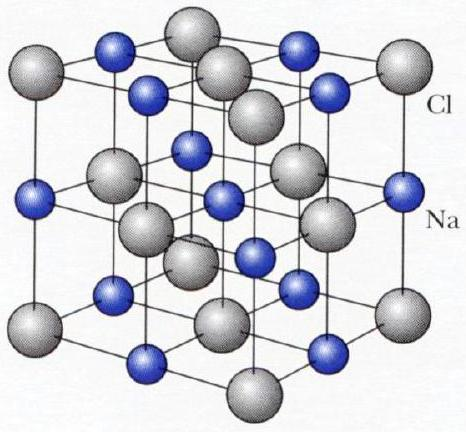

## Problem 2: Ionic Crystal, Yukawa-type Potential and Pauli Principle

Atoms of many chemical elements possess very low ionization energy and easily loose the outer electrons. Vice versa, atoms of other elements accept easily the electrons. Taken into one volume, these positive and negative ions can combine into stable ionic structures. Many solids exhibit a crystal structure, in which the atoms are arranged in extremely regular, periodic patterns. In an ideal crystal the same basic structural unit is repeated through the space.

Fig. 1
The face-centered cubic lattice of the sodium chloride $(\mathrm{NaCl})$. The lattice spacing between the atomar centres is constant and is given by parameter $r_{0}$.

The main contribution to the binding energy of an ionic crystal is given by the electrostatic potential energy of ions.

The electric interaction acting between two point charges $\mathrm{q}_{1}$ and $\mathrm{q}_{2}$ standing in distance R is well defined by Coulomb's potential:

$$
V_{C}(R)=k \frac{q_{1} q_{2}}{R}
$$

where $k=1 / 4 \pi \varepsilon_{0} \approx 9 \cdot 10^{9}\left[N \cdot m^{2} / C^{2}\right]$ is the Coulomb constant. A negative force implies an attractive force. The force is directed along the line joining the two charges. For the case of NaCl crystals both types of ions has the unit charge ±e and one should also take into account many other neighbors acting on the chosen ion. Taking into account all positive and negative ions in a crystal of the infinite sizes results in the attractive potential energy $V_{\text {att }}(r)=\alpha \cdot V_{C}(r)$, where $r$ is the distance between nearest neighbors and $\alpha=1.74756$ is the Madelung constant [E.Madelung, Phys. Zs, 19 (1918) p542] and used in determining the energy of a single ion in a crystal.

Along the attractive potential energy there should to be a repulsive potential energy due to the Pauli Exclusion Principle and the overlap of electron shells in a crystal lattice. In contrast to the Coulomb-type attractive part, the repulsive potential energy is very short range.

There are two different models to describe the repulsive potential.
Model \#1. A reasonable approximation to the repulsive potential is an exponential function:

$$
V_{r e p 1}(r)=\lambda \cdot e^{-r / \rho}, \quad(\lambda, \rho>0)
$$

which describes the repulsion interaction of selected ion with the entire crystal lattice. Here $\lambda$ is coupling strength and $\rho$ stands for the range parameter.

Model \#2. Another good approximation to the repulsive potential is an inverse power

$$
V_{\text {rep } 2}(r)=b / r^{n}, \quad(b>0)
$$

where $b$ is coupling strength and $n$ is integer greater than 2 (the Born exponent). These parameters take into account the repulsion with entire crystals.

Obviously, the physical parameters and model potentials depend on the type of crystal lattice.
Experimental data for the lattice constant $r_{0}$ and the dissociation energy $\mathrm{E}_{\text {dis }}$ (needed to break the lattice into separate ions) are given in Table 1 for some ionic crystals at normal temperature and pressure.

| Crystal | $r_{0}[\mathrm{~nm}]$ | $\mathrm{E}_{\text {dis }}[k J /$ mole $]$ |
| :--- | :--- | :--- |
| NaCl | 0.282 | +764.4 |
| LiF | 0.214 | +1014.0 |
| RbBr | 0.345 | +638.8 |

Table 1
Properties of Salt Crystals with the NaCl Structure [C.Kittel, "Introduction to Solid State Physics",
N.Y., Wiley (1976) p.92] (in one mole there are the Avogadro's number of pairs of ions or atoms).

## Questions (total 10 points):

Q1. Write down the Coulomb potential $V_{C 0}(r)$ for an ion located at the centre of cubic lattice in Fig 1. Let it interact only with the nearest neighbors (in distance up to and including $r=\sqrt{3} r_{0}$ ) of a crystal lattice. Find the Madelung constant $\alpha_{0}$ corresponding to this approximation.
(1.5 points)

Q2. By using Model \#1 write down the net potential energy per ion $V_{1}(r)$. Determine its equilibrium equation for $r=r_{0}$ and write down the net potential energy $V_{1}\left(r_{0}\right)$
[in terms of $\left.\alpha, r_{0}, \rho\right]$. Use exact Madelung constant $\alpha$. (1.5 points)

Q3. By using experimental data estimate the range parameter $\rho$. Use $\mathrm{N}_{A}=6.022 \cdot 10^{23}[1 /$ mole $]$. (2.0 points)

Q4. By using Model \#2 write down the net potential energy $V_{2}(r)$ per ion. Determine its equilibrium position $r=r_{0}$ and write down the net potential energy $V_{2}\left(r_{0}\right)$. Use exact Madelung constant $\alpha$. [in terms of $\left.\alpha, r, r_{0}, n\right]$ (2.0 points)

Q5. By using experimental data (from Table 1) estimate the Born exponent $n$ for NaCl . Estimate the proportions of the Coulomb interaction and the Pauli exclusion (repulsive part) in the entire net potential energy in the equilibrium state? (1.5 points)

Q6. The ionization energy (required to extract an electron from an atom) of the Na atom is $+\mathbf{5 . 1 4 ~ e V}$, the electron affinity (required to receive an electron to an atom) of the Cl atom is -3.61 eV. Estimate the total binding energy (holds an atom inside lattice) per atom in the NaCl crystal. The experimental result is $E_{\text {exp }} \approx-3.28[\mathrm{eV}]$. [in terms of eV]
Use the conversion of units: $1[\mathrm{eV}]=1.602 \cdot 10^{-19}[\mathrm{~J}]$ (1.5 points)
