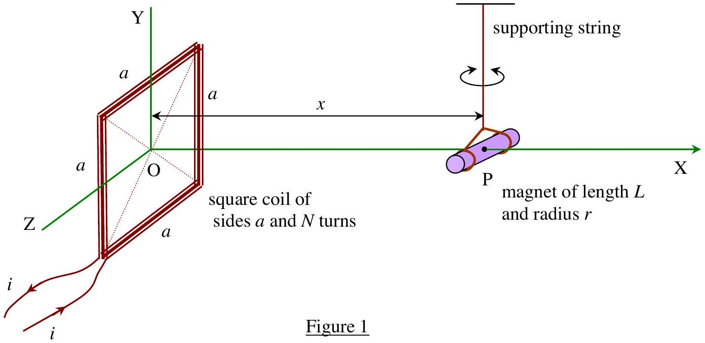
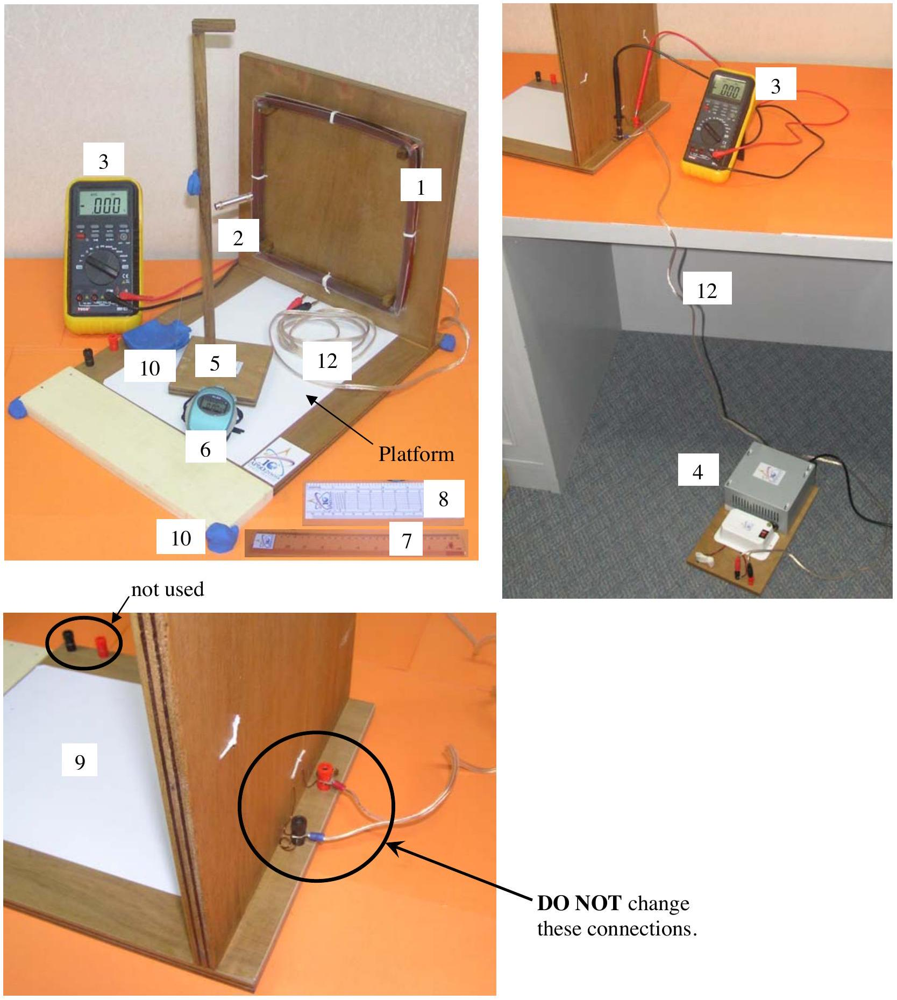
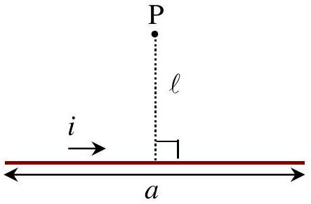

## Problem 1: The Earth's Horizontal Magnetic Field

This is to determine the horizontal component of the Earth's magnetic field $B_{\mathrm{H}}$ using small-amplitude oscillation of a cylindrical bar magnet. The magnet is to oscillate in the combined static fields of the Earth and that due to a square coil.

The experiment is to be done in three sections. Section I is a derivation of formulae to be used in Section III.

## Apparatus

Each student is provided with apparatus as shown in Figure 2:

1. a square coil of resistance $5.2 \pm 0.2 \Omega$ and 130 turns
2. a small cylindrical magnet of mass 15.0 ± 0.2 g with nylon strings.
3. a voltmeter (for measuring the potential difference across the coil only)
4. a power supply (placed under the table to avoid the interference of its magnetic field)
5. a wooden stand
6. a stop watch
7. a ruler
8. a protractor
9. white label (you can write on it)
10. color clay
11. graph papers
12. an electrical cord

Figure 2

Warning
Use the multi-meter to measure only the voltage difference of the coils. Using the multi-meter in other modes can destroy the power supply!!!

Section I
[1 point]

Figure 3

It is given here that the magnetic flux density $B_{\mathrm{P}}$ at a perpendicular distance $\ell$ from the middle of a straight current element $i a$ is

$$
B_{\mathrm{P}}=\frac{\mu_{0} i}{2 \pi \ell} \frac{(a / 2)}{\sqrt{\ell^{2}+\left(\frac{a}{2}\right)^{2}}}
$$

where $\mu_{0}=4 \pi \times 10^{-7}$ henry per metre, the permeability of free space.

Use this expression to show that the expression for the magnitude of the magnetic flux density from the square coil at point P in Figure 1 is given by

$$
B_{p x}=\left(\frac{\mu_{0} a^{2} i N}{2 \pi}\right)\left[\frac{1}{\left(x^{2}+\left(\frac{a}{2}\right)^{2}\right) \sqrt{x^{2}+2\left(\frac{a}{2}\right)^{2}}}\right]
$$

It is also given here that the period of a small-amplitude oscillation of the magnet in the net magnetic field $B$ is

$$
T=2 \pi \sqrt{\frac{I}{m B}}
$$

where $m$ is the magnetic moment of magnet with mass $M$, and $I$ is its moment of inertia about the axis through its centre of mass

$$
I=M\left(\frac{L^{2}}{12}+\frac{r^{2}}{4}\right)
$$

## Section II

[0.8 point]
For the experiments in Section III you have to align the magnet in the position as shown in Figure 1. If the length of the string is too small, the torsion of the string cannot be neglected in the oscillation of the magnet. Perform appropriate measurements (say, oscillation of magnet in Earth's magnetic field alone) to justify that we can ignore the torsion of the string. You are not required to plot a graph.

## Section III

For the following experiments (in $\mathrm{a}, \mathrm{b}$, and c ), you have to align the magnet in the position as shown in Figure 1. Measure and write down the value of the distance between the centre of the magnet and the top surface of the platform.
[0.2 point]
a) Coil's magnetic field and Earth's horizontal magnetic field in the same direction [5 points]

Warning
Please connect the coil to the power supply and leave it on for at least 5 minutes.

Measure periods of oscillation for different values of the combined field strength when the coil's magnetic field and Earth's magnetic field are in the same direction. Draw a straight line graph and compute the values of $B_{\mathrm{H}}$ and the magnetic moment $m$ from this graph and estimate their errors.
b) Earth's magnetic field only
[1 point]
Use the value of $m$ from (a) and the period of oscillation of the magnet bar in the absence of the Coil's magnetic field from Section II to calculate again the value for $B_{\mathrm{H}}$ and estimate its error.
c) Coil's magnetic field and Earth's horizontal magnetic field in opposite directions
[2 points] By reversing the connection at the power supply, find the equilibrium position $x_{0}$ along the Xdirection between Earth's magnetic field and the opposing magnetic field from the coil. Use the value of $x_{0}$ to calculate again the value for $B_{\mathrm{H}}$ and estimate its error.
