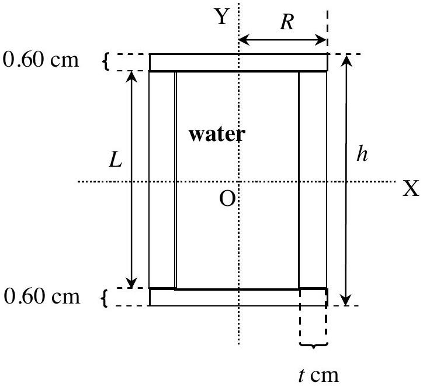
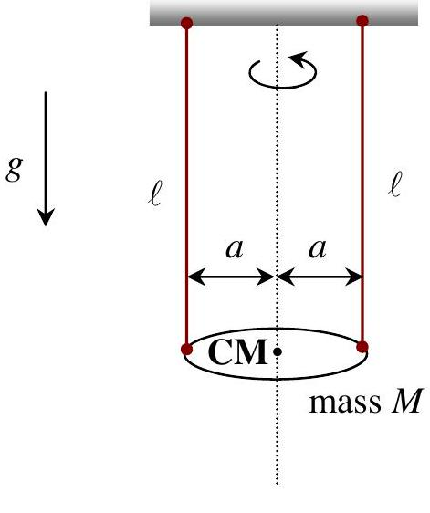
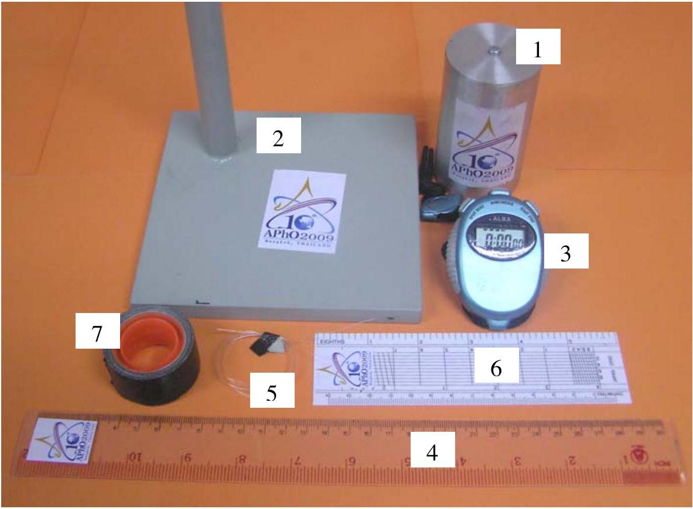
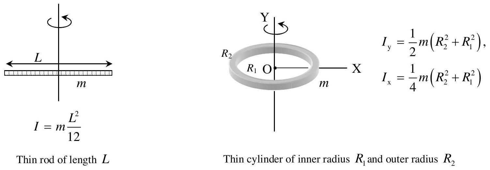
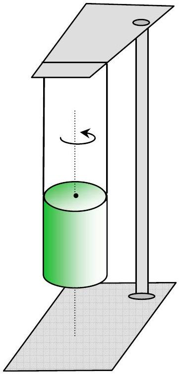
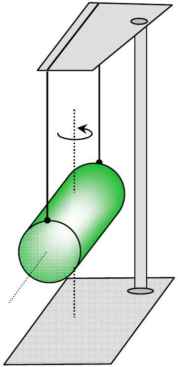

## Problem 2: Oscillation of Water-Filled Vessel

The student is required to perform non-destructive measurements in order to determine the thickness $t$ of an aluminium vessel whose cavity is completely filled with water. The aluminium vessel is composed of a cylinder and two end plates. The cylinder is of length $L$ and outer radius $R$. The total length of the vessel is $h$. The thickness of both end plates is 0.60 cm (see Figure 1). You can neglect the error of this thickness. In this problem, please use gramme and centimetre as units for mass and length, respectively.

Figure 1

Figure 2

Figure 2 shows the so-called bifilar suspension of mass $M$. The two strings are each of equal length $\ell$. The period $T$ of a small-amplitude oscillation of $M$ is

$$
T=2 \pi \sqrt{\frac{\ell}{g} \cdot \frac{I}{M a^{2}}}
$$

where $I$ is the effective moment of inertia about the vertical axis through the centre of mass of $M$ and $g$ is the acceleration due to gravity at Bangkok $\left(g=978 \mathrm{~cm} \mathrm{~s}^{-2}\right)$.

This experiment consists of two parts. Section I concerns a derivation of formulae and Section II concerns the actual experimentation.

## Apparatus

Each student is provided with:

1. a water-filled vessel
2. a stand
3. a stop watch
4. a ruler
5. a nylon string
6. a protractor
7. masking tapes
8. a knife (not shown in the figure below)

## Section I

[2.0 points] The student is to derive expressions in terms of $R, L, t$ and the density $\rho$ of aluminium of the following quantities, [see Figure 1]

i) mass $\left(m_{1}\right)$ of the cylindrical body of the vessel,
ii) mass $\left(m_{2}\right)$ of each end plate,
iii) mass $\left(m_{3}\right)$ of water in the whole cavity,
iv) the total mass $(M)$ of the water-filled vessel, and
v) the effective moment of inertia, $I_{\mathrm{y}}$, about the Y-axis, of this water-filled vessel (see

Figure 1), assuming that the water is ideal fluid.
Then perform measurements of $R, h, L$. By substituting the values, derive expressions in terms of $t$ for the quantities i)-v) above. The aluminium density $\rho=2.70 \mathrm{~g} / \mathrm{cm}^{3}$ and the water density is 1.00 $\mathrm{g} / \mathrm{cm}^{3}$.

## Hint:

Figure 3

## Section II

Figure 4

Figure 5

a) Angular oscillation about the axis of symmetry
[4.0 points] For one fixed value of $\ell$, perform precise measurements of the period $T_{\mathrm{y}}$ for a small-amplitude oscillation as in Figure 4. Then compute the value of the thickness $(t)$ of the cylindrical wall. Estimate the experimental error $\Delta t$ for the thickness. Compute also the values of $m_{1}, m_{2}, m_{3}$, and $M$ using this value of $t$.
b) Angular oscillation about the central axis perpendicular to the length
[2.8 points] Change the bifilar suspension of the vessel to that of Figure 5 and make similar measurements as in (a).

Then use the value of the period of oscillation just found together with the values of $t, m_{1}, m_{3}, M$ found in (a) to compute the value of the effective moment of inertia $I_{\mathrm{x}}^{\text {Exp }}$ of the vessel about the X-axis (see Figure 2 and Figure 5).

Compute also the theoretical estimate of the value of $I_{\mathrm{x}}^{\text {Theo }}$ based on the value of $t$ found in (a) assuming that the whole of the computed mass of water found in (a) is now constrained to take part in the oscillatory motion of the vessel.
c) Comparing experimental and theoretical values of the moment of inertia
[1.2 points]
What is the difference ( $\Delta I_{\mathrm{x}}$ ) between the values of $I_{\mathrm{x}}^{\text {Theo }}$ and $I_{\mathrm{x}}^{\text {Exp }}$ ?
Do you consider this difference statistically significant?
Estimate the percentage of the mass of water that takes part in the oscillatory motion in (b), assuming this water to be circular discs adhering to the end plates.

Hint:

$$
I_{\mathrm{x}}^{\text {Theo }}=m_{1}\left[\frac{L^{2}}{12}+\frac{R^{2}+(R-t)^{2}}{4}\right]+2 m_{2}\left[\frac{(0.6 \mathrm{~cm})^{2}}{12}+\frac{R^{2}}{4}+\left(\frac{L}{2}+\frac{0.6 \mathrm{~cm}}{2}\right)^{2}\right]+m_{3}\left[\frac{L^{2}}{12}+\frac{(R-t)^{2}}{4}\right]
$$
