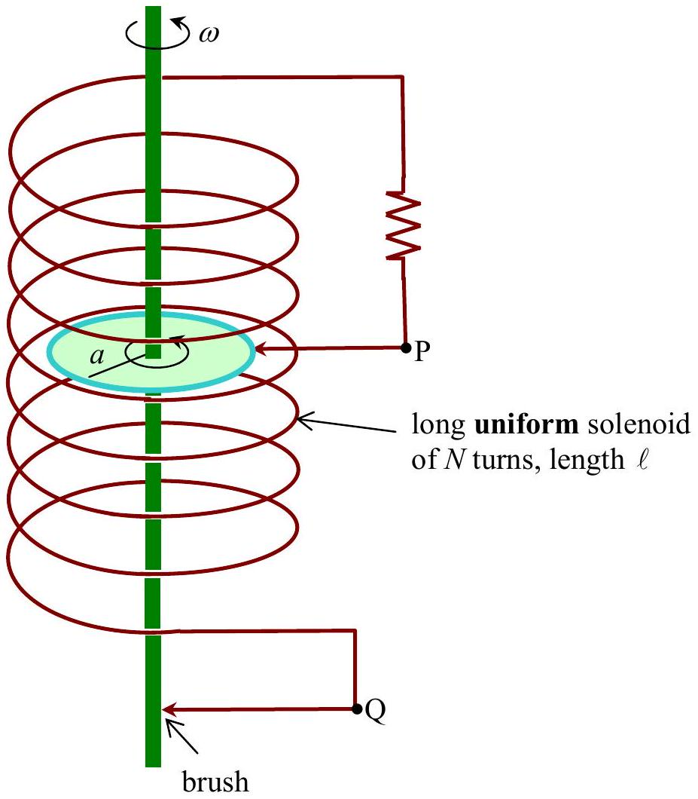

## A Self-excited Magnetic Dynamo

A metallic disc of radius $a$ mounted on a slender axle is rotating with a constant angular velocity $\omega$ inside a long solenoid of inductance $L$ whose two ends are connected to the rotating disc by two brush contacts as shown. The total resistance of the whole circuit is $R$. A small magnetic disturbance can initiate the growth of an induced electromotive force across the terminals P, Q.

2.1) Write down the differential equation for $i(t)$, the current through the circuit. Express your answer in terms of $L, R$, and the induced e.m.f. $(\mathcal{E})$ across the terminals P and Q . ( 1.0 point)
2.2) What is the value of the magnetic flux density $(B)$ in terms of $i, N, \ell$, and the permeability of free space $\mu_{0}$ ? Ignore the magnetic field generated by the disc and the axle. (1.5 points)

2.3) What is the expression for the induced e.m.f. $(\mathcal{E})$ in terms of $\mu_{0}, N, a, \ell, i$, and the angular velocity $\omega$ ? (2.0 points)
2.4) Solve the equation in question 2.1 for current at any time $t$ in terms of the initial current $i(0)$, and other parameters. (1.5 points)
2.5) What is the minimum value of the angular velocity that will permit the current to grow? Give your answers in terms of $R, \mu_{0}, N, a$, and $\ell$. (2.0 points)
2.6) In order to maintain a certain steady angular velocity $\omega$, what must be the value of torque applied to the axle at the instant $t$ ? (2.0 points)
