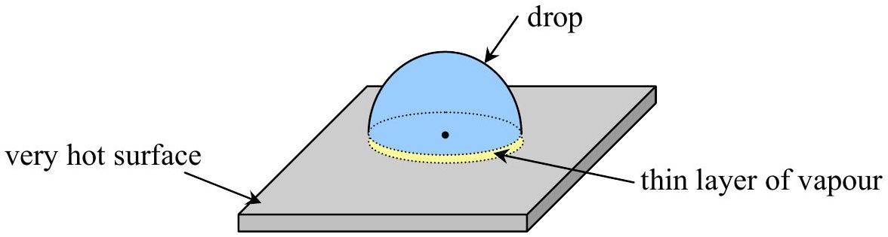
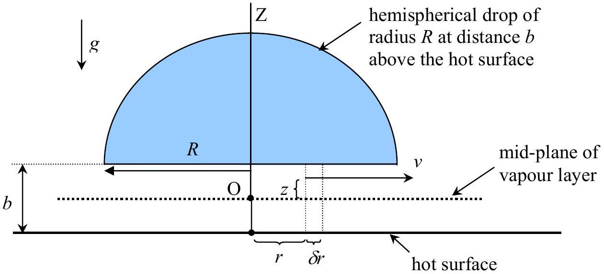

## The Leidenfrost Phenomenon

The purpose is to estimate the lifetime of a (hemispherical) drop of a liquid sitting on top of a very thin layer of vapour which is thermally insulating the drop from the very hot plate below.

Figure 1

It will be assumed here that the flow of vapour underneath the drop is streamline and behaves as a Newtonian fluid of viscosity coefficient $\eta$ and of thermal conductivity $\mathcal{K}$. The specific latent heat of vaporization of the liquid is $\ell$. And for a Newtonian fluid we have the shear stress $\frac{F}{A}=\eta \times$ the rate of shear $\frac{d v}{d z}$ where $v$ is the flow velocity and $z$ is the perpendicular distance to the direction of flow, and the direction of $F$ is tangential to the surface area $A$.

Figure 2

$v$ is the velocity of vapour in the radial direction at the height $z$ above the mid-plane. The pressure $P$ inside the vapour must be higher towards the centre O. This will result in the out-flowing of
vapour and in force that holds the drop against the pull of gravity. The thickness of vapour layer under thermal and mechanical equilibria is $b$.

For a Newtonian flow of vapour we can approximate that

$$
\frac{d}{d z} v=\frac{z}{\eta} \frac{d}{d r} P
$$

3.1) Show that $\quad v(z)=\frac{z^{2}}{2 \eta} \frac{d}{d r} P+C$ where $C$ is an arbitrary constant of integration. (0.5 point)
3.2) Refer to figure 2 , find the value of $C$ in terms of $\eta, \frac{d}{d r} P$, and $b$ using the boundary condition $v=0$ for $z= \pm \frac{b}{2}$. (0.5 point)
3.3) Calculate the volume rate of flow of vapour through the cylindrical surface defined by $r$. (Hint: the cylinder is of radius $r$ and of height $b$ underneath the drop). (1.0 point)
3.4) By assuming that the rate of production of vapour of density $\rho_{\mathrm{v}}$ is due to heat flow from the hot surface to the drop, find the expression for the pressure $P(r)$. Use $P_{\mathrm{a}}$ to represent the atmospheric pressure, and use $\Delta T$ for the temperature difference between those of the hot surface and of the drop. Assume that the system has reached the steady state. (2.0 points)
3.5) Calculate the value of $b$ by equating the weight of the drop to the net force due to pressure difference between the bottom and the top of the drop. The density of the drop is $\rho_{0}$. (2.0 points)
3.6) Now, what is the total rate of vaporization?

3.7) Assume that the drop maintains a hemispherical shape, what is the life-time of the drop?
