## Experimental components

Set-C for common components :
| Label | Items | Quantity |
| :--- | :--- | :--- |
| C-A | Optical track (60 cm) | 1 |
| C-B | Optical clamps | 4 |
| C-C-\# | Collimated laser diode (CLD) | 1 |
| C-D-\# | Sine wave generator (sine wave, DC 5V output) | 1 |
| C-E-\# | Variable resistor ( $5 \mathrm{k} \Omega$ ) | 1 |
| C-F-\# | Connecting wires | 4 |
| C-F-6 | Component stand | 1 |
| C-G | Ruler | 1 |

Note: "\#" is the serial number for the component. This number is for examiner's use.
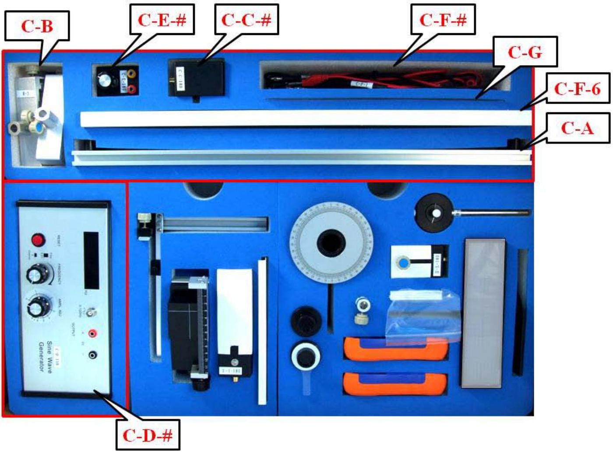

Experimental Competition
27 April 2010

Page 2 of 12

Set-I for Experiment-I
| Label | Items | Quantity |
| :--- | :--- | :--- |
| I-H-\# | Black box on a 1-D translational stage | 1 |
| I-I-\# | Brass reed attached to a driving box* | 1 |
| I-J | Screen for amplitude measurement | 1 |
| I-K-\# | Vertical slider (with a ruler and a magnet) | 1 |

*The brass reed with a fixed end inside a box is attached to a piezo driven by an AC voltage.
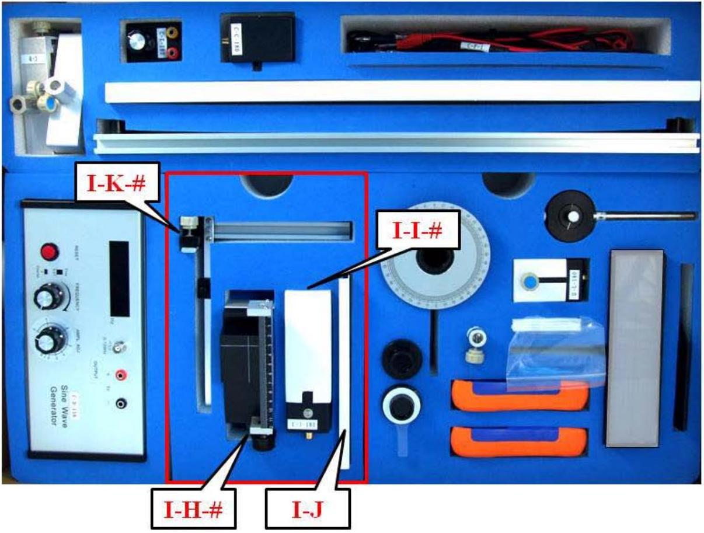

Experimental Competition
27 April 2010

Page 3 of 12
(O) Instructions for the Sine Wave Generator:

- The power button, not shown in the picture, is on the right-hand side of the instrument.
- The "Display Panel" shows the frequency of the output sine wave.
- Use the "Sine Wave" BNC connector for supplying a sine wave voltage.
- Use the "5V DC" banana connectors for supplying a constant voltage of 5V.
- The frequency of the sine wave can be changed by turning the "FREQUENCY" knob, faster for coarse adjustment and slower for fine adjustment. Ignore the fine and coarse labels next to the "FREQUENCY" knob.
- The amplitude of the sine wave voltage can be adjusted by turning the "AMPL ADJ" knob.
- The "RESET" bottom may be pushed to reset frequency to 0.00 Hz.
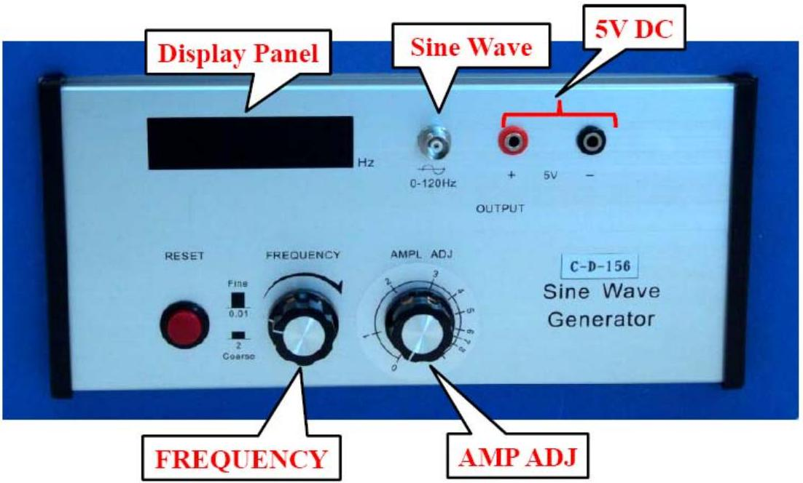

Set-II for Experiment -II
| Label | Items | Quantity |
| :--- | :--- | :--- |
| II-L-\# | Uncollimated laser diode (ULD) | 4 |
| II-M | Holders for ULD | 1 |
| II-P-\# | Polarizer with indicator (PR2) | 1 |
| II-Q-\# | Polarizer (PR1) | 1 |
| II-R | Holder for PR1 and PR2 | 1 |
| II-T | Holder for light filter | 1 |
| II-U | Light filters | 4 |
| II-V | Beam viewing bex (screen) | 4 |
| II-W-\# | Photoconductor (PC) | 1 |
| II-X | Digital multimeter | 1 |
| II-Y | Digital multimeter | 1 |

Items II-L-\#, II-M, and II-V are not used.
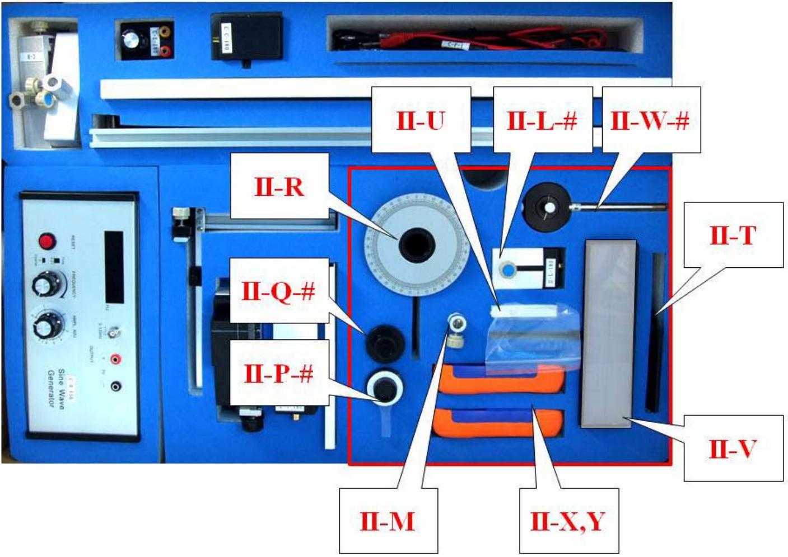

Experimental Competition
27 April 2010

Page 5 of 12

○ Instructions for the digital multimeter:

- You can turn the digital multimeter on or off by pressing the power button.
- Use the "V $\Omega$ " and the "COM" inlets for voltage and resistance measurements.
- Use the "mA" and the "COM" inlets for small current measurements.
- Use the function dial to select the proper function and measuring range. "V" is for voltage measurement, " A " is for current measurement and " $\Omega$ " is for resistance measurement.
- Do not press the "HOLD" button, which will hold the display reading and stop the measurement function. You can release it by pressing the button again.

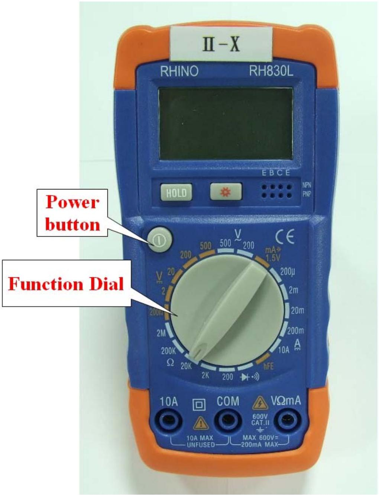

## Experiment I. Magnetic force probe

Introduction
As shown in Fig. I-1, the free end of a reed can oscillate in the vertical direction when it is driven by an external oscillating force, and its frequency is determined by the external driver. If we plot the average power dissipated in the vibrating reed, which has certain damping mechanisms, as a function of frequency, we can find a maximum dissipated power at a certain frequency called the resonance frequency $\boldsymbol{f}_{\boldsymbol{R}}$, as illustrated in Fig. I-2. The sharpness of the resonance is described by the quality factor $\boldsymbol{Q}$ as:

$$
\mathrm{Q}=\frac{f_{R}}{\Delta f}
$$

where $\Delta f$ is the full width at half maximum of the $P_{a v} f$ curve, as shown in Fig. I-2, i.e. $\Delta f$ $=f_{2}-f_{1}$ with $f_{1}$ and $f_{2}$ corresponding to $P_{\text {max }} / 2$ on the lower side and the higher side of the resonance frequency respectively.

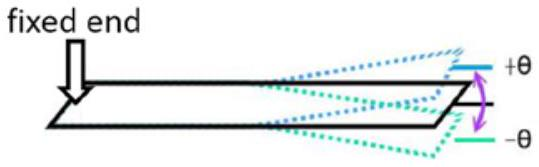
Fig. I-1. A vibrating reed.

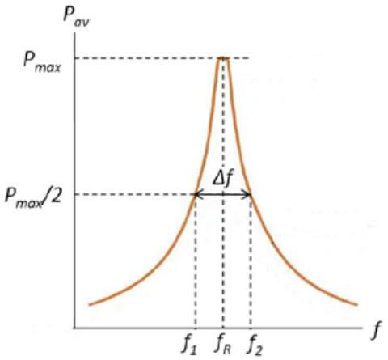
Fig. I-2. Plot of the average dissipated power versus the driving frequency.

Besides the oscillating driving force, if the free end of the reed is subjected to a uniform force, its resonance frequency, amplitude and quality factor remain the same. On the other hand, under a non-uniform force, many properties of the vibrating reed, such as the resonance frequency $f_{R}$, the maximum amplitude $A$, and the quality factor $Q$, may vary with the position of its free end.

In this experiment, a small magnet adhered to the free end of the reed serves as a probe tip as shown in Fig. I-3, while a target magnet underneath the tip magnet produces a non-uniform magnetic field and exerts a non-uniform force on the tip magnet. When the tip magnet approaches the target magnet underneath with same pole opposing each other, then the repulsive force becomes stronger. Thus the resonance frequency $f_{R}$ of the reed varies with the distance between the tip magnet and the target magnet. The resonance frequency increases with decreasing separation distance between the two repulsing magnets. However, when moving the tip magnet horizontally away from the target magnet as shown in Fig. I-4, it may sense a weak attractive force at a certain distance. The resonance frequency shifts to lower values when the non-uniform force is attractive. We shall use this property, that the resonance frequency of the reed sensitively depends on the separation between the tip magnet and target magnet, to locate the hidden magnets inside a black box.

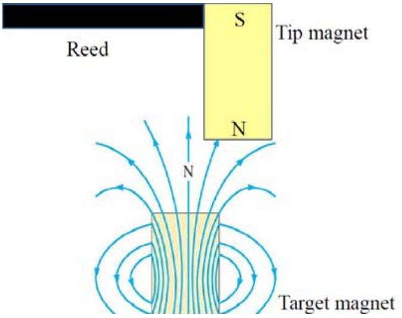
Fig. I-3. Near a pole of a target magnet, the magnetic field is non-uniform.

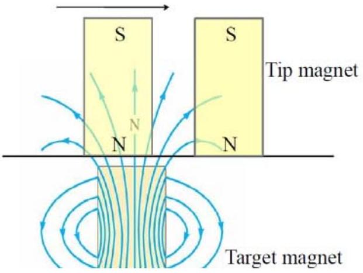
Fig. I-4. Moving a tip magnet horizontally may cause it to sense an attractive or repulsive force.

○ Experimental procedures
Error analysis is not required in any parts of Experiment I.

Exp. I-A 、Measuring the resonance frequency
Carefully take out the experimental components from Set-C and Set-I, and set up the experimental apparatus as shown in Fig. I-A-1. The schematic plot is shown in Fig. I-A-2. Connect the 5V-DC voltage source to the laser box (C-C-\#). Connect the oscillating output of the sine wave generator to the driving box of the brass reed (I-I-\#). Turn on the power and fix the output voltage of the sine wave generator. Direct the laser beam into the mirror at the free end of the brass reed so that the reflected beam spot on the screen (I-J) can be used to determine the vibrating amplitude of the reed.

Caution: 1) Carefully remove the paper protected cover before using the brass reed (I-I-\#) for experimental measurements. The resonance frequency of the brass reed is very sensitive to its shape, and any deformation of reed during the experiment may give an inaccurate result.
2) Do not directly look into the laser beam, which can damage your eyes.

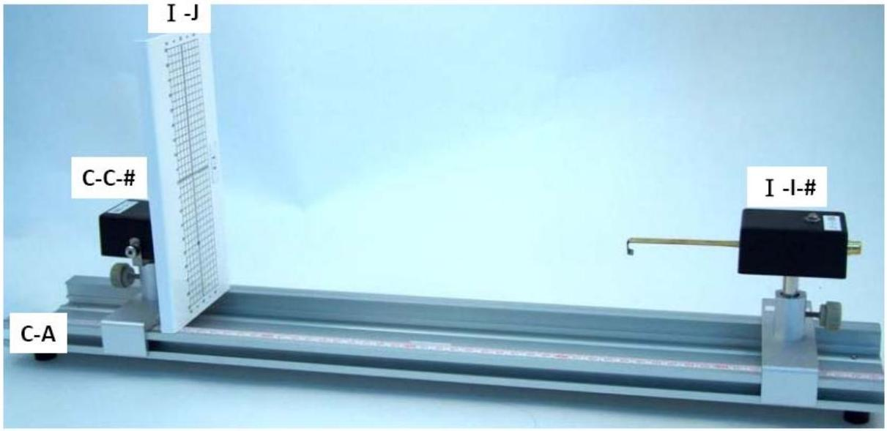
Fig. I-A-1. Experimental setup for finding the resonance frequency.

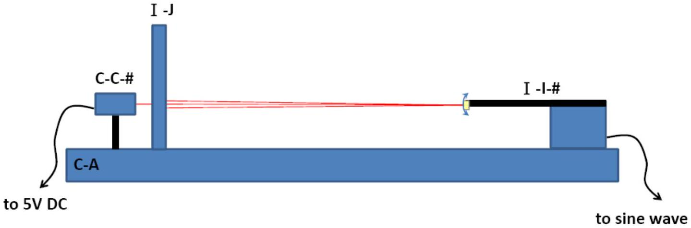
Fig. I-A-2. The schematic plot of Fig. I-A-1.

(1) Measure the amplitude $A$ of the oscillating laser beam spot by changing the frequency of the sine wave generator. Record the measured amplitude as a function of frequency in the data table on the answer sheet. (0.8 points)
(2) Make a proper plot on one of the supplied graph papers to determine the resonance frequency $f_{R O}$ and quality factor $Q$. Also record the obtained $f_{R O}$ and $Q$ in the proper blank spaces on the answer sheet. (1.2 points)

## Exp. I-B 、Resonance frequency versus the external force.

In this part of experiment, the resonance frequency under the influence of a non-uniform force is investigated. The non-uniform force is provided by a small 3-mm cylindrical metallic calibration magnet $\mathrm{M}_{\mathrm{C}}$ fixed on a vertical slider ( $\mathrm{I}-\mathrm{K}-\#$ ) with its N pole pointing upward. The tip magnet $\mathrm{M}_{\mathrm{T}}$, adhered at the free end of the oscillating reed, has its N pole pointing downward. The pole axes of both magnets should be aligned along the same vertical line.

Set up the experiment as shown in Fig. I-B-1. The schematic plot is shown in Fig. I-B-2.

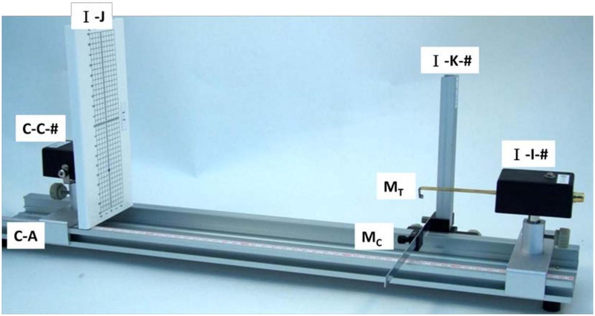
Fig. I-B-1. Experimental setup of finding the relation of resonance frequency with the nominal distance between two magnets, $\mathrm{M}_{\mathrm{C}}$ and $\mathrm{M}_{\mathrm{T}}$.

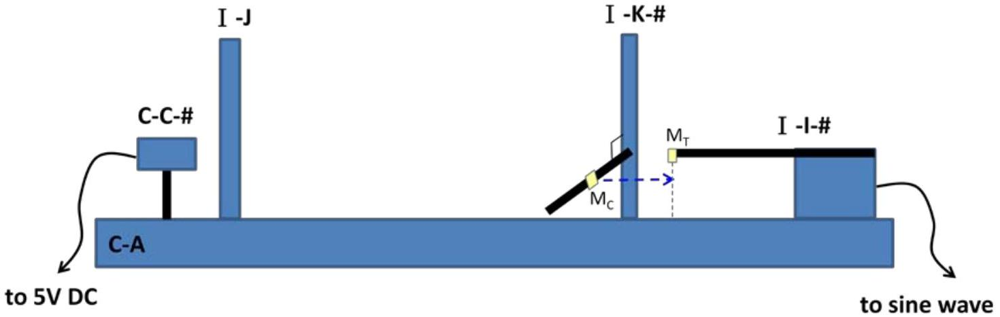
Fig. I-B-2. The schematic plot of Fig. I-B-1.

(1) On the scale of the vertical slider, read out the position $z_{0}$ of the bottom plane for the tip magnet $\mathrm{M}_{\mathrm{T}}$ without the interaction of $\mathrm{M}_{\mathrm{C}}$ by properly moving $\mathrm{M}_{\mathrm{C}}$ away from $\mathrm{M}_{\mathrm{T}}$. Record the measured $z_{0}$ in the data table. (0.2 points)
(2) Adjust the position of the magnet $\mathrm{M}_{\mathrm{C}}$ to be right underneath $\mathrm{M}_{\mathrm{T}}$. The pole axes of both magnets should be aligned along the same vertical line. Determine the position $z$ of the top plane of the N-pole of $\mathrm{M}_{\mathrm{C}}$. Calculate the nominal distance $d$ by defining $d=z_{0}-z$. Record $z$ and $d$ in the data table. (Note: The equilibrium separation between the two magnets is not the same as $d$ because the two magnets repel each other.)
(3) Determine the resonance frequency $f_{R}$ for the distance $d$ by tuning the frequency of

the sine wave generator until the maximum amplitude is reached, plotting amplitude versus frequency is not necessary for determining $f_{\mathrm{R}}$ of each distance $d$. Record the determined resonance frequency $f_{R}$ in the data table.
(4) Change the vertical position of the magnet $\mathrm{M}_{\mathrm{C}}$ and repeat the steps (2) and (3) for a number of measurements of different distance $d$ and the corresponding resonance frequency $f_{R}$. (1.2 points)
(5) Plot a graph of $f_{R}$ as a function of distance $d$ using a graph paper. Guiding by eyes, draw the best line through the data points. (1.2 points)
(6) Define $\Delta f_{R}=f_{R}-f_{R O}$, and plot $\ln \left(\Delta f_{R}\right)$ as a function of $d$ using another graph paper. Guiding by eyes, draw the best line through the data points. (1.0 points)

## Exp. I-C 、Finding the positions and depths of the magnets inside a black box.

There are two magnets $\mathrm{M}_{\mathrm{A}}$ and $\mathrm{M}_{\mathrm{B}}$ buried in the black box (I-H-\#) which is fixed on a 1D translational stage. The N poles of both magnets are pointed upward. Magnets $\mathrm{M}_{\mathrm{A}}$ and $\mathrm{M}_{\mathrm{B}}$, and $\mathrm{M}_{\mathrm{C}}$ used in Exp. I-B are very close in size, shape, and magnetic properties. The depths of the magnets $\mathrm{M}_{\mathrm{A}}$ and $\mathrm{M}_{\mathrm{B}}$ may be different. Magnet $\mathrm{M}_{\mathrm{A}}$ is located at the intersection of the two lines marked on the top surface of the black box. Magnet $\mathrm{M}_{\mathrm{B}}$ is located somewhere along the longer line as shown in Fig. I-C-1. The horizontal distance between magnets $\mathrm{M}_{\mathrm{A}}$ and $\mathrm{M}_{\mathrm{B}}$ is denoted by $\overline{A B}$.

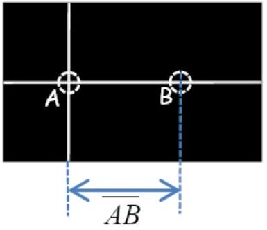
Fig. I-C-1. Magnet $\mathrm{M}_{\mathrm{A}}$ is located beneath the intersection of the two lines marked on the top surface while the magnet $\mathrm{M}_{\mathrm{B}}$ is located somewhere along the longer line.

(1) On the scale of the vertical slider, read out the position $z_{0}$ (in this part, $z_{0}$ may be different from the $z_{0}$ in Exp. I-B) of the bottom plane for the tip magnet $\mathrm{M}_{\mathrm{T}}$ without the interaction of the magnets inside the black box. On the scale of the vertical slider, read out the position $z_{\text {box }}$ of the top plane of black box. Record $z_{0}$ and $z_{\text {box }}$ on the answer sheet. (0.2 points)

(2) Move the black box along the longer line and observe the variation in resonance frequency $f_{R}$ of the reed to find the position of $\mathrm{M}_{\mathrm{B}}$. Record the measured distances $y$ and their corresponding resonance frequencies $f_{R}$ in the data table. (1.4 points)
(3) Plot $f_{R}$ as a function of $y$ on a graph paper to determine the position of magnet $\mathrm{M}_{\mathrm{B}}$. Mark the positions of magnets $\mathrm{M}_{\mathrm{A}}$ and $\mathrm{M}_{\mathrm{B}}$ on the $y$-axis of your graph, and write down the value of $\overline{A B}$ on the answer sheet. (1.2 points)
(4) Determine the depths $d_{A}$ and $d_{B}$ of the magnets $\mathrm{M}_{\mathrm{A}}$ and $\mathrm{M}_{\mathrm{B}}$ from the top surface of the black box using the results in Exp. I-B. Write down the values of $d_{A}$ and $d_{B}$ on the answer sheet. (1.6 points)
