## Experiment II Understanding Semiconductor Lasers

The purpose of this experiment is to explore the basic characteristics of semiconductor lasers. We will measure and calculate the fraction of the linear polarization of the collimated laser beam by using a pair of polarizers and a photoconductor. Finally, we will determine the maximum value of the power increase per current increment of the collimated laser.

Safety Caution: Do not look directly into the laser beam, which can damage your eyes!!

## - Background Description

The photoconductor, the light-sensing device in this experiment, is made of semiconductor, which has a band gap of $\mathrm{E}_{\mathrm{G}}=\left(\mathrm{E}_{\mathrm{C}}-\mathrm{E}_{\mathrm{V}}\right)$ (see Fig. II-1). When the energy of the incident photons is larger than that of the band gap, the photons can be absorbed by the semiconductor to create free electrons and holes. The density of charge carriers, including electrons and holes, is then increased, and so is the conductivity of the material. In this experiment, the resistance (the inverse of conductance) is measured by using a multimeter.

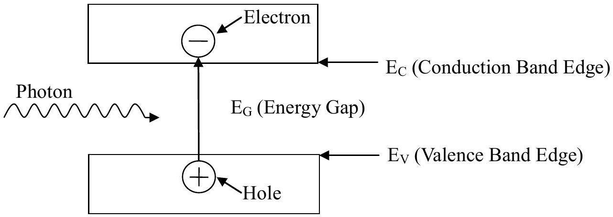
Fig. II-1 Schematic diagram of an electron-hole pair generated by a single photon in a semiconductor.

In the semiconductor laser, the light emitting device in this experiment, as the external source injects electrons and holes into the device, they can combine to emit photons as shown schematically in the Fig. II-2. Ideally, the combination of one pair of electron and hole can generate one photon. Realistically, there are also nonradiative processes through which an electron-hole pair recombines without generating a photon. Thus the number of photons generated is not equal to the number of electron-hole pairs recombined. The average fractional number of photons generated by an electron-hole pair is called the quantum efficiency.

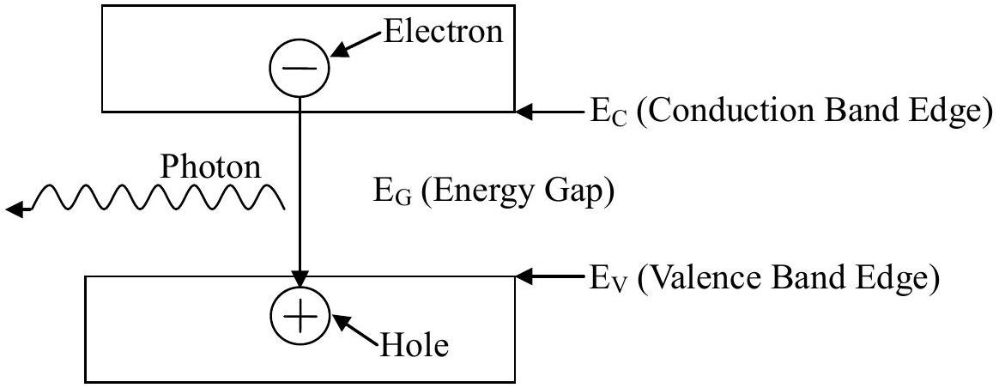
Fig. II-2 Schematic diagram of a single photon generated by an electron-hole pair combined in a semiconductor.

The semiconductor laser can emit a monochromatic, partially polarized and coherent light beam. The partially polarized light is composed of two parts - linearly polarized and unpolarized. The light intensity due to the former is denoted by $\mathrm{J}_{\mathrm{p}}$ and the other by $\mathrm{J}_{\mathrm{u}}$. When the partially polarized light is incident upon a polarizer, the transmittance of the linearly polarized part depends on the angle between its polarized direction and the direction of the polarizer. But for the unpolarized part, a constant portion is allowed to pass through the polarizer and is independent of the angle.

## - Experiments and Procedures

## Exp. II-A : Light Response of the Photoconductor

The light source used in this part should be the collimated laser diode (CLD). Use the circuit diagram shown in Fig. IIA-1 to provide current for the CLD. The symbols used in Fig. IIA-1 are listed in Table IIA-1.

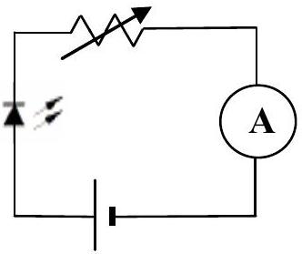
Fig. IIA-1 Circuit diagram used for the CLD.

Table IIA-1 Symbols used in Fig. IIA-1
| Devices | Collimated Laser Diode | 5V dc-power | Variable Resistors | Ammeter (Multimeter) |
| :--- | :--- | :--- | :--- | :--- |
| Symbols | 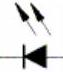 | 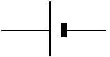 | 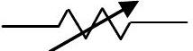 | 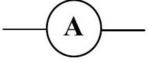 |
| Label | C-C-\# | C-D-\# | C-E-\# | II-X, II-Y |

Operate the CLD with the maximum current. The laser intensity is detected by a photoconductor (PC). When you shine light on a PC, the conductance increases with the light intensity. You should minimize the ambient light effect. In this experiment, we actually measure the resistance, which is the inverse of conductance. The intensity of the laser light reaching the PC may be varied by using the supplied polarizers or filters. The symbols of other optical components are given in the Table IIA-2. The partial polarization of the laser light may be observed by using the experimental setup in the Fig. IIA-2.

Table IIA-2 Symbols of optical components.
| Devices | Collimated Laser Diode | Polarizers | Photoconductor | Light filter |
| :--- | :--- | :--- | :--- | :--- |
| Symbols | 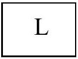 | 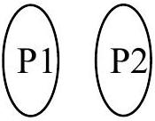 |  | 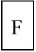   Optional |
| Label | C-C-\# | II-P-\# II-Q-\# | II-W-\# | II-U |

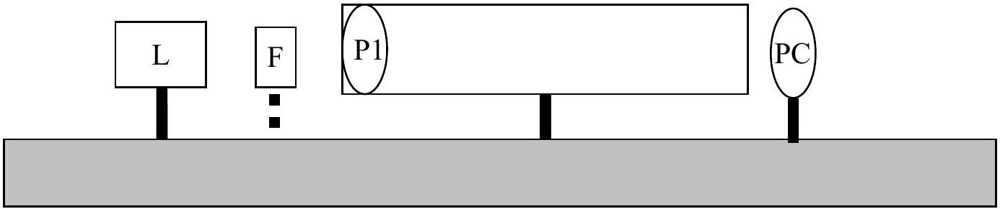
Fig.IIA-2 Experimental setup for the preparation

Rotating P1, one should observe that the PC resistance varies. Adjust P1 so that the PC resistance reaches a minimum. If the observed minimum resistance happens in a range, say 10° or larger of the rotation angle of P1, then the PC is saturated. In this case light filter(s) should be used to avoid PC saturation near the maximum light intensity.

Fix the P1 position according to the description in previous paragraph. Characterize the conductance of the PC versus the relative light intensity following the experimental setup shown in the Fig. IIA-3.

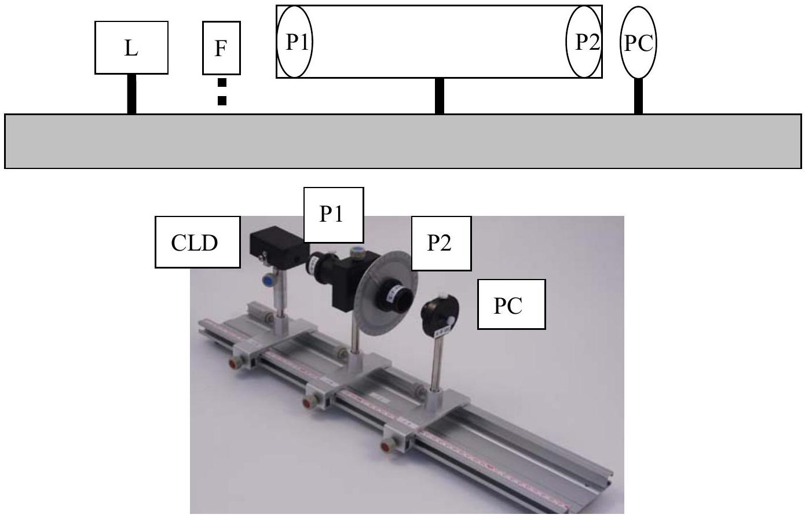
Fig.IIA-3 Experimental setup for the PC characterization

(1) Define $\theta_{P}$ to be the relative angle between polarization axes of P1 and P2. By varying the angle $\theta_{P}$ from $0^{\circ}$ to $180^{\circ}$ in step of $5^{\circ}$. Record the measured PC resistance and $\theta_{P}$ in the data table. Transform the measured PC resistance values into conductance values and record them in the data table. No error analysis is required. (1.2 points)
(2) Plot the PC conductance values as a function of $\theta_{P}$ on a graph paper. No error analysis is required. (1.2 points)

## Exp. II-B : The Fraction of Linearly Polarized Laser Light

The light source used in this part should be the collimated laser diode (CLD) with a 15 mA current from the dc power supply. The task in this part is to determine the fraction $\beta$ of the laser light that is linearly polarized by using the setup in Fig. IIA-2, which is the same as the previous section. No error analysis is required in this part.

$$
\beta=\frac{J(\text { Linearly Polarized })}{J(\text { Unpolarized })+J(\text { Linearly Polarized })}=\frac{J_{\max }-J_{\min }}{J_{\max }+J_{\min }}
$$

$J_{\text {max }}$ and $J_{\text {min }}$ are the maximum and minimum light intensity detected by PC while rotating P1.

Fig.IIA-2 Experimental setup for the preparation

(1) Find the maximum and minimum values of PC resistance $\left(R_{\text {max }}\right.$ and $\left.R_{\text {min }}\right)$ by rotating P1 $360^{\circ}$. Transform $R_{\text {max }}$ and $R_{\text {min }}$ into the minimum and maximum values of PC conductance $C_{\text {min }}$ and $C_{\text {max }}$. Record the data in the data table. (0.8 points)
(2) Utilizing the conductance versus $\theta_{P}$ graph in Exp. II-A-(2) to determine the relative intensities $J_{\text {max }}$ and $J_{\text {min }}$ corresponding to $C_{\text {max }}$ and $C_{\text {min }}$. Write down the result on the answer sheet. (1.6 points)
(3) Calculate $\beta$ and write down the result on the answer sheet.

## Exp. II-C : The Differential Quantum Efficiency of the

## Collimated Laser Diode

The task of this part is to characterize the relative light intensity versus the current through the collimated laser diode (CLD) and determine the Differential Quantum Efficiency $\boldsymbol{\eta}$, which will be defined below. Control the current of CLD in the range between 5 mA and 20 mA. Make sure that the PC is not saturated when the current is close to 20 mA. Filters or polarizers can be used to avoid saturation.

(1) Control the CLD current and measure the corresponding PC resistance values. Record the data in the data table. Transform your data and plot the PC conductance versus CLD current on a graph paper. No error analysis is required. (1.3 points)
(2) Based on the graph of step (1), choose a region $(\Delta I \sim 3 \mathrm{~mA})$ centered around the maximum slope. By using the conductance versus $\theta_{P}$ graph in Part II-A-(2), transform and record the data of this region in the table of step (1) into the relative light intensity ( $J$ ). Plot the relative light intensity $(J)$ versus CLD current $(I)$ on a graph paper. No error analysis is required. (0.8 points)
(3) The maximum radiating power of the CLD is assumed to be exactly $P_{\max }=3.0 \mathrm{~mW}$. Extract the maximum slope from the graph in step (2) and transfer it to the value of $\left.G \equiv \frac{\Delta P}{\Delta I}\right|_{\max }$, which is the maximum ratio of the increased amount of radiating power and the increase amount of input current. Write down your analysis and the calculated value $G$ on the answer sheet. Estimate the error of $G$. Do not include the error of the $P_{\text {max }}$. Write down your analysis and the calculated value $\Delta G$ on the answer sheet. (2.0 points)
(4) The Quantum Efficiency equals the probability of one photon being generated per electron injected. From a particular bias current of the laser, a small increment of electrons injected would cause a corresponding increment of photons. The Differential Quantum Efficiency $\boldsymbol{\eta}$ is defined as the ratio of the increased number of photons and the increased number of injected electrons. Determine $\boldsymbol{\eta}$ of your CLD by using the value of $G$ obtained in step (3). Write down your analysis and the calculated value $\boldsymbol{\eta}$ on the answer sheet.

Estimate the error of $\boldsymbol{\eta}$. Write down your analysis and the calculated value $\Delta \boldsymbol{\eta}$ on the answer sheet. (Laser wavelength $=650 \mathrm{~nm}$. Planck's constant $=6.63 \times 10^{-34} \mathrm{~J} \cdot \mathrm{~s}$. Light speed $=3.0 \times 10^{8} \mathrm{~m} / \mathrm{s}$ )
