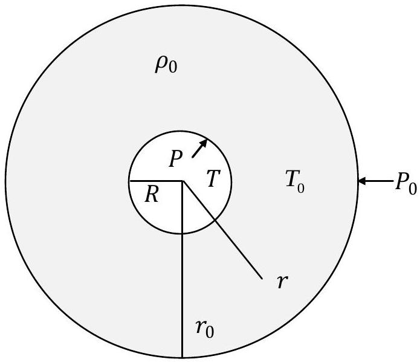

## Theoretical Question 3   Electron and Gas Bubbles in Liquids

This question deals with physics of two bubble-in-liquid systems. It has two parts:
Part A. An electron bubble in liquid helium
Part B. Single gas bubble in liquid

## Part A. An Electron Bubble in Liquid Helium

When an electron is planted inside liquid helium, it can repel atoms of liquid helium and form what is called an electron bubble. The bubble contains nothing but the electron itself. We shall be interested mainly in its size and stability.

We use $\Delta f$ to denote the uncertainty of a quantity $f$. The components of an electron's position vector $\vec{q}=(x, y, z)$ and momentum vector $\vec{p}=\left(p_{x}, p_{y}, p_{z}\right)$ must obey Heisenberg's uncertainty relations $\Delta q_{\alpha} \Delta p_{\alpha} \geq \hbar / 2$, where $\hbar$ is the Planck constant divided by $2 \pi$ and $\alpha=x, y, z$.

We shall assume the electron bubble to be isotropic and its interface with liquid helium is a sharp spherical surface. The liquid is kept at a constant temperature very close to 0 K with its surface tension $\sigma$ given by $3.75 \times 10^{-4} \mathrm{~N} \cdot \mathrm{~m}^{-1}$ and its electrostatic responses to the electron bubble may be neglected.

Consider an electron bubble in liquid helium with an equilibrium radius $R$. The electron, of mass $m$, moves freely inside the bubble with kinetic energy $E_{\mathrm{k}}$ and exerts pressure $P_{\mathrm{e}}$ on the inner side of the bubble-liquid interface. The pressure exerted by liquid helium on the outer side of the interface is $P_{\mathrm{He}}$.

(a) Find a relation between $P_{\mathrm{He}}, P_{\mathrm{e}}$, and $\sigma$. [0.4 point]
Find a relation between $E_{\mathrm{k}}$ and $P_{\mathrm{e}}$. [1.0 point]
(b) Denote by $E_{0}$ the smallest possible value of $E_{\mathrm{k}}$ consistent with Heisenberg's uncertainty relations when the electron is inside the bubble of radius $R$. Estimate $E_{0}$ as a function of $R$. [0.8 point]
(c) Let $R_{\mathrm{e}}$ be the equilibrium radius of the bubble when $E_{\mathrm{k}}=E_{0}$ and $P_{\mathrm{He}}=0$. Obtain an expression for $R_{\mathrm{e}}$ and calculate its value. [0.6 point]
(d) Find a condition that $R$ and $P_{\mathrm{He}}$ must satisfy if the equilibrium at radius $R$ is to be locally stable under constant $P_{\mathrm{He}}$. Note that $P_{\mathrm{He}}$ can be negative. [0.6 point]
(e) There exists a threshold pressure $P_{\mathrm{th}}$ such that equilibrium is not possible for the electron bubble when $P_{\mathrm{He}}$ is less than $P_{\mathrm{th}}$. Find an expression for $P_{\mathrm{th}}$. [0.6 point]

## Part B. Single Gas Bubble in Liquid - Collapsing and Radiation

In this part of the problem, we consider a normal liquid, such as water.
When a gas bubble in a liquid is driven by an oscillating pressure, it can show dramatic responses. For example, following a large expansion, it can collapse rapidly to a small radius and, near the end of the collapse, emit light almost instantly. In this phenomenon, called single-bubble sonoluminescence, the gas bubble undergoes cyclic motions which typically consist of three stages: expansion, collapse, and multiple after-bounces. In the following we shall focus mainly on the collapsing stage.

We assume that, at all times, the bubble considered is spherical and its center remains stationary in the liquid. See Fig 1. The pressure, temperature, and density are always uniform inside the bubble as its size diminishes. The liquid containing the bubble is assumed to be isotropic, nonviscous, incompressible, and very much larger in extent than the bubble. All effects due to gravity and surface tension are neglected so that pressures on both sides of the bubble-liquid interface are always equal.

## - Radial motion of the bubble-liquid interface

As the bubble's radius $R=R(t)$ changes with time $t$, the bubble-liquid interface will move with radial velocity $\dot{R} \equiv d R / d t$. It follows from the equation of continuity of incompressible fluids that the liquid's radial velocity $\dot{r} \equiv d r / d t$ at distance $r$ from the center of the bubble is related to the rate of change of the bubble's volume $V$ by

$$
\frac{d V}{d t}=4 \pi R^{2} \dot{R}=4 \pi r^{2} \dot{r} .
$$

This implies that the total kinetic energy $E_{\mathrm{k}}$ of the liquid with mass density $\rho_{0}$ is

$$
E_{\mathrm{k}}=\frac{1}{2} \int_{R}^{r_{0}} \rho_{0}\left(4 \pi r^{2} d r\right) \dot{r}^{2}=2 \pi \rho_{0} R^{4} \dot{R}^{2} \int_{R}^{r_{0}} \frac{1}{r^{2}} d r=2 \pi \rho_{0} R^{4} \dot{R}^{2}\left(\frac{1}{R}-\frac{1}{r_{0}}\right)
$$

where $r_{0}$ is the radius of the outer surface of the liquid.

Fig. 1

(f) Assume the ambient pressure $P_{0}$ acting on the outer surface $r=r_{0}$ of the liquid is constant. Let $P=P(R)$ be the gas pressure when the radius of the bubble is $R$.
Find the amount of work $d W$ done on the liquid when the radius of the bubble changes from $R$ to $R+d R$. Use $P_{0}$ and $P$ to express $d W$. [0.4 point]
The work $d W$ must be equal to the corresponding change in the total kinetic energy of the liquid. In the limit $r_{0} \rightarrow \infty$, it follows that we have Bernoulli's equation in the form
$$
\frac{1}{2} \rho_{0} d\left(R^{\mathrm{m}} \dot{R}^{2}\right)=\left(P-P_{0}\right) R^{\mathrm{n}} d R .
$$
Find the exponents m and n in Eq. (3). Use dimensional arguments if necessary. [0.4 point]

## - Collapsing of the gas bubble

From here on, we consider only the collapsing stage of the bubble. The mass density of the liquid is $\rho_{0}=1.0 \times 10^{3} \mathrm{~kg} \cdot \mathrm{~m}^{-3}$, the temperature $T_{0}$ of the liquid is 300 K and the ambient pressure $P_{0}$ is $1.01 \times 10^{5} \mathrm{~Pa}$. We assume that $\rho_{0}, T_{0}$, and $P_{0}$ remain constant at all times and the bubble collapses adiabatically without any exchange of mass across the bubble-liquid interface.

The bubble considered is filled with an ideal gas. The ratio of specific heat at constant pressure to that at constant volume for the gas is $\gamma=5 / 3$. When under temperature $T_{0}$ and pressure $P_{0}$, the equilibrium radius of the bubble is $R_{0}=5.00 \mu \mathrm{~m}$.

Now, this bubble begins its collapsing stage at time $t=0$ with $R(0)=R_{\mathrm{i}}=7 R_{0}$, $\dot{R}(0)=0$, and the gas temperature $T_{\mathrm{i}}=T_{0}$. Note that, because of the bubble's expansion in the preceding stage, $R_{\mathrm{i}}$ is considerably larger than $R_{0}$ and this is necessary if sonoluminescence is to occur.

(g) Express the pressure $P \equiv P(R)$ and temperature $T \equiv T(R)$ of the ideal gas in the bubble as a function of $R$ during the collapsing stage, assuming quasi-equilibrium conditions hold. [0.6 point]
(h) Let $\beta \equiv R / R_{\mathrm{i}}$ and $\dot{\beta}=d \beta / d t$. Eq. (3) implies a conservation law which takes the following form
$$
\frac{1}{2} \rho_{0} \dot{\beta}^{2}+U(\beta)=0 .
$$
Let $P_{\mathrm{i}} \equiv P\left(R_{\mathrm{i}}\right)$ be the gas pressure of the bubble when $R=R_{\mathrm{i}}$. If we introduce the ratio $Q \equiv P_{\mathrm{i}} /\left[(\gamma-1) P_{0}\right]$, the function $U(\beta)$ may be expressed as
$$
U(\beta)=\mu \beta^{-5}\left[Q\left(1-\beta^{2}\right)-\beta^{2}\left(1-\beta^{3}\right)\right] .
$$
Find the coefficient $\mu$ in terms of $R_{\mathrm{i}}$ and $P_{0}$. [0.6 point]
(i) Let $R_{\mathrm{m}}$ be the minimum radius of the bubble during the collapsing stage and define $\beta_{\mathrm{m}} \equiv R_{\mathrm{m}} / R_{\mathrm{i}}$. For $Q \ll 1$, we have $\beta_{\mathrm{m}} \approx C_{\mathrm{m}} \sqrt{Q}$.
Find the constant $C_{\mathrm{m}}$. [0.4 point]

| Evaluate $R_{\mathrm{m}}$ for $R_{\mathrm{i}}=7 R_{0}$. |
| :--- |
| Evaluate the temperature $T_{\mathrm{m}}$ of the gas at $\beta=\beta_{\mathrm{m}}$. |

(j) Assume $R_{\mathrm{i}}=7 R_{0}$. Let $\beta_{u}$ be the value of $\beta$ at which the dimensionless radial speed $u \equiv$ $|\dot{\beta}|$ reaches its maximum value. The gas temperature rises rapidly for values of $\beta$ near $\beta_{u}$. Give an expression and then estimate the value of $\beta_{u}$. [0.6 point] Let $\bar{u}$ be the value of $u$ at $\beta=\bar{\beta} \equiv\left(\beta_{\mathrm{m}}+\beta_{u}\right) / 2$. Evaluate $\bar{u}$. [0.4 point] Give an expression and then estimate the duration $\Delta t_{\mathrm{m}}$ of time needed for $\beta$ to diminish from $\beta_{u}$ to the minimum value $\beta_{\mathrm{m}}$. [0.6 point]

## - Sonoluminescence of the collapsing bubble

Consider the bubble to be a surface black-body radiator of constant emissivity $a$ so that the effective Stefan-Boltzmann's constant $\sigma_{\text {eff }}=a \sigma_{\text {SB }}$. If the collapsing stage is to be approximated as adiabatic, the emissivity must be small enough so that the power radiated by the bubble at $\beta=\bar{\beta}$ is no more than a fraction, say 20 \%, of the power $\dot{E}$ supplied to it by the driving liquid pressure.

(k) Find the power $\dot{E}$ supplied to the bubble as a function of $\beta$. [0.6 point] Give an expression and then estimate the value for an upper bound of $a$. [0.8 point]

## Appendix

1. $\frac{d}{d x} x^{n}=n x^{n-1}$
2. Electron mass $m=9.11 \times 10^{-31} \mathrm{~kg}$
3. Planck constant $h=2 \pi \hbar=2 \pi \times 1.055 \times 10^{-34} \mathrm{~J} \cdot \mathrm{~s}$
4. Stefan-Boltzmann's constant $\sigma_{\mathrm{SB}}=5.67 \times 10^{-8} \mathrm{~W} \cdot \mathrm{~m}^{-2} \cdot \mathrm{~K}^{-4}$

END
