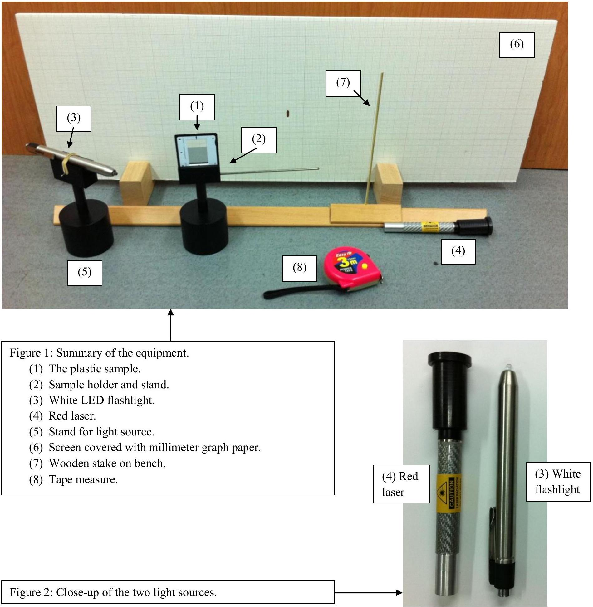
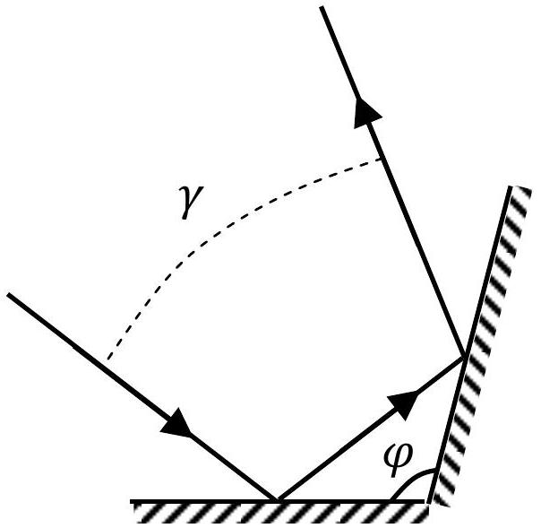
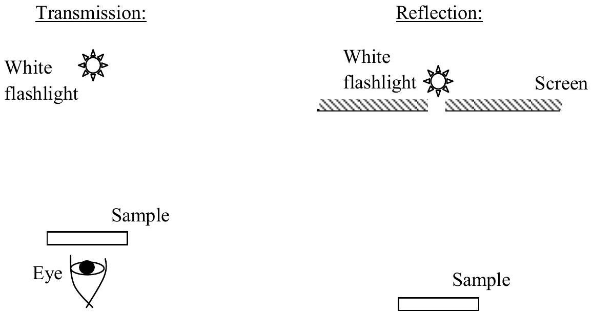
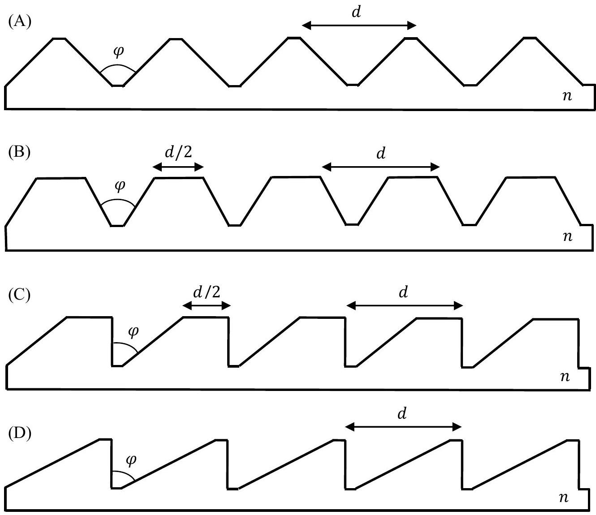
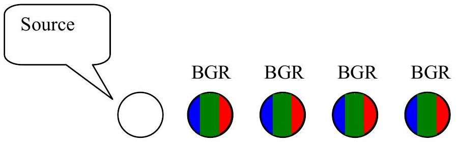
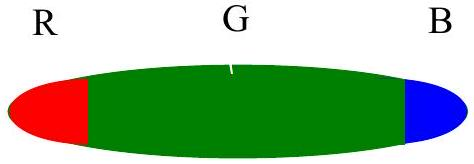
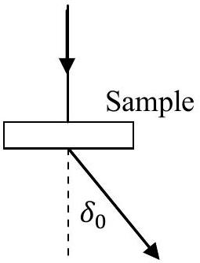
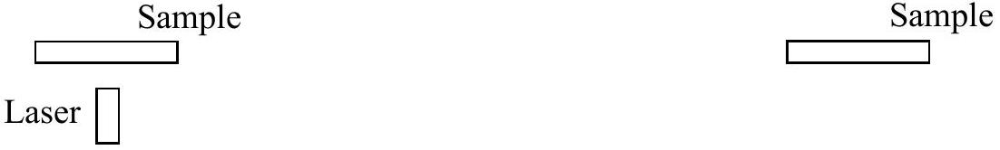

Experimental Question 2: An Optical "Black Box"

TV and computer screens have advanced significantly in recent years. Today, most displays consist of a color LCD filter matrix and a uniform white backlight source. In this experiment, we will study a sample of plastic material which was considered for use as an ingredient in the backlight illumination of LCD screens.

Equipment
On your desk, you have the following items (see Figure 1):

(1) The sample - a piece of plastic material fixed in a slide frame. The sample is sensitive - do not touch it. To adjust the sample's position, use its holder and stand.
(2) A holder and stand for the slide frame. The stand includes a handle which can be used for fine rotations of the sample. Do not remove the slide frame from its holder.
(3) A white LED flashlight. The flashlight can be turned on and off using a button at its rear end. Do not confuse it with the laser (see Figure 2).
(4) A red laser pointer. The laser is marked with a warning label. Do not confuse it with the white flashlight (see Figure 2). The laser may be turned on and off by moving its black cap back and forth. Don't try to remove the cap - it may be dangerous, and you may break the laser. The laser's battery will weaken after about an hour - do not keep it turned on longer than necessary. The laser's wavelength is $\lambda=652 \mathrm{~nm} \pm 2 \mathrm{~nm}$.
(5) A single stand to be used for the two light sources. At the start of the experiment, the flashlight is fixed to the stand, while the laser lies on the desk.
(6) A white screen on wooden legs, covered with millimeter graph paper. There is a hole near the middle of the screen. You are allowed to make markings on the screen.
(7) A wooden stake that can be moved back and forth on a wooden bench. You are allowed to make markings on the bench.
(8) A tape measure.
(9) A ruler.
(10) Millimeter graph paper.
(11) A desktop lamp which can be turned on or off for your convenience.

LASER SAFETY:

1. Do not stare into the laser beam!
2. Beware of reflections from metallic surfaces.
3. Do not point the laser at others.
4. Do not try to repair or disassemble the laser. Call a supervisor if you require assistance.

Part I - Theory (0.4 points)

a.( 0.4 pts.) A light ray is reflected from two mirrors which meet at an angle $\varphi$ (Figure 3 ). Find the angle $\gamma$ between the incoming and outgoing rays. Assume that all light rays lie in the plane perpendicular to the mirrors' intersection line.

Figure 3: A light ray reflected from two mirrors.

Part II - Measurements with white light (6.1 points)

Using the white flashlight as your light source, you may observe both the transmission and the reflection properties of the sample. Figure 4 illustrates the suggested setups for both types of observation. Note: you may observe different results when illuminating the two sides of the sample.

Figure 4: Suggested observation setups for white light.

CAUTION: For viewing transmitted light, you will have to look directly into the flashlight beam through the sample. Don't do this with the laser! Also, avoid looking directly into the flashlight itself for long periods of time.

b.( 0.5 pts.) Figure 5 illustrates schematically four possibilities for the sample's microscopic structure. $n$ stands for the refractive index of the plastic. Choose the structure that best fits your observations. Note: the 5 periods shown in the figure are for illustration only. In reality, $d$ is small, and the sample contains many periods.

Figure 5: Different possibilities for the sample's structure.
c. ( 0.8 pts.) Find the angle $\varphi$ for the sample and estimate its error.

d. ( 0.5 pts.) When a perpendicular white light beam is incident on the sample from one of its sides, the following faint pattern can be observed in the transmitted light, slightly to the right from the source (Figure 6). "R", "G" and "B" stand for red, green and blue respectively. Note: this pattern may be difficult to observe, and measurements on it are not required.

Figure 6: Faint pattern near the light source.

Further to the right you may observe a much brighter pattern (Figure 7):

Figure 7: Bright pattern farther to the right from the light source.

Choose the correct option:

A. All the colored patterns result from interference.
B. All the colored patterns result from the dependence of $n$ on the wavelength.
C. The patterns depicted in Figure 6 result from interference, while the pattern depicted in Figure 7 results from dependence of $n$ on the wavelength.
D. The patterns depicted in Figure 6 result from the dependence of $n$ on the wavelength, while the pattern depicted in Figure 7 results from interference.
e.(1.4 pts.) With the white light set up as in part (d), measure the deflection angle $\delta_{0}$ of violet light (at the far blue end of the spectrum) for the dominant peak depicted in Figure 7. The deflection angle is defined in Figure 8. Record all intermediate measurements. Provide error estimates.

Figure 8: The deflection angle $\delta_{0}$.
f. (1.4 pts.) Illumination of the sample at different angles of incidence results in different deflection angles for the dominant transmitted peaks. Measure the minimal deflection angle $\delta_{m i n}$ of the dominant peak for transmitted violet light (there is only one such minimal angle). Record all intermediate measurements. Provide error estimates.
g. (0.8 pts.) Using the angle $\varphi$ from part (c), express the refraction index $n$ of the sample in terms of either $\delta_{0}$ or $\delta_{m i n}$. You may use the reversibility of light propagation and the fact that there is only one minimal angle $\delta_{m i n}$.
h. (0.7 pts.) Find the refraction index $n_{v}$ of the sample for violet light and its error estimate.

## Part III - Laser measurements (3.5 points)

Remove the flashlight from the light-source stand, and replace it with the laser. You can use the white screen to view both transmission and reflection patterns, as illustrated in Figure 9. The laser has a limited battery life - do not keep it turned on longer than necessary. When aligning the components, it may help to rotate the laser around its axis.
WARNING: Do not look directly into the laser beam or its reflections! Do not look at the laser light through the sample - use the provided screen.

Transmission

Screen
YY

Reflection

Laser □ Screen
YEMSEMEATEATEATER

Figure 9: Suggested observation setups for laser light.

Observe the alternating pattern of bright and dim fringes on the screen as you slightly rotate the sample. The dimming of some of the fringes is due to destructive interference between different regions of each "tooth" on the sample.

i. (1 pt.) Use one of the setups in Figure 9, with the sample illuminated perpendicularly by the laser beam. Record the deflection angles $\theta$ of the observed fringes as a function of the fringe number $m$. Define the center of the pattern as $m=0$. Use the provided table on the answer form. Record all intermediate measurements. Provide error estimations.
j. (1.5 pts.) Using a linear graph, find the spacing $d$ between two adjacent "teeth" of the sample. Error bars on the graph are not required. Provide error estimation for $d$.
k. (1 pt.) Using the formula you derived in part (g), find the refraction index $n_{r}$ of the sample for the laser's red wavelength. Record any additional measurements. Provide error estimates. WARNING: Do not look through the sample! Use the provided screen.
