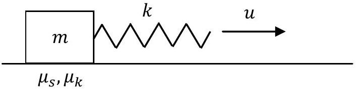
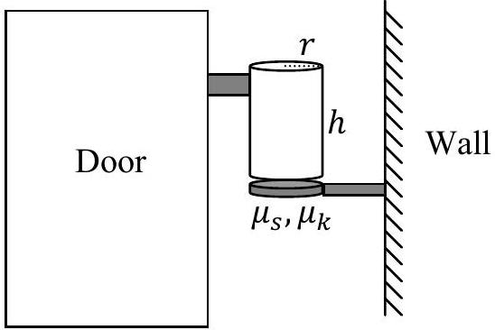
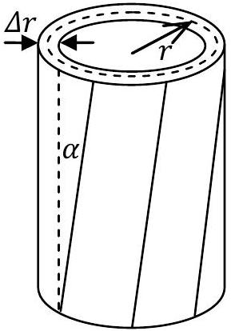

Theoretical Question 2: Creaking Door

The phenomenon of creaking is very common, and can be found in doors, closets, chalk squeaking on a blackboard, playing a violin, new shoes, car brakes and other systems from everyday life. Here in Israel, a similar phenomenon causes violent earthquakes with a period of several decades. These originate in the Dead Sea rift, located right above the deepest known break in the earth's crust.

The physical mechanism for creaking is based on elasticity combined with the difference between the static and the kinetic friction coefficients. In this question, we will study this mechanism and its application to the case of an opening door.

Part I: General model (7.5 points)
Consider the following system (see Figure 1):
A box with mass $m$ is attached to a long ideal spring with spring constant $k$, whose other end is driven at a constant velocity $u$. The static and the kinetic friction coefficients between the box and the floor are given respectively by $\mu_{s}$ and $\mu_{k}$, where $\mu_{k}<\mu_{s}$.

Figure 1: A general model for creaking

We would like to understand why this setup supports two different forms of motion:

1. The friction is always kinetic. This is known as a pure slip mode.
2. Kinetic and static friction alternate. This is known as a stick-slip mode. Stick-slip motion is the source of the creaking sound commonly encountered.
a. ( 1 pt.) Consider the case where at the initial time $t=0$, the box slides on the floor with velocity $v_{0}$, and the spring's tension exactly balances the kinetic friction. Assume $0<v_{0}<u$. The spring's elongation $x$ will oscillate as a function of $t$.
    a1. (0.6 points) Find the period $T_{0}$ and the amplitude $A$ of these oscillations.
    a2. ( 0.4 points) Sketch a qualitative graph of the spring's elongation $x(t)$ for $0<t<3 T_{0}$.
b. (1.2 pts.) Now, consider the case where at $t=0$ the box is at rest, while the initial spring elongation $x$ is the same as in part (a). Sketch a qualitative graph of the velocity $v(t)$ of the box with respect to the floor for $0<t<3 T$, where $T$ is the (new) period of the oscillations $x(t)$. Motion to the right corresponds to a positive sign of $v$. Indicate approximately on your graph the horizontal line $v=u$.
c. (0.5 pts.) For the initial conditions of part (b), find the time-averaged value $\bar{x}$ of the spring's elongation after a sufficiently long time has passed.

d. (2.4 pts.) For the conditions of part (b), find the period $T$ of the oscillations $x(t)$.

Generically, stick-slip motion stops at high driving velocities $u$. We will now discuss one of the possible mechanisms behind this effect.

e. (2.4 pts.) Suppose that during each period $T$, a small amount of energy is dissipated into heat in the spring, via an additional mechanism. Let $\eta=|\Delta A / A|$ be the fractional amplitude loss per period due to dissipation in pure-slip motion. For $\eta \ll 1$, find the critical driving velocity $u_{c}$ above which periodic stick-slip becomes impossible.

The results of part (e) are not required for part II.
Part II: Application to creaking door (2.5 points)
A door hinge is a hollow, open-ended metal cylinder with radius $r$, height $h$ and thickness $\Delta r$. The lower end of the cylinder lies on a metal base attached to the wall (the area of contact is a ring of radius $r$ ); see Figure 2. The static and the kinetic friction coefficients between the cylinder and its base are $\mu_{s}$ and $\mu_{k}$ respectively, with $\mu_{k}<\mu_{s}$. The upper end of the cylinder is attached to the door, which can be regarded as perfectly rigid. A typical door hangs on two or three such hinges, but its weight is concentrated on only one of them - this is the hinge that will creak. The cylinder of that hinge presses down on its metal base with the weight of the entire door, whose mass is $M$.

Figure 2: Schematic drawing of a door

Figure 3: The twisted hinge cylinder

The cylinder is not a perfectly rigid body - it can twist tangentially without changing its overall form, so that vertical line segments become tilted with a small angle $\alpha$; see Figure 3 . The elastic force on a small area element $d S$ of the base due to this deformation is given by:

$$
d F=G \alpha d S,
$$

where $G$ is a material property known as the shear modulus. Use the values $r=5 \mathrm{~mm}, h=3 \mathrm{~cm}, \Delta r=1 \mathrm{~mm}$, $\mu_{s}=0.75, \mu_{k}=0.55, G=8 \cdot 10^{10} \mathrm{~Pa}, M=30 \mathrm{~kg}, g=9.8 \mathrm{~m} / \mathrm{s}^{2}$. You may use the approximation $\Delta r \ll r$.

f. (1 pt.) We start rotating the door very slowly from equilibrium (zero torque). For small rotation angles, obtain an expression for the torsion coefficient $\kappa=\tau / \theta$, where $\tau$ is the torque which must be applied to rotate the door by an angle $\theta$.
g. (1.5 pts.) At very low angular velocity, when a transition from stick to slip occurs, a sound pulse is emitted. Find the angular velocity $\Omega$ of the door for which the frequency of these pulses enters the audible range at $f=20 \mathrm{~Hz}$.

Assume that the frequency $f_{0}$ of pure-slip oscillations in the hinge is much higher: $f_{0} \gg f$. Provide an expression and a numerical result.
