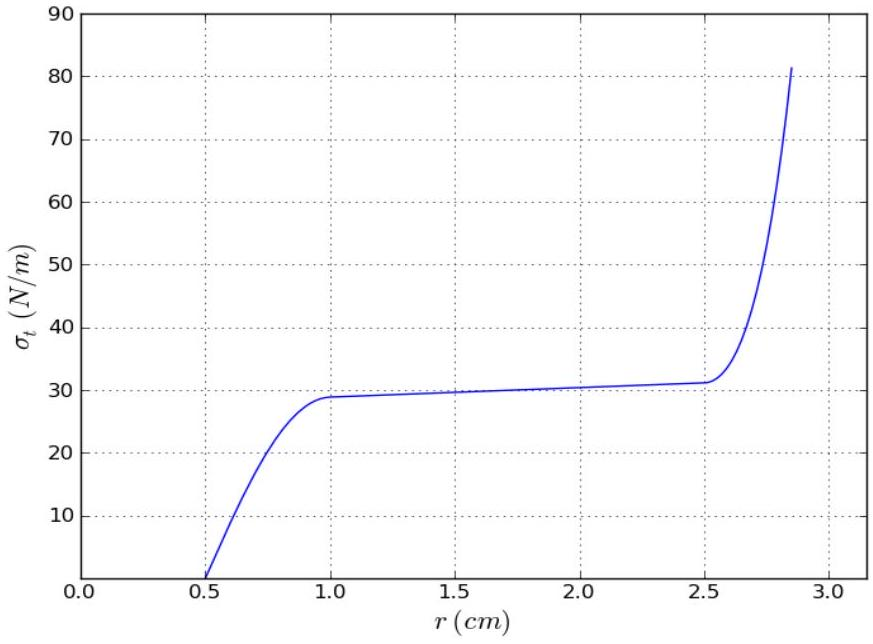
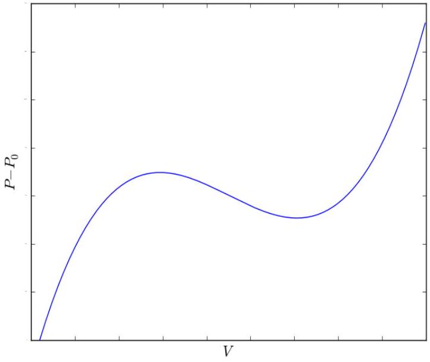

Theoretical Question 3: Birthday Balloon

The picture shows a long rubber balloon, the kind that is popular at birthday parties. A partially inflated balloon usually splits into two domains of different radii. In this question, we consider a simplified model to help us understand this phenomenon.

Consider a balloon with the shape of a long homogeneous cylinder (except for the ends), with a mouthpiece through which the balloon can be inflated. All processes will be considered isothermal at room temperature. At all times, the pressure $P$ inside the balloon exceeds the atmospheric pressure $P_{0}$ by a small fraction, so the air may be treated as an incompressible fluid. Gravity and the balloon's weight may also be neglected. The inflation is slow and quasistatic. In parts (a)-(d), the balloon is inflated uniformly throughout its length. We denote by $r_{0}$ and $L_{0}$ the radius and length of the balloon before it was inflated.

a. (1.8 pts.) The balloon is held by the mouthpiece, while its other parts hang freely. Find the ratio $\sigma_{L} / \sigma_{t}$ between the longitudinal surface tension $\sigma_{L}$ (in the direction parallel to the balloon's axis) and the transverse surface tension $\sigma_{t}$ (in the direction tangent to the balloon's circular cross-section).
The surface tension of a rubber film is the force that adjacent parts exert on each other, per unit length of the boundary.

Hooke's Law is a linear approximation of real-world elasticity for small tensions. Assume that the balloon's length remains constant at $L_{0}$, while the surface tension $\sigma_{t}$ depends linearly on the inflation ratio $r / r_{0}$ :

$$
\sigma_{t}=k\left(\frac{r}{r_{0}}-1\right)
$$

b. (1 pt.) With these assumptions, obtain an expression for the dependence of the pressure $P$ inside the balloon on the balloon's volume $V$. Sketch a plot of $P-P_{0}$ as a function of $V$. What is the maximal inflation pressure $P_{\max }$ resulting from Hooke's elasticity approximation?

In reality, because the inflation ratio $r / r_{0}$ is large (in Figure 1, typical values of about 5 can be observed), one must consider non-linear behavior of the rubber and changes in the balloon's length. These effects allow higher inflation pressures than predicted by part (b). In a typical balloon, the graph of $\sigma_{t}(r)$ is composed of three pieces:

1. For small inflation ratios, $\sigma_{t}(r)$ grows in a Hooke-like manner.
2. At $r-r_{0} \sim r_{0}$, the balloon's length $L$ begins to increase, and $\sigma_{t}(r)$ reaches a long plateau where it grows very slowly.
3. At some large inflation ratio, the rubber starts strongly resisting any further stretch, which leads to a sharp rise in $\sigma_{t}(r)$.

This behavior is depicted in Figure 2.

c. (1.3 pts.) Sketch a qualitative plot of the pressure difference $P-P_{0}$ as a function of $V$ for a uniformly inflated balloon that behaves according to Figure 2. Indicate any local extremum points on your plot. Indicate also the

points corresponding to $r=1 \mathrm{~cm}$ and $r=2.5 \mathrm{~cm}$. Find the values of $P-P_{0}$ at these two points with 10\% accuracy.

Figure 2: $\sigma_{t}(r)$ for a realistic party balloon.

Figure 3: A plot of equation (2).

To explore the consequences of the behavior you found in part (c), we approximate $P(V)$ for a uniformly inflated balloon with a cubic function:

$$
P-P_{0}=a\left((V-u)^{3}-b(V-u)+c\right)
$$

where $a, b, c$ and $u$ are positive constants. Assume that the volume $u$ is larger than the balloon's uninflated volume $V_{0}$, and $c$ is large enough so that the function (2) is positive in the entire physical range $V>V_{0}$. See Figure (3).

The balloon is attached to a large air reservoir maintained at a controllable pressure $P$. It may happen that some values of $P$ are consistent with more than one value of the volume $V$. If the balloon suffers occasional perturbations (such as local stretching by external forces) while held at such inflation pressure, it may jump to a state of different volume. This will happen when it becomes energetically favorable for the entire system, consisting of the balloon, the atmosphere and the machinery maintaining the pressure $P$. If the pressure is slowly increased from $P_{0}$, and sufficient perturbations exist at every step, this explosive volume jump will happen at a certain pressure $P_{c}$ where the energy required to move between the two states is zero. Above this pressure, going from the smaller volume to the larger volume branch releases energy, and vice versa. This type of discontinuity is often found in nature, and is sometimes referred to as a "phase transition".

d. (2.3 pts.) By considering equation (2), obtain the value of $P_{c}$, the volume $V_{1}$ of the balloon before the jump, and the volume $V_{2}$ after the jump. Express your answers using $a, b, c$ and $u$.

A more realistic inflating agent, such as a birthday boy, is unable to supply enough air for the instantaneous volume change described above. Instead, air is pumped gradually into the balloon, effectively controlling the balloon's volume rather than the pressure. In this case, a new type of behavior becomes possible. If it helps to minimize the total energy of the system, the balloon will split (given sufficient perturbations) into two cylindrical domains of different radii,
whose lengths will gradually change. The splitting boundary itself requires energy, which you may neglect. We shall also neglect the length of the boundary layer (these assumptions are valid for a very long balloon.)

e. (1 pt.) Sketch a qualitative graph of the pressure difference $P-P_{0}$ as a function of $V$, taking the split into account. Indicate on your axes the pressure $P_{c}-P_{0}$ and the volumes $V_{1}$ and $V_{2}$.
f. (1.4 pts.) The balloon is in the volume range that supports two coexisting domains. Find the length $L_{\text {thin }}$ of the thinner domain as a function of the total air volume $V$. Express your answer in terms of $V_{1}, V_{2}$ and the radius $r_{1}$ of the thinner domain.
g. (1.2 pts.) The balloon is in the volume range that supports two coexisting domains. Find the latent work $\Delta W /$ $\Delta L_{\text {thin }}$ that must be performed on the balloon to convert a unit length of the thin domain into the thick domain. Express your answer in terms of $P_{c}, V_{1}, V_{2}$ and the radius $r_{1}$ of the thinner domain.
