$\mathbf{1 3}^{\text {th }}$ Asian Physics Olympiad
New Delhi, India
Experimental Competition
Wednesday, $\mathbf{2}^{\text {nd }}$ May 2012
Please first read the following instructions carefully:

1. The time available is $2 \frac{1}{2}$ hours for each of the two experimental questions.
2. Use only the pen and equipment provided.
3. In the boxes at the top of each sheet of paper write down your student code.
4. There is a set of answersheets in which you have to enter your data and results. In addition blank sheets are provided which you can use.
5. Use only pencil to draw graphs on the graph sheets.
6. If you add any blank sheets to your main answersheets, write down the progressive number of each sheet (page number) on these additional sheets. You should enter the number of the question (Question No.) on such used blank sheets.
7. If you use some blank writing sheets for notes that you do not wish to be marked, put a large 'X' across the entire sheet and do not include it in your numbering.
8. Numerical results must be written with as many digits as appropriate; don't forget the units.
9. You should use mainly equations, numbers, symbols, graphs, figures and as little text as possible in your answers.
10. At the end of the experiment arrange all sheets in the following order:
    a. Main Answersheet
    b. Used Graph sheets
    c. Used writing sheets
    d. The sheets which are marked with 'X'
    e. Unused writing sheets and graph sheets
    f. The printed question paper
11. Put all the papers inside the envelope and leave the envelope on your desk.
12. You are not allowed to take any sheet of paper or any material used in the experiment out of the room.

## FRICTION

If a cord is passed around a post or a beam and the tensions in the two segments are different, friction between the cord and the beam plays a role in controlling the motion of the cord (Fig.1). It is observed that to hold a body suspended at one end of the cord, the minimum force needed at other end of the cord is less than the weight of the body due to the presence of frictional forces. With the increase in the number of turns around the beam the decrease in force is spectacular. Sailors are known to use this idea for arresting the motion of ships by winding ropes tied to ships around posts at the docks.

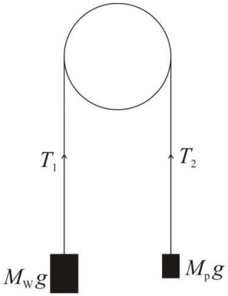
Fig. 1

## Objective:

To explore the relationship among the three quantities: the load $W\left(=M_{\mathrm{w}} g\right)$, the minimum effort $P\left(=M_{\mathrm{p}} g\right)$ needed to keep the system in equilibrium and the angle $\theta$, subtended by the segment of the cord in contact with one or more beams, by systematically varying these quantities and to express it in the form of an equation.

Apparatus:

| Sr. No. | Item | Quantity |
| :--- | :--- | :--- |
| 1 | An apparatus consisting of four pieces of steel pipe on four sides of an identical vertical piece at the centre, all fixed on a wooden platform | 1 |
| 2 | An acrylic sheet (with lines 1.5 mm apart) mounted in front of one of the horizontal pipes | 1 |
| 3 | A plastic pan (including supporting rods) with its mass ( $M_{\text {pan }}$ ) written on its side | 1 |
| 4 | A magnifying glass with torch | 1 |
| 5 | White cord with blue markings (Dial cord) | 2 pieces |
| 6 | Pink cord | 1 piece |
| 7 | A weight box containing following weights |  |
|  | 500.0 g | 1 |
|  | 200.0 g | 2 |
|  | 100.0 g | 1 |
|  | 50.0 g | 1 |
|  | 20.0 g | 2 |
|  | 10.0 g | 1 |
|  | 5.0 g | 1 |
|  | 2.0 g | 2 |
|  | 1.0 g | 1 |
| 8 | A body of unknown mass, $M_{\mathrm{u}}$ | 1 |
| 9 | A hanger of slotted weights with hook (each weight 100.0 g and total weight 800.0 g) | 1 |
| 10 | A piece of cleaning cloth | 1 |

The blue switch can be moved to switch the torch ON/OFF. The acrylic plate with lines ruled on it is provided to detect the motion of the cord. The lines on the acrylic plate can be taken as reference against which the motion of the cord can be observed.

| 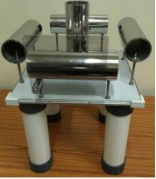 | 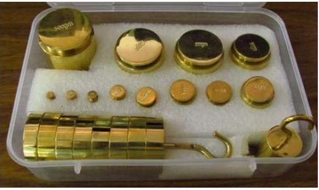 | 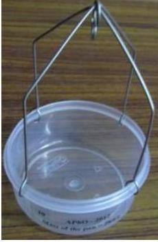 |
| :--- | :--- | :--- |
| Fig.2(a) Steel pipes mounted on wooden platform | Fig.2(b) Set of weights | Fig.2(c) Plastic pan |
| 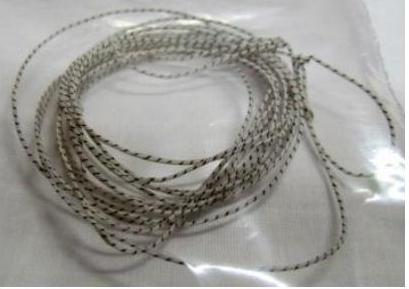 | 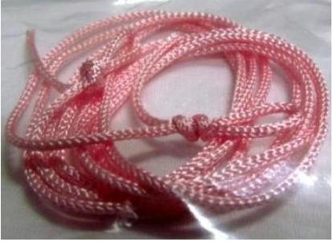 | 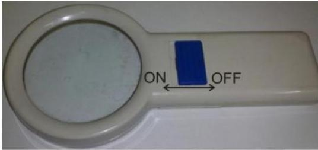 |
| Fig.2(d) Dial cord | Fig.2(e) Pink cord | Fig.2(f) Magnifying glass with torch |
| 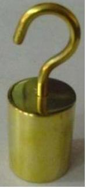 | 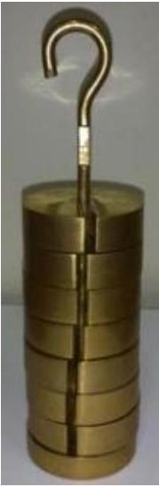 | 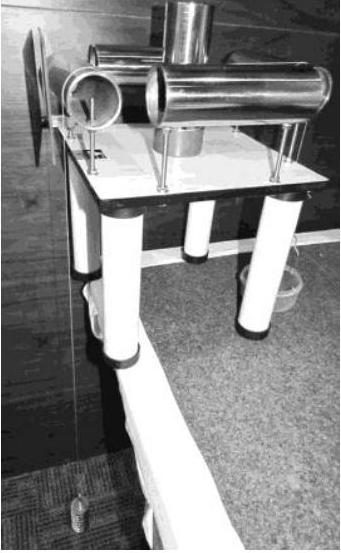 |
| Fig.2(g) Body of unknown Mass, $M_{\mathrm{u}}$ | Fig.2(h) Slotted weights with hook | Fig.2(i) Complete set-up |

Experimental Procedure:

Caution: Do not touch the surface of the pipes with which the cord would be in contact. Any greasy material can change the frictional properties of the surface (surface of the pipes as well as the cord). A cleaning cloth is provided if required.

Part 1:
(Note: Use the dial cord in this part.)

Use the hanger with slotted weights as load $M_{\mathrm{w}}$. Attach the load at one end of the given piece of dial cord (whose mass is negligible) and a pan (with known mass) at the other. A weight box with weights is also provided. The angle $\theta$ subtended by the cord can be changed by passing it over/around two or more of the given pipes. (Refer Fig.3).
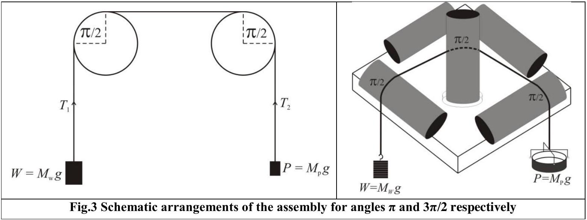

The minimum value of angle $\theta$ is obtained when the cord passes over two parallel rods without making any contact with the central post (Fig.3). By winding the cord around the vertical post and shifting the position of the effort the angle $\theta$ can be changed by steps of $\pi / 2$. The load $M_{\mathrm{w}}$ should be suspended from the pipe to which the ruled acrylic plate is mounted.

For increasing the angle $\theta$ the cord is to be turned around the central vertical post. To observe whether the cord suspending the load is slipping over the pipe, the transparent acrylic plate is provided. You can use the magnifying glass with torch to view whether the cord is slipping over the pipe. Ideally one should note the effort $M_{\mathrm{p}}$ when the load $M_{\mathrm{w}}$ is on the verge of moving down (overcoming static friction). But that is not possible. However, it is possible to determine the interval $\left[M_{\mathrm{p}-}, M_{\mathrm{p}+}\right]$ within which this value lies. Since this interval is a measure of the uncertainty in the magnitude of $M_{\mathrm{p}}$, it should be made as small as possible.

For $\theta=\pi$, take observations over as wide range as possible with the weights provided. Make estimate of the uncertainties in the observations. Plot the necessary graphs and combine the results from the graphs to get the desired equation. On the basis of the analysis of your data write down the quantitative relation giving value of $P$ in terms of $W$ and $\theta$. The value of $P$ is also
dependent on friction between the cord and the pipe. Identify the term in your equation which accounts for friction and equate it to the coefficient of friction $\mu$ for the given system. Estimate the expanded uncertainty in its value.

## Part 2:

(Note: Use the pink cord in this part.)

A body of unknown mass $M_{\mathrm{u}}$ and a pink cord is provided. Suspend the unknown mass from one end of the cord and the pan from the other end. Write down the relevant equations to determine $M_{\mathrm{u}}$ and $\mu_{\mathrm{u}}$. With $\theta=\pi$, take necessary observations to determine its mass and the coefficient of friction between the pink cord and the pipes using the relationship obtained in the experiment. Estimate the expanded uncertainty in your results.

## Note on uncertainty evaluation

1) If it is observed that the magnitude $X$ of a quantity to be measured lies somewhere in an interval $\left[X_{1}, X_{2}\right]$, and there is equal probability that it can have any value in this interval, then the probability distribution is said to be uniform or rectangular. The standard uncertainty for such distribution is given by $\frac{\left|X_{1}-X_{2}\right|}{2 \sqrt{3}}$.
2) After evaluating the combined standard uncertainty in a measured quantity, the result is stated with an expanded uncertainty. If the expanded uncertainty is taken equal to twice the combined standard uncertainty, the confidence level is approximately 95 \%. The number giving expanded uncertainty is rounded upwards to retain a single digit (generally) and the number giving the magnitude of the measured quantity is rounded to keep appropriate number of digits such that the last digit has the same decimal place as that of the expanded uncertainty.
