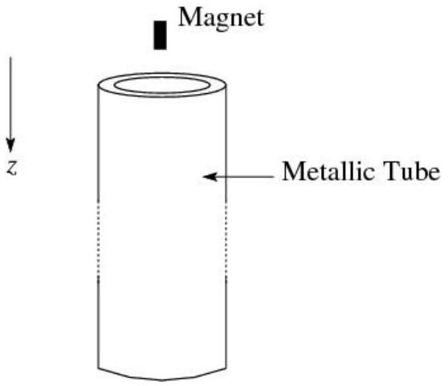
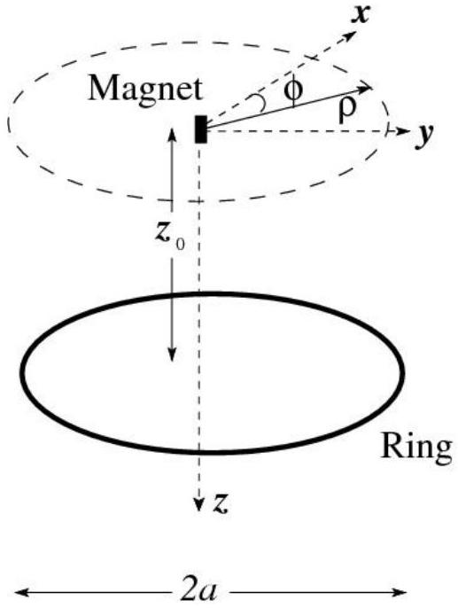
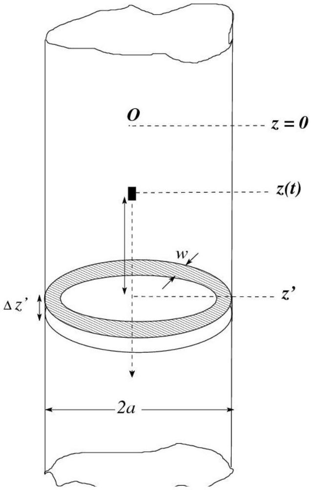

## The Drag on a Falling Magnet

A clear and detailed discussion on eddy currents was first provided by the British physicist Sir James H. Jeans (1877-1946) in his celebrated book The mathematical theory of electricity and magnetism (1925). The present problem is based on electricity and magnetism.

James H. Jeans (1877-1946)

Figure 1

A small size magnet with dipole moment of magnitude $p$ and mass $m$ is dropped through a very long vertically held non-magnetic metallic tube as shown in Fig. (1) (figure is not to scale). In general the fall is governed by

$$
m \ddot{z}=m g-k \dot{z}
$$

Here $g$ is the acceleration due to gravity. Note that the damping parameter $k$ is due to the generation of eddy currents in the tube.
I. 1 Obtain the terminal velocity $\left(v_{T}\right)$ of the magnet.
[0.5 point]
I. 2 Obtain $z(t)$, i.e. position of the magnet at time $t$. Take $v(t=0)=0$ and $z(t=0)=0$.
[1.0 point]

We shall attempt to understand the dynamics of the fall. In order to do this we consider in part (I.3) - part (I.8) a simplified problem of the magnet falling axially towards a fixed non-magnetic metallic ring of radius $a$, resistance $R$ and inductance $L$ as shown in Fig. (2). In this problem, we shall ignore radiation effects.

In our case it is convenient to change the reference coordinates to a set of cylindrical ones ( $\rho, \varphi, z$ ) as shown in Fig. (2) where $z$-axis is the ring axis, the magnet is initially at rest at the origin and the center of the ring is at distance $z_{0}$ from the origin. Cartesian axes $(x, y, z)$ are also shown in the figure. The magnet has dipole moment $\vec{p}$ in the positive $z$ direction ( $\vec{p}=p \hat{k}$ ) where $\widehat{k}$ is unit vector in $z$ direction. We will assume that during the fall, magnetic moment remains in the same direction. The axial component $\left(B_{z}\right)$ and radial component $\left(B_{\rho}\right)$ of the magnetic field at an arbitrary point $(\rho, \varphi, z)$ when the magnet is at the

Figure 2

origin are given by

$$
\begin{aligned}
& B_{z}=\frac{\mu_{0}}{4 \pi} \frac{p}{\left(\rho^{2}+z^{2}\right)^{\frac{3}{2}}}\left[\frac{3 z^{2}}{\rho^{2}+z^{2}}-1\right] \\
& B_{\rho}=\frac{\mu_{0}}{4 \pi} \frac{3 p z \rho}{\left(\rho^{2}+z^{2}\right)^{5 / 2}}
\end{aligned}
$$

where $\mu_{0}$ is the permeability of free space.

I. 3 Let the instantaneous speed of the magnet be $v$. Obtain the magnitude of the induced $\operatorname{emf}\left(e_{i}\right)$ in the ring. [1.5 points]
I. 4 This emf will give rise to an induced current (i) in the ring. Obtain the magnitude of the instantaneous electromagnetic force ( $f_{e m}$ ) on the ring in terms of $i$.

[1.0 point]

I. 5 What is the magnitude of the force on the magnet due to this ring?

[0.5 point]

I. 6 Express the emf in the ring in terms of $L, R$ and $i$. Do not solve for $i$. [0.5 point]
I. 7 As the magnet falls it loses gravitational potential energy. Identify the three main forms of energy into which the gravitational potential energy is converted and write down the expressions you would use to calculate each of the three contributions. [1.0 point]
I. 8 Does the magnetic field of the magnet do any work in this process? Tick in the appropriate box. [0.5 point]
Next we will estimate the damping parameter $k$ due to the pipe (see Eq. (1)). Take an infinitely long pipe with radius $a$, small thickness $w$, and electrical conductivity $\sigma$. For this and later part, we take inductance of the pipe to be negligible. It would help if you considered the pipe to be made of many rings each of height $\Delta z^{\prime}$, radius $a$, small thickness $w$ and electrical conductivity $\sigma$ (see Fig. (3)). For simplicity, the two ends of the pipe are at $z=-\infty$ and at $z=\infty$, respectively.
I. 9 Obtain the resistance of an individual ring. [0.5 point]

Figure $\overline{3}$

I. 10 Obtain the damping parameter $k$ due to the entire pipe in terms of $p, \sigma$ and geometrical parameters of the ring. Since each ring is very thin, you may take magnetic field to be constant over the thickness of the ring and equal to $B_{\rho}(\rho=$ $a)$. Assume that at an instant $t$, the magnet has a coordinate $z(t)$ with an instantaneous speed $\dot{z}$. You should leave your answer in terms of a dimensionless integral $I$, involving a dimensionless variable $u=\left(z-z^{\prime}\right) / a$.
[2.0 points]
I. 11 Assume that the damping constant $k$ depends on the following
$$
k=f\left(\mu_{0}, p, R_{0}, a\right)
$$
where $R_{0}$ is the effective resistance of a long pipe. Use dimensional analysis to obtain an expression for $k$. Take the dimensionless constant to be unity.[1.0 point]

The following integral may be useful:

$$
\int \frac{u d u}{\left(u^{2}+a^{2}\right)^{n}}=\frac{1}{2} \frac{\left(a^{2}+u^{2}\right)^{1-n}}{1-n}+\text { Constant } \quad(\mathrm{n}>1)
$$
