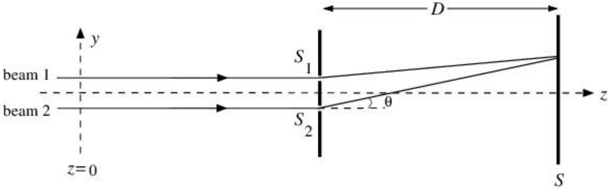
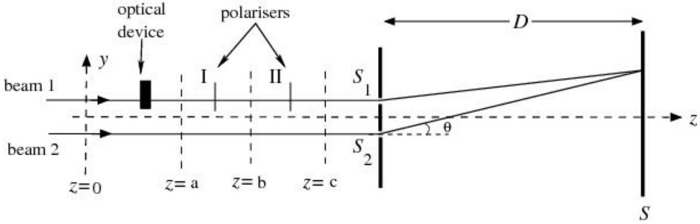
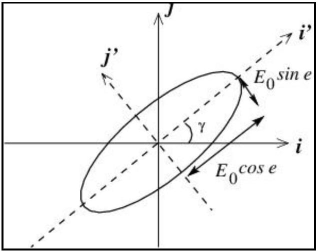
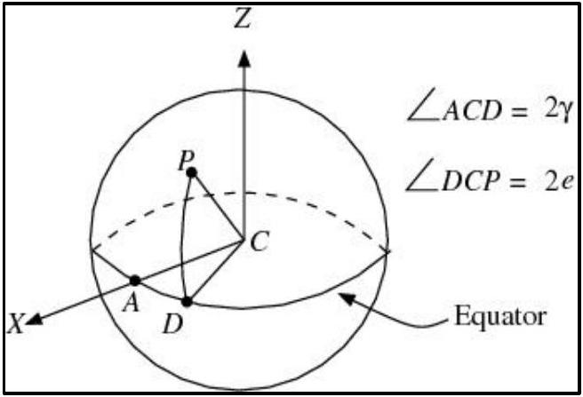

## Pancharatnam Phase

This problem deals with the two beam phenomena associated with light, its interference, polarization and superposition. The particular context of the problem was studied by the Indian physicist S. Pancharatnam (1934-1969).

S. Pancharatnam
(1934-1969)

Consider the experimental set up as shown in Fig. (1). Two coherent monochromatic light beams (marked as beam 1 and 2), travelling in the $z$ direction, are incident on two narrow slits and separated by a distance $d\left(S_{1} S_{2}=d\right)$. After passing through the slits the two beams interfere and the pattern is observed on the screen $S$. The distance between the slits and the screen is $D$ and $D \gg d$. Assume that the width of each slit $S_{1}$ and $S_{2}$ is much smaller than the wavelength of light.

Figure 1

III.1. Let the beams 1 and 2 be linearly polarized at $z=0$. The corresponding electric field vectors are given by

$$
\begin{aligned}
& \vec{E}_{1}=\hat{\imath} E_{0} \cos (\omega t) \\
& \vec{E}_{2}=\hat{\imath} E_{0} \cos (\omega t)
\end{aligned}
$$

where $\hat{\imath}$ is the unit vector along the $x$-axis, $\omega$ is angular frequency of light and $E_{0}$ is the amplitude. Find the expression for the intensity of the light $I(\theta)$, that will be observed on the screen where $\theta$ is the angle shown in Fig. (1). Express your answer in terms of $\theta, d, E_{0}, c$ and $\omega$ where $c$ is the speed of light. Also, note that the intensity is proportional to the time average of the square of the electric field. Here you make take the proportionality constant to be $\beta$. You may ignore the attenuation in the magnitude of the electric fields with distance from the slits to any point on the screen.
[1.0 point]
III.2. A perfectly transparent glass slab of thickness $w$ and refractive index $\mu$ is
introduced in the path of beam 1 before the slits. Find the expression for the intensity of the light $I(\theta)$ that will be observed on the screen. Express your answer in terms of $\theta, d, E_{0}, c, \omega, \mu$ and $w$.
[1.0 point]
III.3. An optical device (known as quarter wave plate (QWP)) is introduced in the path of beam 1, before the slits, replacing the glass slab. This device changes the polarization of the beam from the linear polarization state

$$
\vec{E}_{1}=\hat{\imath} E_{0} \cos (\omega t)
$$

to a circular polarization state which is given by

$$
\vec{E}_{1}=\frac{1}{\sqrt{2}}\left[\hat{\imath} E_{0} \cos (\omega t)+\hat{\jmath} E_{0} \sin (\omega t)\right]
$$

where $\hat{J}$ is the unit vector along the $y$-axis.
Assume that the device does not introduce any additional path difference and that it is perfectly transparent. Note that the tip of the electric field vector traces a circle as time elapses and hence, the beam is said to be circularly polarized. We assume that the angle $\theta$ is small enough so that intensity from slit one does not depend on the angle $\theta$ even for $\hat{J}$ polarization.
III.3.a. Find the expression for the intensity $I(\theta)$ of the light that will be observed on the screen. Express your answer in terms of $\theta, d, E_{0}, c$ and $\omega$.
III.3.b. What is the maximum intensity ( $I_{\text {max }}$ )?
III.3.c. What is the minimum intensity $\left(I_{\text {min }}\right)$ ?
[2.0 points]
III.4.

Figure 2

Now, consider the experimental setup (see Fig. (2)) in which the beam 1 is subjected to

- the device (QWP) described in part 3 and,
- a linear polarizer (marked as I), between $z=a$ and $z=b$ which allows only the component of the electric field parallel to an axis $\left(\hat{\imath}^{\prime}\right)$ to pass through. The

unit vector $\hat{\imath}^{\prime}$ is defined as

$$
\hat{\imath}^{\prime}=\hat{\imath} \cos \gamma+\hat{\jmath} \sin \gamma
$$

and,

- another linear polarizer (marked as II) between $z=b$ and $z=c$ which polarizes the beam back to $\hat{\imath}$ direction.

Thus the beam 1 is back to its original state of polarization. Assume that the polarizers do not introduce any path difference and are perfectly transparent.
III.4.a. Write down the expression for the electric field of beam 1 after the first polarizer at $z=b\left[\vec{E}_{1}(z=b)\right]$.
III.4.b. Write down the expression for the electric field of beam 1 after the second polarizer at $z=c\left[\vec{E}_{1}(z=c)\right]$.
III.4.c. What is the phase difference $(\alpha)$ between the two beams at the slits?
[2.0 points]

The most general type of polarization is elliptical polarization. A convenient way of expressing elliptical polarization is to consider it as a superposition of two orthogonal linearly polarized components i.e.

$$
\vec{E}=\hat{\imath}^{\prime} E_{0} \cos e \cos (\omega t)+\hat{\jmath}^{\prime} E_{0} \sin e \sin (\omega t)
$$

where $\hat{\imath}^{\prime}$ and $\hat{\jmath}^{\prime}$ and this state of polarization are depicted in Fig. 3.

Figure 3

The tip of the electric field vector traces an ellipse as time elapses. Here $e$ represents the ellipticity and is given by

$$
\tan e=\frac{\text { Semi-minor axis of the ellipse }}{\text { Semi-major axis of the ellipse }}
$$

Linear polarization (Eqs. (1)) and circular polarization (Eq. (2)) are special cases of elliptical polarization (Eq. (3)). The two parameters $\gamma(\epsilon[0, \pi])$ and $e(\epsilon[-\pi / 4, \pi / 4])$ completely describe the state of polarization.

The polarization state can also be represented by a point on a sphere of unit radius called the Poincare sphere. The polarization of the beam described in Eq. (3) is represented by a point $P$ on the Poincare sphere (see Fig. 4), then latitude $\angle P C D=2 e$ and longitude $\angle A C D=2 \gamma$. Here $C$ is the center.

Figure 4

III.5. Consider a point on the equator of the Poincare sphere.
III.5.a. Write down the electric field $\left(\vec{E}_{\mathrm{Eq}}\right)$ corresponding to this point.
III.5.b. What is its state of polarization?
[0.5 point]
III.6. Consider a point at the north pole of the Poincare sphere.
III.6.a Write down the electric field $\left(\vec{E}_{\mathrm{NP}}\right)$ corresponding to this point.
III.6.b What is its state of polarization?
[0.5 point]
III.7. Now, consider the three polarization states of beam 1 as given in part 4. Let the initial polarization (at $z=0$ ) be represented by a point $A_{1}$ on the Poincare sphere; after the optical device, let the state (at $z=a$ ) be represented by point $A_{2}$ and after the first polarizer (say, at $z=b$ ), the state be represented by point $A_{3}$. At $z=c$, the polarization returns to its original state which is represented by $A_{1}$. Locate these points ( $A_{1}, A_{2}$, and $A_{3}$ ) on the Poincare sphere.
[1.5 points]
III.8. If these three points ( $A_{1}, A_{2}$, and $A_{3}$ from the part (III.7)) are joined by great circles on the sphere, a triangle on the surface of the sphere is obtained (Note: A great circle is a circle on the sphere whose center coincides with the center of the sphere). The phase difference $\alpha$ obtained in part 4 and the area $S$ of the curved surface enclosed by the triangle are related to each other. Relate $S$ to $\alpha$.
This relationship is general and was obtained by Pancharatnam and the phase difference is called the Pancharatnam phase.
[1.5 points]
