## WIND POWER AND ITS METROLOGIES

I. APPARATUS

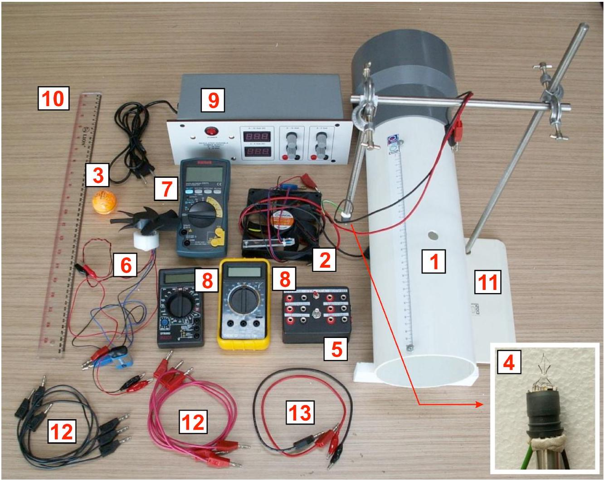
Figure 1. Overall setup

1. Wind tunnel with nichrom (nickel-chromium) wire
2. Computer fan: with frequency sensor
3. Ping pong ball
4. Hotwire filament: Please be careful not to touch the filament
5. Electronic box for hotwire
6. Turbine: with frequency sensor
7. Digital MutiMeter (DMM) \#1: for frequency measurement
8. DMM\#2 and \#3
9. Power Supply: with adjustable output 15 V max and 9 V max
10. Ruler (50 cm)
11. Static stand
12. Cables with banana jacks on both ends (3 pairs)
13. Cable with banana jack and crocodile jack on each end (1 pair)

CONSTANTS \& DATA:

| Gravitational acceleration : | $g=9.81 \mathrm{~m} / \mathrm{s}^{2}$ |
| :--- | :--- |
| Mass density of air : | $\rho_{A}=1.2 \mathrm{~kg} / \mathrm{m}^{3}$ |
| Ping pong ball diameter : | $d_{B}=(39.5 \pm 0.1) \mathrm{mm}$ |

Error analysis is not required

## II. INTRODUCTION

Wind power is a rapidly expanding source of renewable and clean energy and is becoming more important to power our growing population. The wind power can be converted to useful electrical power using wind turbine as shown in Figure 2.

We will explore the physics of wind power and wind turbine and their related metrologies. We will investigate two methods of measuring wind speed i.e. ping pong ball anemometer and hot wire anemometer. Finally we will also explore the physics of wind turbine and its power conversion efficiency. We will use a wind tunnel with a suction fan on one end that provides a laminar (not turbulent) wind flow. ${ }^{1}$

This experiment is divided into five sections:

A. Theoretical background
B. The wind tunnel
C. Ping pong ball anemometer
D. Hot wire anemometer:
    (1) Constant Temperature Method
    (2) Constant Current Method
E. Wind turbine

Figure 2. An array of wind turbine in a wind farm

## III. EXPERIMENT \& QUESTIONS

## [A] Theoretical Background [1.0 pt]

We will explore basic theoretical aspects of wind power and power conversion efficiency of a wind turbine.

[^0]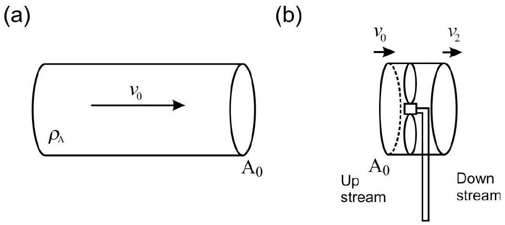
Figure 3. (a) A tubular packet of wind (b) A wind turbine intercepting the wind flow

[A.1] Consider a packet of air with mass density $\rho_{A}$ flowing through a tube with a cross section area $A_{0}$ as shown in Figure 3(a). Show that the power contained in the wind is:

$$
P_{W}=\frac{1}{2} \rho_{A} A_{0} v_{0}^{n}
$$

What is the value of $n$ ? We will also determine $n$ experimentally in part B.2.
[0.4 pt]
[A.2] Now consider a wind turbine with a rotor area $A_{0}$, intercepting a tubular section of the wind of the same cross section area as shown in Figure 3(b). The velocity at the rotor can be assumed to be $\left(v_{0}+v_{2}\right) / 2$. The maximum power that can be extracted by the wind turbine can be written as:

$$
P_{R}=\frac{1}{4} \rho_{\mathrm{A}} A_{0}\left(v_{0}+v_{2}\right)\left(v_{0}^{2}-v_{2}^{2}\right)
$$

The downstream wind slows down by a factor $\lambda$, where $\lambda=v_{2} / v_{0}$. For the turbine to extract maximum power, $\lambda$ cannot be too low (as the wind flow will stop) or too high (which means the turbine captures very little power from the wind). Find the optimum value of $\lambda$ that will yield the maximum power for the wind turbine.
[0.4 pt]
[A.3] We define rotor efficiency (or power coefficient) $C p$ as the power that can be extracted by rotor of the wind turbine $P_{R}$ over the available wind power $P_{W}$ :

$$
C_{P}=\frac{P_{R}}{P_{W}} .
$$

Based on your answer in question A.2, find the maximum value of $C_{P}$. This value is called Betz efficiency ${ }^{2}$ which sets the theoretical limit of maximum power conversion efficiency of a wind turbine.
[0.2 pt]

## [B] The Wind Tunnel [3.2 pt]

[^1]We will use a wind tunnel with a computer fan to serve as wind generator by blowing the wind out of wind tunnel (a suction type wind tunnel) ${ }^{1}$ to achieve a more laminar flow of wind.

Measuring the rotation speed of the motor or wind turbine is important in wind power engineering. We will use a simple optoelectronic-sensor circuit as shown below to measure the rotation frequency of the motor. The opto-sensor consists of a pair of infrared light emitter and detector that will detect a reflective strip on the blade as the motor rotates (Figure 4).

## INSTRUCTION \& WARNINGS:

(a) Connect the opto-sensor circuit as shown in Figure 4.
(b) WARNING: Please be careful with the crocodile jacks on the battery for the opto-sensor, they are quite fragile.
(c) WARNING: If you don't need to read the motor frequency please disconnect the battery to avoid draining its power.
(d) WARNING: If you need to read the voltage from the power supply, you can use DMM (digital multimeter) to get more significant figures.
(e) WARNING: If you are using the DMM as an ampere-meter beware of the range limit. If you blow the DMM fuse only one replacement is provided.

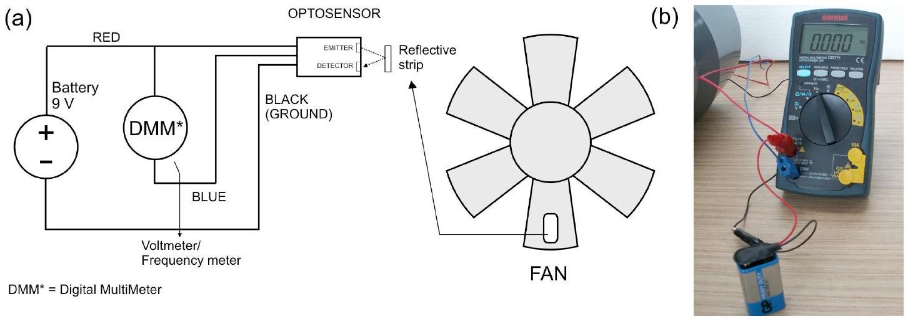
Figure 4. Opto-sensor output connection to the DMM\#1 that works as voltmeter or frequency meter.

[B.1] With no power to the motor, switch DMM\#1 to voltmeter mode (labeled $\mathbf{V}$ on the DMM) and rotate the fan manually and slowly and you will see the voltage is changing. Roughly plot the opto-sensor's signal as a function of blade rotation (or time). Indicate the period of the signal.
[0.8 pt]
The wind speed inside the tunnel is mainly determined by the rotation frequency ( $f_{M}$ ) of the wind generator motor. The relationship between the wind speed (measured at the center of the tunnel) and the motor frequency has been measured as shown in Figure 5 below and follows a simple linear relationship:

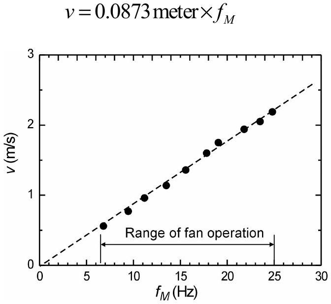
Figure 5. Wind velocity (at the center of the tunnel) vs. the motor fan rotation frequency.

[B.2] The motor fan has fairly fixed mechanical efficiency (ratio of the wind power $P_{W}$ generated over the input electrical power to the motor fan $P_{M}$ ) for the rated voltage: 3 V $<V_{M}<12 \mathrm{~V}$. This mechanical efficiency is given by $\eta_{M}=P_{W} / P_{M}$. Perform an experiment to determine the mechanical efficiency $\eta_{M}$ and the power factor $n$ for the wind power $P_{W}$ in Eq. 1. Sketch your connection diagram.
[2.4 pt]

## [C] Ping Pong Ball Anemometer [3.5 pt]

Measuring wind speed is a primary metrology activity in wind power engineering. We will investigate a very simple method to measure wind speed using a ping pong ball pendulum as shown in Figure 6.

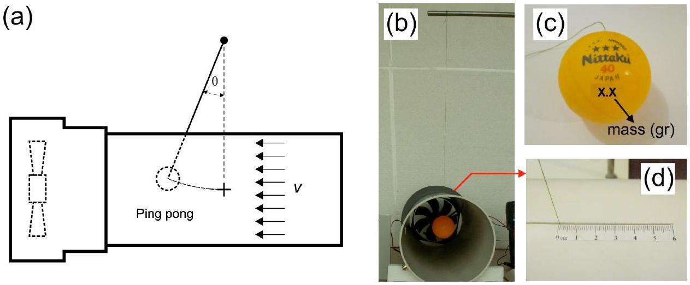
Figure 6. Ping pong ball anemometer experiment.

The principle of operation is very simple, the wind will impose a drag force and deflect the ping pong pendulum by an angle $\theta$. This drag force is given by:

$$
F_{D}=\frac{1}{2} C_{D} \rho_{\mathrm{A}} A_{B} v^{m},
$$

where $C_{D}$ is the drag coefficient of the object, $\rho_{A}$ is the density of the fluid (air), $A_{B}$ is the cross section of the ping pong ball, $v$ is the velocity of the ball relative to the fluid and $m$ is the power factor. Mass of the ping pong ball $m_{B}$ (in gram) is written on the ball as shown Figure 6(c). Please refer to Constants \& Data in. pg. 2 for other data.

## INSTRUCTIONS \& WARNING:

(a) Insert the pendulum thread into the slot with the imprinted ruler as shown in Figure 6(d). Position the ping pong ball at the center of the tunnel. The imprinted ruler helps you to calculate the deflection angle $\theta$
(b) WARNING: The joint between the thread and the ping pong ball is fragile. Please be gentle.
(c) WARNING: Please make sure that the pingpong pendulum moves freely.
(d) WARNING: If you do not need to read the motor frequency, please disconnect the 9V battery to avoid draining its power.

[C.1] Relate the wind speed $v$ as a function of the deflection angle $\theta$. Draw tforce diagram. Express your answer in terms of, among others, mass density of the air $\left(\rho_{\mathrm{A}}\right)$ and the ping pong ball mass $\left(m_{B}\right)$.
[0.7 pts]
[C.2] Perform an experiment to determine $C_{D}$ and $m$.
[2.8 pts]

## [D] Hot Wire Anemometer [6.7 pt]

The ping pong ball anemometer we studied just now is not really suitable for practical applications that usually requires electrical read-out. Thus, we will investigate another method of measuring wind speed: hot-wire anemometer (HWA). HWA utilizes a filament that becomes hot as electrical current is passed through it. As the wind blows, it introduces forced convection that takes away heat from the filament so the temperature (and thus the resistance) of the filament will drop as shown in Figure 7 (unless compensated by increasing the electrical power). This phenomenon can be exploited to measure the wind speed. In this experiment we will study the characteristics of the hot wire with respect to varying wind velocity.

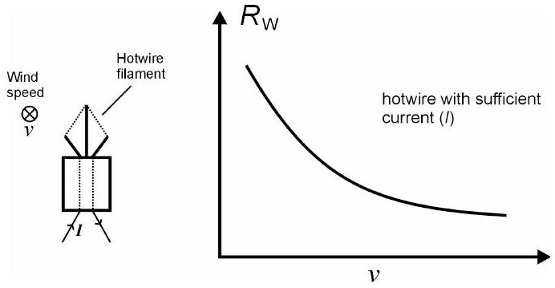
Figure 7. Hot wire anemometer with wind blowing into the plane

We use a metal (tungsten) filament from an ordinary light bulb where the bulb is intentionally broken to expose the filament. For a small change of temperature, the filament resistance follows a linear relationship:

$$
R_{w}=R_{0}\left[1+\alpha\left(T_{w}-T_{0}\right)\right],
$$

where $R_{w}$ is the filament's resistance at temperature $T_{w}, R_{0}$ is the resistance at temperature $T_{0}$ and $\alpha$ is the temperature coefficient of the resistance. For tungsten, the value is $\alpha=4.5 \times 10^{-3} /{ }^{\circ} \mathrm{C}$.

Now, we will consider the heat transfer between the filament and it surrounding, which can happen through natural convection (without external source of wind/fluid movement), forced convection (with external source of disturbance), conduction (mainly to the filament's holder and base) and radiation.

Consider the case where the filament is heated by external power such as by electric current, and is transferring the heat to its surrounding by all the processes above. After the system has reached equilibrium, the power balance can be expressed as:

$$
\begin{aligned}
& P_{\text {input }}=Q_{\text {forced convection }}+Q_{\text {natural convection }}+Q_{\text {conduction }}+Q_{\text {radiation }}, \\
& \left.V_{W} . I_{W}=h^{\prime} A_{W}\left(T_{W}-T_{0}\right)+Q_{\mathrm{nc}}+Q_{\text {conduction }}+A_{W} \sigma \varepsilon\left(T_{W^{4}}-T_{0}\right)^{4}\right)
\end{aligned}
$$

where $A_{w}$ is the surface area of the filament, $T_{0}$ the room/surrounding temperature (presumably the original temperature of the filament), $\sigma$ the Stefan-Boltzmann constant, $\varepsilon$ the emissivity and $h^{\prime}$ the forced convection heat transfer coefficient.

For the forced convection of the hot wire filament, the forced convection process can be expressed as King's law: $h^{\prime}=a^{\prime}+b v^{c}$, where $a^{\prime}$ and $b$ are constants and $c$ is the power factor of the wind velocity. The filament's length is much larger than its width hence the heat transfer by means of conduction can be ignored. For small temperature difference $\left(T_{w} \sim T_{0}\right), T_{w}^{4}-T_{0}^{4} \sim T_{0}^{3}\left(T_{w}-T_{0}\right)$, so the radiation heat transfer can be written as $4 A_{W} \sigma \varepsilon$ $\mathrm{T}_{0}{ }^{3}\left(T_{W}-T_{0}\right) \rightarrow k\left(T_{W}-T_{0}\right)$ and $Q_{n c}$ can be considered constant. After taking into account all these we can rewrite Eq. (6) as:

$$
V_{W} \cdot I_{W}=\left(a+b v^{c}\right) A_{w}\left(T_{w}-T_{0}\right),
$$

with $a=a^{\prime}+\mathrm{Q}_{\mathrm{nc}} /\left(T_{w}-T_{0}\right)+4 A_{W} \sigma \varepsilon T_{0}{ }^{3}$.
Now we will perform experiments to determine the value of $b / a$ and $c$ with two different methods: hotwire with constant temperature and with constant current flowing through it.

Mount the hotwire filament to a steel rod as shown in Figure 8(a) and put it in inside the wind tunnel through the hole (you can rotate the wind tunnel). When you insert the hotwire into the wind tunnel, make sure you have correct orientation: the largest cross section of the hotwire filament is perpendicular to the wind flow, see Figure 8(b).
WARNING: Please don't touch the filament.

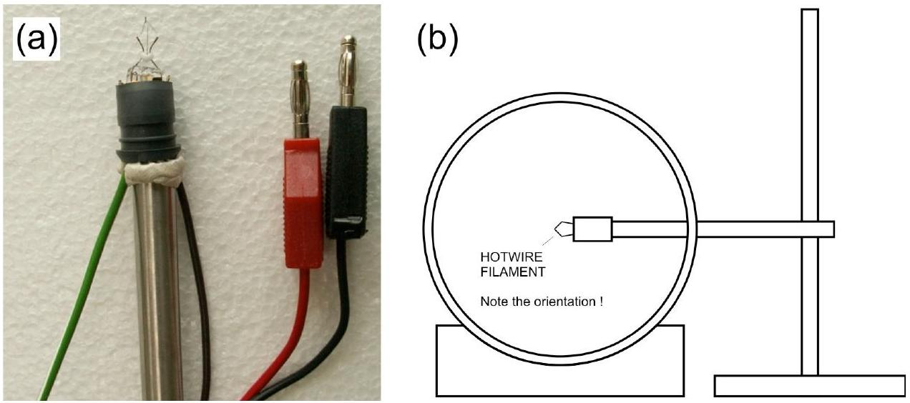
Figure 8. (a) Hotwire filament (b) Hotwire filament in the wind tunnel

The two experiments require some electronic circuit to perform which we provide in an electronic box, see Figure 9 below. To perform each of the experiment, you will only need one side of the circuit. There is a small switch on the top of the box to toggle between the two, labeled as CTA (Constant Temperature Anemometer) and CCA (Constant Current Anemometer).

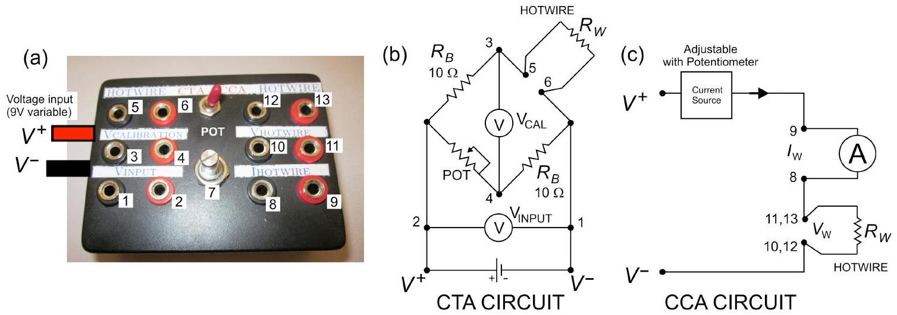
Figure 9. (a) Hotwire electronic box (b) Constant Temperature Anemometer (CTA) circuit (c) Constant Current Anemometer circuit (CCA).

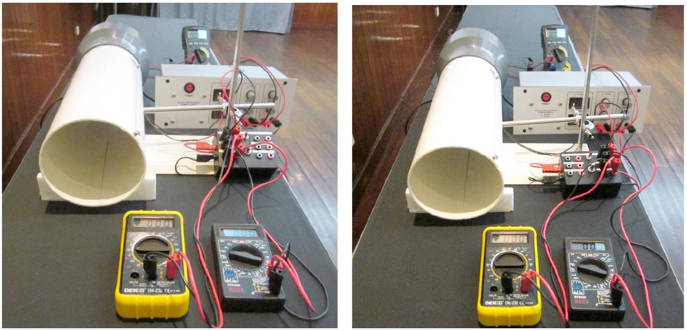
Figure 10. (a) Constant temperature anemometer (CTA) setup on the left. (b) Constant current anemometer (CCA) setup on the right.

## [D.1] Constant Temperature Method [3.2 pts]

The constant temperature method is performed by keeping the temperature of the hotwire (and thus its resistance) constant for different wind speed. To achieve this we use Wheatstone bridge with a variable (POT) resistor across the hotwire to balance the bridge as shown in Figure 9(b).

First we balance the bridge by tuning the potentiometer (POT) to set the $V_{\text {CALIBRATION }}$ to zero. When the wind speed increases, $R_{W}$ reduces and the bridge goes out of balance. To restore $R_{W}$ and rebalance the bridge we need to increase $V_{W}$ (by increasing $V_{\text {INPUT }}$ ) to increase power dissipation.

The following formula is used in the constant temperature experiment:

$$
\frac{V_{W}^{2}}{R_{W}}=\left(a+b v^{c}\right) A_{w}\left(T_{w}-T_{0}\right),
$$

with $V_{W}$ and $R_{W}$ are potential and resistance across the hotwire. We do not measure the hotwire potential, instead we measure the potential drop through the Wheatstone bridge $\left(V_{\text {INPUT }}\right)$. With this substitution, Eq. 9 above can be rewritten as:

$$
{V_{\text {INPUT }}}^{2}=A+B v^{c} .
$$

[D.1.1] Find expression for $A$ and $B$.

Eq. 10 can be rewritten into a linear form that you can use in linear regression:

$$
\ln y=\ln \frac{b}{a}+c \ln v .
$$

[D.1.2] What is $y$ ?
[0.3 pt]
[D.1.3] Perform the experiment and obtain $b / a$ and $c$ !
[2.5 pt]
INSTRUCTIONS \& WARNING:

(a) Switch the electronics box to constant temperature (CTA) mode.
(b) Connect the wires and jacks according to Figure 9(b) and Figure 10(a). Use the 9V variable voltage source from the power supply for the hotwire electronic box.
(c) WARNING: Please be careful not to touch and damage the hotwire filament. If you damage the hotwire, you will be provided with only 1 replacement hotwire during the whole experiment.
(d) Carefully inspect that you have all the connections correct and make sure all the knobs on the power supply are turned all the way down (left) before you turn it on.
(e) Turn on the power supply and slowly increase the voltage to the electronic box to around 1 V. After this, you have to adjust the potentiometer on the Wheatstone bridge so that $V_{\text {CALIB }}$ is zero. Before the wind is blowing, adjust the potentiometer so that $V_{\text {CALIB }}$ is zero. We called the bridge in this condition balanced.
(f) Once balanced you do not need to vary the resistance with the potentiometer for subsequent measurement.
(g) WARNING: do not use voltage higher than 2 V when there is no wind, you may damage the hotwire. The hotwire is damaged if it glows. Remember: only 1 replacement hotwire is allowed for the whole experiment.
(h) Increase wind speed, adjust $V_{\text {INPUT }}$ so that the bridge is balanced again, i.e. the hotwire resistance has returned to the initial value.
(i) Repeat step (h) until you have enough data. Record your data on the answer sheet and plot your graph to determine $b / a$ and $c$.
(j) WARNING: Do not turn down the power to the motor before you turn off the power to the hotwire. If you do, the hotwire will overheat and may be damaged. Remember: only 1 replacement hotwire is allowed for the whole experiment.

[D.2] Constant Current Method [3.5 pts]
The constant current experiment is done by keeping the current through the hotwire constant using the electronic box that serves as constant current source. The current can be adjusted by tuning the potentiometer on the box.

The following formula is used for constant current experiment:

$$
V_{W} \cdot I_{W}=\left(a+b v^{c}\right) \frac{A_{w}}{\alpha R_{0}}\left(R_{w}-R_{0}\right),
$$

which is obtained from Eq. 8 with the following substitution: $T_{w}-T_{0}=\frac{R_{w}-R_{0}}{\alpha R_{0}}$.
In this experiment, we first need to measure $R_{0}$, which is done when there is no wind $(v=0)$. Eq. (12) can be rewritten as:

$$
\frac{V_{W}}{I_{W}}=\frac{R_{0}}{k} V_{W} \cdot I_{W}+R_{0} .
$$

[D.2.1] Find expression for $k$.
[0.2 pt]
[D.2.2] Perform an experiment to determine the value of $R_{0}$.
[1.2 pts]

## INSTRUCTION \& WARNINGS:

(a) Switch the electronics box to constant current (CCA) mode.
(b) Connect the wires and jacks according to Figure 9(c) and Figure 10(b). Carefully inspect that they are correct and make sure all the knobs on the power supply are turned all the way down (left) before you turn it on.
(c) WARNING: do not use current higher than 180 mA, you may damage the hotwire. The hotwire is damaged if it glows. Remember: only 1 hotwire replacement is allowed.
(d) Turn on the power supply and slowly increase the voltage or current to the hotwire.
(e) Notice that you can limit the current to the hotwire by adjusting the potentiometer on the box (i.e. the current and voltage across the hotwire will not increase even when you increase the voltage on the power supply). We suggest you to set the voltage from power supply to 7.5 V to have a stable working voltage for the electronics box.
(f) Make sure the DMM to measure the current is working properly, i.e. the reading is not zero. The current measurement circuit on a DMM is protected by a fuse. If the fuse is broken, the DMM will still appear to be working but the current measurement will always be zero.
(g) Record the current and voltage across the hotwire.
(h) Repeat step (g) until you have enough data. Record your data on the answer sheet and plot your graph to determine $k$ and $R_{0}$.

Now we are ready to determine $b / a$ and $c$ like in the constant temperature case. Rewrite Eq. 12 into the following form:

$$
\ln y=\ln \frac{b}{a}+c \ln v .
$$

[D.2.3] What is $y$ in this case?
[0.2 pt]
[D.2.4] Perform an experiment to determine $b / a$ and $c$.
[1.9 pt]

## INSTRUCTIONS \& WARNINGS:

(a) Make sure all the knobs on the power supply are turned all the way down (left) before you turn it on. Turn on the power supply and slowly increase the voltage/current to the hotwire.
(b) Adjust the potentiometer to the working current that you desire. Warning: do not use current higher than 180 mA , you may damage the hotwire. The hotwire is damaged if it glows. Remember: only 1 hotwire replacement is allowed.
(c) Turn up the motor wind generator voltage to generate wind.
(d) Record the current and voltage across the hotwire for this wind speed.
(e) Readjust the wind speed and repeat step (d) until you have enough data.
(f) Record your data on the answer sheet and plot your graph to determine $b / a$ and $c$.

## [E] Wind Turbine [5.6 pt]

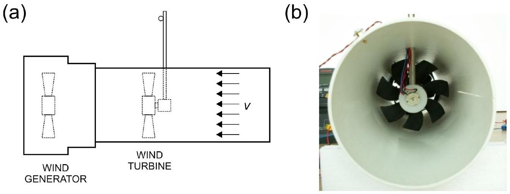
Figure 11. The wind turbine experiment setup

We will explore the physics of wind turbine and investigate its power conversion efficiency. In this experiment we use a simple DC motor to serve as a wind turbine that converts the mechanical power from the rotor into electrical power.

One factor that determines the efficiency of a wind turbine is the external load. In this experiment, we will investigate the load that generates maximum efficiency for a wind turbine, by using a resistive nickel-chromium (nichrom) wire to simulate a low resistive
load (< 2 ohm). This load can be changed by varying the length of the wire. Use the crocodile clips to contact the wire.

One key parameter that influence the wind turbine efficiency is Tip Speed Ratio (TSR), which is defined as:

$$
T S R=\frac{\Omega R}{v},
$$

where $\Omega$ is the angular speed of the blade, $R$ is the radius of the blade swept area and $v_{\text {is }}$ the wind speed coming on the rotor at the tip of the blade. We assume the wind speed is uniform across the cross section of the tunnel.

The motor turbine has an equivalent internal circuit as shown below. A rotating coil provides electromotive force (emf) voltage when the motor rotates. There is an effective series resistance $R_{M}$, which is the sum of resistance of the rotor coil inside the motor. $R_{M}$ is small but not negligible ( $<2 \Omega$ ). Thus the real motor can be modeled as an ideal motor (whose coil has no resistance) plus a series resistance $R_{M}$ as shown below.

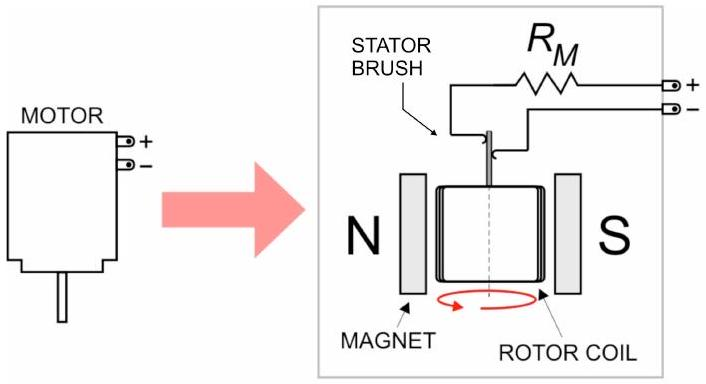
Figure 12. The equivalent circuit of the motor (wind turbine)

[E.1] Determine the internal series resistance of the motor turbine $R_{M}$. Note that the moving contact between the rotor and stator brush of the DC motor (see Figure 12) may add extra resistance that varies with the position of the turbine blade.
[0.4 pt]
[E.2] Determine the resistance per unit length of the nichrom wire, $\lambda_{\mathrm{R}}$ (in $\Omega / \mathrm{m}$ ). Note that the range of resistance of nichrom wire is low (< 7 ohm) comparable to the cable resistance of the digital multimeter (DMM).
[1.2 pt]
If you need constant current source you can use the hotwire electronic box in Constant Current Anemometer (CCA) mode. If you need to use amperemeter use DMM\#2 or \#3 and please be careful not to exceed the rating or to blow the fuse.

## INSTRUCTIONS:

(a) Place the turbine inside the wind tunnel. First, route the banana and crocodile jacks of the turbine through the small hole on the top of the wind tunnel from inside the tunnel. Then insert the mounted steel rod (use

the one for hotwire) into the hole and put the turbine at the end of it, see Figure 11.
(b) You will need to measure two frequencies in this experiment: the wind generator frequency (to obtain the wind speed) and the wind turbine frequency. You can do this by combining the connection as shown in Figure 13(a). You can use the black crocodile clip to switch between reading wind generator or wind turbine.
(c) Connect the nichrom wire as load to the motor turbine using crocodile clips. You can measure the voltage across the wire section separately by simply connecting the voltmeter at both ends of the nichrom wire as shown in Figure 13(b).

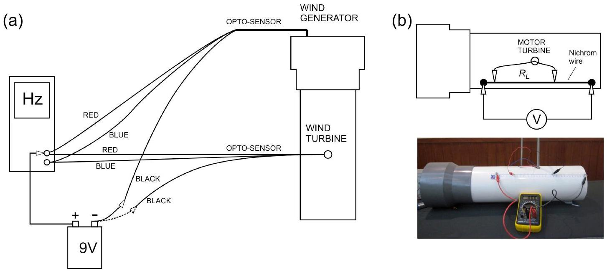
Figure 13(a) Connection to read two frequencies. (b) Connection to the nichrom wire as a load. Note that the Voltmeter is connected at both ends of the nichrom wire.

[E.3] Perform experiment to determine the optimum load $R_{L}$ for maximum power transfer. Plot the power delivered to $R_{L}$ vs. $R_{L}$ or nichrom length $l$. What do you expect theoretically for $R_{L}$ ?
[2.4 pt]
The wind turbine efficiency $\eta_{W T}$ is defined as the ratio of power delivered to the load $R_{L}$ to the available wind power $P_{W}$.
[E.4] Using the optimum load $R_{L}$ that you found experimentally in E.3, plot $\eta_{W T}$ vs. TSR.
[1.6 pt]

[^0]:    ${ }^{1}$ In contrast, a wind tunnel with a fan blowing into the tunnel has more turbulent wind flow

[^1]:    ${ }^{2}$ Albert Betz, a German physicist who derived this formula in 1919.
